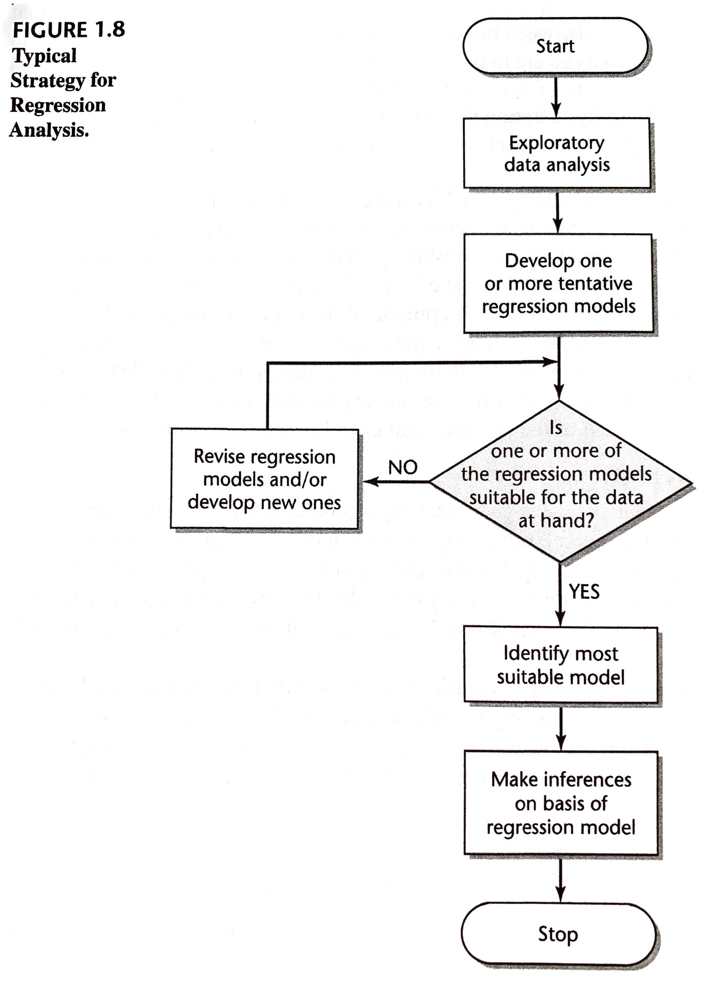
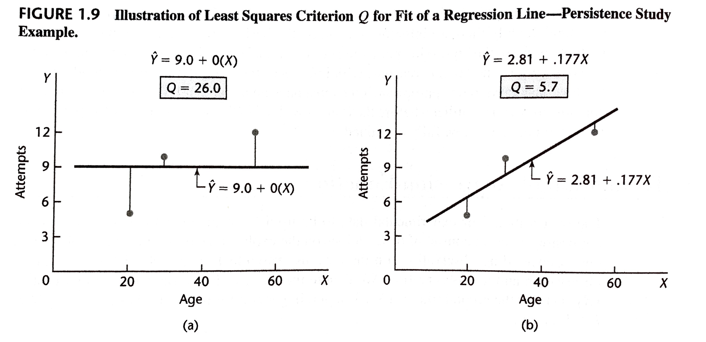
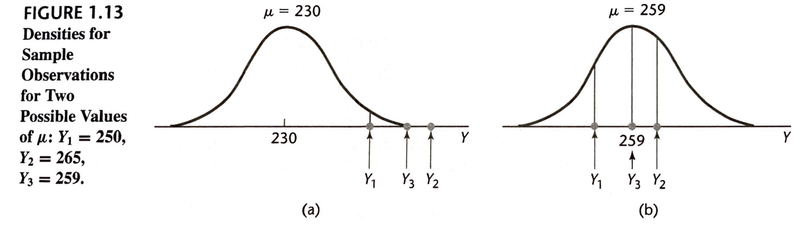
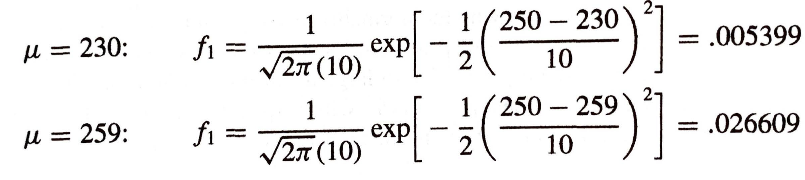

```{r xaringan-themer, include=FALSE, warning=FALSE}
library(xaringanthemer)
duo_accent(primary_color = "#006747", secondary_color = "#CFC493",   
	header_font_google = google_font("Josefin Sans"),
  text_font_google   = google_font("Montserrat", "300", "300i"),
  code_font_google   = google_font("Droid Mono"))
```		


```{r setup, include=FALSE}
library(here)
library(sjPlot)
library(sjmisc)
library(sjlabelled)
library(tidyverse)
library(ggplot2)
library(knitr)
library(mosaic)
library(DT)
library(latticeExtra)

options(htmltools.dir.version = FALSE)

knitr::opts_chunk$set(fig.retina = 3, warning = FALSE, message = FALSE, fig.align="center")
options(DT.options = list(scrollX = TRUE, pageLength=20, scrollY = 300))


spending_subset_all = read.csv(here("data", "spending_subset.csv"))

spending_subset=spending_subset_all[1:30,]

par(lwd=3,cex=1.5) 
cdi = as_tibble(read.delim(here("data", "CDI.txt"), sep=" ", header=FALSE)[,-c(1:2)] %>% mutate(V18 = recode_factor(V18, "NE", "NC", "S", "W")))
names(cdi) = c("county", "state", "land_area", "population", "pop_18_to_34", "pop_65", "number_physicians", "number_hospital_beds", "total_serious_crimes", "high_school_grads", "bachelor_degrees", "poverty_rate", "unemployment_rate", "per_capita_income", "total_personal_income", "region")

tab_model <- function(...,  show.ci=.95){sjPlot::tab_model(...,  show.ci=show.ci, show.se=TRUE, collapse.ci=TRUE, show.stat=TRUE)}
```


### 1: Linear Regression with One Predictor Variable

Regression analysis is widely used in business, the social and behavioural sciences, the biological sciences, and many other disciplines. 

The goal is to predict a *response* or outcome variable from other *predictor* variables. E.g., 

1. Sales of a product can be predicted by utilizing the relationship between sales and amount of advertising expenditures.
2. The performance of an employee on a job can be predicted from a battery of aptitude tests.
3. The size of the vocabulary of a child can be predicted from the age of the child and amount of education of the parents. 
4. The length of hospital stay of a surgical patient can be predicted from the severity of the operation. 

--

In Part I, we focus on regression analysis with a single predictor variable is used. 

In Part II, we focus on regression with multiple predictors. 


---
class: inverse 


A few of my projects: 

* Predicting organized sport participation among youth from family structure
* Predicting substance-use behavior from involvement in team sport culture in Canadian adolescents
* Family structure as a predictor of screen time among youth
* Distance to specialist medical care and diagnosis of obstructive sleep apnea in rural Saskatchewan


---

### Learning Objectives for Sections 1.1, 1.2, 1.4

After Sections 1.1, 1.2, 1.4, you should be able to 

* Describe the uses of regression analysis
* Contrast regression vs causation
* Identify observational and experimental data and contrast these with respect to causation

---

### 1.1: Relations between Variables

A **functional relationship** between two variables is expressed by a mathematical formula:
$$Y = f(X),$$
where 

* $Y$ represents the *dependent variable* and 
* $X$ represents the *independent variable*.

For example, consider the relation between dollar sales ( $Y$) of a product sold at a fixed price and number of units sold ( $X$). 
If the selling price is `$`2 per unit, the relation is expressed by the equation 
$$Y = 2 \cdot X.$$

---

class: inverse

```{r, echo=TRUE, eval=TRUE}
X = seq(0, 150, by=10)
Y = 2*X
data.frame(units=X, sales=Y) %>% datatable()
```

---
class: inverse

```{r, echo=TRUE, eval=TRUE}
plot(X,Y, type="l")
points(X,Y)
```

Notice that all observations fall directly on the line

---

class: center, middle

A functional relationship does not need to be *linear*:

---

class: inverse

```{r, echo=TRUE, eval=TRUE}
X = seq(0, 150, by=10)
Y = 2*X^2
data.frame(units=X, sales=Y) %>% datatable()
```

---
class: inverse

```{r, echo=TRUE, eval=TRUE}
plot(X,Y, type="l")
points(X,Y)
```

This is an example of a *curvilinear* relationship. 

---

### Statistical Relation between Two Variables

A **statistical relation**, unlike a *functional relation*, is not a perfect one. 

* In general, the observations from a statistical relation do not fall directly on the underlying curve.

--

For example, consider now the relationship between dollar sales ( $Y$) of a product sold at a fixed price and the amount of money spent on advertising ( $X$). 

As $X$ increases, you would generally expect $Y$ to increase, but you certainly wouldn't expect every dollar in advertising to give you the exact same increase in sales. 

---

class: inverse

```{r}
X = seq(0, 150, by=10)
Y = 2*X + rnorm(length(X), 0, 50)
xyplot(Y~X,  type=c("p", "r"))
```

---
class: inverse 

It is, of course, possible to have *curvilinear* statistical relations: 

```{r}
X = seq(0, 150, by=10)
Y = 2*X^2 + rnorm(length(X), 0, 50^2)
xyplot(Y~X,  type=c("p", "smooth"))
```

---

Since our focus is on **linear regression**, we will need to develop appropriate methodology for capturing underlying non-linear relationships:
	
* Transformations (ch. 3)
* Polynomial regression (ch. 8)
* Generalized linear models (ch. 14)


---

### 1.2: Regression Models and Their Uses

A regression model is a formal means of expressing the two essential ingredients of a statistical relation: 

1. A tendency of the response variable $Y$ to vary with the predictor variable $X$ in a systematic fashion.
2. A scattering of points around the curve of statistical relationship. 


---

### Regression and Causality

The existence of a statistical relation between the response variable $Y$ and the explanatory (or predictor) variable $X$ does NOT imply in any way that $Y$ depends causally on $X$.


---

### 1.4: Data for Regression Analysis 

Data for regression analysis may be obtained from non-experimental or experimental studies. 

--

### Observational Data 

* Non-experimental
* Do not control the explanatory variable of interest
* Causal inference is hard

--

### Experimental Data

* E.g., a completely randomized design
* Researcher controls the treatment assignment
* Causal inference is much easier to justify
	+ Treatment groups are identical aside from the treatment assignment; if one group does better, it is *because of* the treatment. 


---

### Use of Computers

Computers make statistics much less tedious; use a computer.

Your book gives output and graphics from BMDP, MINITAB, SAS, SPSS, SYSTAT, JMP, S-Plus, and MATLAB.

I will give code, output, and graphics from `R`, which is basically the same as `S-Plus` except it is free! 

---
class: inverse

### Data Set for Warm Up Questions: SHS

The Canadian Survey of Household Spending is carried out annually across Canada. 

(http://dli-idd-nesstar.statcan.gc.ca.proxy.library.upei.ca/webview/) 

The main purpose of the survey is to obtain detailed information about household spending. Information is also collected about dwelling characteristics as well as household equipment. 

The survey data are used by the following groups:

- Government departments use the data to help formulate policy; 
- Community groups, social agencies and consumer groups use the data to support their positions and to lobby governments for social changes; 
- Lawyers and their clients use the data to determine what is fair for child support and other compensation; 
- Labour and contract negotiators rely on the data when discussing wage and cost-of-living clauses; 
- Individuals and families can use the data to compare their spending habits with those of similar types of households. 

---
class: inverse

```{r, data_print, include=TRUE}
#A subset of the latest Survey of Household Spending data are displayed below:
spending_subset %>% datatable()
```

We are interested in the potential relationship between the income of working Canadians and the amount that they spend on clothing in a year.


---
class: inverse

Income and Clothing Expenditure for a small subset of the Survey of Household Spending are displayed below:
 
```{r, fig.cap="", include=TRUE, message=FALSE, echo=TRUE, eval=TRUE}
xyplot(clothing_expenditure~income, data=spending_subset,  type=c("p", "r", "smooth"))
```


---
class: inverse

### Data Set C.2: CDI

This data set provides selected county demographic information (CDI) for 440 of the most populous counties in the United States. 

Each line of the data set has an identification number with a county name and state abbreviation and provides information on 14 variables for a single county. 

Counties with missing data were deleted from the data set.

---
class: inverse

```{r , echo = TRUE}
cdi %>% datatable()
```

---
class: inverse


```{r , echo = TRUE}
xyplot(number_physicians ~ number_hospital_beds, data=cdi,  type=c("p", "r", "smooth"))
```

---
class: inverse

```{r , echo = TRUE}
xyplot(number_physicians ~ population, data=cdi,  type=c("p", "r", "smooth"))
```

---
class: inverse

```{r , echo = TRUE}
xyplot(number_physicians ~ total_personal_income, data=cdi,  type=c("p", "r", "smooth"))
```


---

### Recap: Sections 1.1, 1.2, 1.4

After Sections 1.1, 1.2, 1.4, you should be able to 

* Describe the uses of regression analysis
* Contrast regression vs causation
* Identify observational and experimental data and contrast these with respect to causation


---

### Learning Objectives for Sections 1.3, 1.5, 1.6

After Sections 1.3, 1.5, 1.6, you should be able to 

* Label and interpret the components of a regression model	
*	Apply the method of least squares	
* Define point estimates of mean response and residuals


---

### 1.3: Simple Linear Regression Model with Distribution of Error Terms Unspecified 

Want to find parameters for a function of the form
$$Y_i = \beta_0 + \beta_1 X_i + \varepsilon_i,$$
where the distribution of error random variable not specified.


* $Y_i$ value of the response variable in the $i$th trial
* $\beta_0$ and $\beta_1$ are parameters
* $X_i$ is a known constant, the value of the predictor variable in the $i$th trial
* $\varepsilon_i$ is a random error term with mean $E(\varepsilon_i) = 0$ and variance $Var(\varepsilon_i) = \sigma^2$
* $\varepsilon_i$ and $\varepsilon_j$ are uncorrelated
* $i = 1, \ldots, n$

This is **Simple** and **Linear** 

---
class: inverse

```{r, echo=TRUE}
X = seq(0, 150, by=10)
Y = 2*X + rnorm(length(X), 0, 50)
xyplot(Y~X,  type=c("p", "r"))
```

---

### Important Features of Model
* The response $Y_i$ is the sum of two components:
	+ Constant term $\beta_0 + \beta_1 X_i$
	+ Random term $\varepsilon_i$
	
$Y_i$ is, therefore, a random variable

---

* The expected response is
$$E[Y_i] = E[\beta_0 + \beta_1 X_i + \varepsilon_i] = \beta_0 + \beta_1 X_i + E[\varepsilon_i] = \beta_0 + \beta_1 X_i$$
	+ Thus, when the level of $X$ in the $i$th trial is $X_i$, $Y_i$ comes from a probability distribution whose mean is 
$$E[Y_i] = \beta_0 + \beta_1 X_i$$
	+ The regression function relates the means of the probability distributions of $Y$ for a given $X$ to the level of $X$, so our model is therefore 
$$E[Y] = \beta_0 + \beta_1 X$$
	
---


* The response $Y_i$ in the $i$th trial exceeds or falls short of the value of the regression function by the error term amount $\varepsilon_i$. 
	
---

* The error terms $\varepsilon_i$ are assumed to have a constant variance $\sigma^2$. 
	+ It therefore follows that the responses $Y_i$ have the same constant variance: 
$$\sigma^2 \{ Y_i \} = \sigma^2\{\beta_0 + \beta_1 X_i + \varepsilon_i\} = \sigma^2\{\varepsilon_i\} = \sigma^2$$
	+ Thus, our regression model assumes that the probability distributions of $Y$ have the same variance $\sigma^2$ regardless of the predictor variable $X$. 


---

* The error terms are assumed to be uncorrelated. Since the error terms $\varepsilon_i$ and $\varepsilon_j$ are uncorrelated, so are the responses $Y_i$ and $Y_j$. 

---

In summary, this regression model implies that the responses $Y_i$ come from probability distributions 

* whose means are $E[Y_i] = \beta_0 + \beta_1 X_i$ and 
* whose variances are $\sigma^2$, the same for all levels of $X$. 

Further, any two responses $Y_i$ and $Y_j$ are uncorrelated. 

---

### Meaning of Regression Parameters

The parameters $\beta_0$ and $\beta_1$ are called the **regression coefficients**. 

$\beta_1$ is the slope of the regression line

* It indicates the change in the mean of the probability distribution of $Y$ per unit increase in $X$

--

$\beta_0$ is the $Y$-intercept of the regression line
* It indicates the mean of the probability distribution of $Y$ at $X=0$. 

--

* If the scope of the model does not cover $X=0$, $\beta_0$ is not meaningful. 


---
class: inverse

### SHS: Meaning of Regression Parameters

The Canadian Survey of Household Spending is carried out annually across Canada. 

(http://dli-idd-nesstar.statcan.gc.ca.proxy.library.upei.ca/webview/) 

The main purpose of the survey is to obtain detailed information about household spending. Information is also collected about dwelling characteristics as well as household equipment. 

The survey data are used by the following groups:

- Government departments use the data to help formulate policy; 
- Community groups, social agencies and consumer groups use the data to support their positions and to lobby governments for social changes; 
- Lawyers and their clients use the data to determine what is fair for child support and other compensation; 
- Labour and contract negotiators rely on the data when discussing wage and cost-of-living clauses; 
- Individuals and families can use the data to compare their spending habits with those of similar types of households. 

---
class: inverse

```{r, include=TRUE}
#A subset of the latest Survey of Household Spending data are displayed below:
spending_subset %>% datatable()
```

We are interested in the potential relationship between the income of working Canadians and the amount that they spend on clothing in a year.

---
class: inverse

```{r, fig.cap="", include=TRUE, message=FALSE, echo=TRUE, eval=TRUE, fig.height=4}
xyplot(clothing_expenditure~income, data=spending_subset,  type=c("p", "r", "smooth"))
```

A preliminary regression analysis follows:
```{r, include=TRUE, message=FALSE, echo=TRUE, eval=TRUE}
clothing_model = lm(clothing_expenditure~income, data=spending_subset)
clothing_model$coef
```

--

** How can we interpret $\beta_1$ in this setting? Be as specific as possible. **

--

** How can we interpret $\beta_0$ in this setting? Be as specific as possible. **

---
class: inverse

### Data Set C.2: CDI

This data set provides selected county demographic information (CDI) for 440 of the most populous counties in the United States. 

Each line of the data set has an identification number with a county name and state abbreviation and provides information on 14 variables for a single county. 

Counties with missing data were deleted from the data set.

---
class: inverse

```{r , echo = TRUE}
cdi %>% datatable()
```


---
class: inverse

```{r , echo = TRUE, fig.height=4}
mod_physician_beds = lm(number_physicians ~ number_hospital_beds, data=cdi)
xyplot(number_physicians ~ number_hospital_beds, data=cdi,  type=c("p", "r", "smooth"))
mod_physician_beds$coef
```
** How can we interpret $\beta_1$ in this setting? Be as specific as possible. **

** How can we interpret $\beta_0$ in this setting? Be as specific as possible. **


---
class: inverse


```{r , echo = TRUE, fig.height=4}
mod_physician_pop = lm(number_physicians ~ population, data=cdi)
xyplot(number_physicians ~ population, data=cdi,  type=c("p", "r", "smooth"))
mod_physician_pop$coef
```
** How can we interpret $\beta_1$ in this setting? Be as specific as possible. **

** How can we interpret $\beta_0$ in this setting? Be as specific as possible. **

---
class: inverse


```{r , echo = TRUE, fig.height=4}
mod_physician_income = lm(number_physicians ~ total_personal_income, data=cdi)
xyplot(number_physicians ~ total_personal_income, data=cdi,  type=c("p", "r", "smooth"))
mod_physician_income$coef
```
** How can we interpret $\beta_1$ in this setting? Be as specific as possible. **

** How can we interpret $\beta_0$ in this setting? Be as specific as possible. **


---

### 1.5: Overview of Steps in Regression Analysis

We will begin by discussing inferences based on a regression model that is considered to be appropriate. 

However, throughout the course, we will be stepping back from this and considering the development of a suitable regression model. 

---


```{r, fig.cap="", include=TRUE, message=FALSE, echo=FALSE, out.width="60%"}

```


---

### 1.6: Estimation of Regression Function

Assuming we know the form of the regression function,
$$Y_i = \beta_0 + \beta_1 X_i + \varepsilon_i,$$
how do we go about estimating the parameters? 

---

### Example:
An experimenter gave three subjects a very difficult task. Data on the age
of the subject ( $X$) and on the number of attempts to accomplish the task
before giving up ( $Y$) follow:

Subject i | 1 | 2 | 3 |
----------|---|---|---|
Age $X_i$	| 20| 55| 30|
Number of Attempts $Y_i$ | 5 | 12 |  10 |

Note: 
* $n=3$
* $(X_1, Y_1) = (20, 5)$
* $(X_2, Y_2) = (55, 12)$
* $(X_3, Y_3) = (30, 10)$


---

### Method of Least Squares

Goal: estimate $\beta_0$ and $\beta_1$ with $b_0$ and $b_1$ if they result in small *deviations*:
$$Y_i - (b_0 + b_1 X_i).$$

* That is, we will make $Y_i$ and $b_0 + b_1 X_i$ close for all $i$ for our observations $(X_i, Y_i)$. 
* In particular, the *method of least squares* seeks to minimize the sum of the $n$ squared deviations: 
$$Q = \sum_{i=1}^n [Y_i - (b_0 + b_1 X_i)]^2.$$

---

```{r, fig.cap="", include=TRUE, message=FALSE, echo=FALSE, out.width="100%"}

```

---

### Finding Least Squares Point Estimates 

We want $b_0$ and $b_1$, the values of $\beta_0$ and $\beta_1$ that minimize 
$$Q = \sum_{i=1}^n [Y_i - (\beta_0 + \beta_1 X_i)]^2.$$

--

In nice situations, this can be accomplished by taking the derivative of the function and finding where it equals 0: 

$$\begin{align*}
0= \left. \frac{\partial Q}{\partial \beta_0} \right | _{\beta=b} &= -2 \sum [Y_i - (b_0 + b_1 X_i)] \\ 
0= \left. \frac{\partial Q}{\partial \beta_1} \right | _{\beta=b} &= -2 \sum X_i [Y_i - (b_0 + b_1 X_i)] 
\end{align*}$$

--

After some simplification, we get the so-called *normal equations*:
$$\begin{align*}
\sum Y_i &= n b_0 + b_1 \sum X_i \\ 
\sum X_i Y_i &= b_0 \sum X_i + b_1 \sum X_i^2
\end{align*}$$

---

These *normal equations* can be solved simultaneously for $b_0$ and $b_1$: 
$$\begin{align*}
b_1 &= \frac{\sum (X_i - \bar X_i)\sum (Y_i - \bar Y_i)}{\sum (X_i - \bar X_i)^2} \\ 
b_0 &= \bar Y - b_1 \bar X
\end{align*}$$
where
$$\begin{align*}
\bar Y  &= \frac{1}{n} \sum Y_i \\ 
\bar X &= \frac{1}{n} \sum X_i
\end{align*}$$

---

### Properties of Least Squares Estimators

```{r, fig.cap="", include=TRUE, message=FALSE, echo=FALSE, out.width="100%"}

```

* The least squares estimators $b_0$ and $b_1$ are unbiased:
$$E[b_0]= \beta_0 \qquad \text{ and } \qquad E[b_1]= \beta_1.$$
* $b_0$ and $b_1$ have minimum variance among all unbiased linear estimators 


---

### Point Estimation of Mean Response

Given sample estimators $b_0$ and $b_1$ of the parameters in the regression function 
$$E[Y] = \beta_0 + \beta_1 X,$$
we estimate the regression function as follows
$$\boxed{
\hat Y = b_0 + b_1 X,
}$$
where $\hat Y$ is the value of the estimated regression function at the level $X$ of the predictor variable. 

--

$\hat Y$ is an unbiased estimator of $E[Y]$ with minimum variance in the class of unbiased linear estimators. 

--

* we call the *value* of the response variable a **response**
* we call $E[Y]$ the **mean response**

---

For observed cases in the study, we will call $\hat Y_i = b_0 + b_1 X_i$ the **fitted value** for the $i$th case ( $i = 1, \ldots, n$)

--

This *fitted value* is different than the *observed value* $Y_i$

--

The difference between the observed value and the fitted value is the $i$th **residual**:
$$\boxed{e_i = Y_i - \hat Y_i} = Y_i - (b_0 + b_1 X_i)$$
 

--

Note that the *model error term* $\varepsilon_i = Y_i - E[Y_i]$ is not the same as the *residual* $e_i = Y_i - \hat Y_i$


---
class: inverse 

### SHS: least squares estimates, estimates of mean response, observed values, fitted values, residuals

```{r, include=TRUE, out.height="50%"}
#A subset of the latest Survey of Household Spending data are displayed below:
spending_subset %>% datatable(options=list(scrollY=200))
```


---
class: inverse

Income and Clothing Expenditure for a small subset of the Survey of Household Spending are displayed below:
 
```{r, fig.cap="", include=TRUE, message=FALSE, echo=TRUE, eval=TRUE}
xyplot(clothing_expenditure~income, data=spending_subset,  type=c("p", "r"))
```

---
class: inverse 

A preliminary regression analysis follows:
```{r, include=TRUE, message=FALSE, echo=TRUE, eval=TRUE}
clothing_model = lm(clothing_expenditure~income, data=spending_subset)
clothing_model$coef
```

```{r}
tibble(X=spending_subset$income, Y = spending_subset$clothing_expenditure, Yhat = predict(clothing_model), e = residuals(clothing_model)) %>% round(5) %>% datatable()
```


---
class: inverse

### CDI: least squares estimates, estimates of mean response, observed values, fitted values, residuals

This data set provides selected county demographic information (CDI) for 440 of the most populous counties in the United States. 

Each line of the data set has an identification number with a county name and state abbreviation and provides information on 14 variables for a single county. 

Counties with missing data were deleted from the data set.

---
class: inverse

```{r , echo = TRUE}
cdi %>% datatable()
```

---
class: inverse

```{r , echo = TRUE, fig.height=3}
mod_physician_beds = lm(number_physicians ~ number_hospital_beds, data=cdi)
xyplot(number_physicians ~ number_hospital_beds, data=cdi,  type=c("p", "r"))
mod_physician_beds$coef

tibble(X1=cdi$number_hospital_beds, Y = cdi$number_physicians, Yhat1 = predict(mod_physician_beds), e1 = residuals(mod_physician_beds)) %>% round(5) %>% datatable(options=list(scrollY=50))
```


---
class: inverse

```{r , echo = TRUE, fig.height=3}
mod_physician_pop = lm(number_physicians ~ population, data=cdi)
xyplot(number_physicians ~ population, data=cdi,  type=c("p", "r"))
mod_physician_pop$coef

tibble(X2=cdi$population, Y = cdi$number_physicians, Yhat2 = predict(mod_physician_pop), e2 = residuals(mod_physician_pop))%>% round(5) %>% datatable(options=list(scrollY=50))
```


---
class: inverse

```{r , echo = TRUE, fig.height=3}
mod_physician_income = lm(number_physicians ~ total_personal_income, data=cdi)
xyplot(number_physicians ~ total_personal_income, data=cdi,  type=c("p", "r"))
mod_physician_income$coef

tibble(X3=cdi$total_personal_income, Y = cdi$number_physicians, Yhat3 = predict(mod_physician_income), e3 = residuals(mod_physician_income)) %>% round(5) %>% datatable(options=list(scrollY=50))
```

---

### Properties of Fitted Regression Line

* The regression line always goes through the point $(\bar X, \bar Y)$. 
* The sum of the squared residuals, $\sum_{i=1}^n e_i^2$, is a minimum

---
* The sum of the residuals is zero:
$$\sum_{i=1}^n e_i =0$$
* The sum of the observed values $Y_i$ equals the sum of the fitted values $\hat Y_i:$
$$\sum_{i=1}^n Y_i = \sum_{i=1}^n \hat Y_i$$
* The sum of the weighted residuals is zero when the residual in the $i$th trial is weighted by the level of the predictor variable in the $i$th trial:
$$\sum_{i=1}^n X_i e_i = 0$$
* The sum of the weighted residuals is zero when the residual in the $i$th trial is weighted by the fitted value of the response variable in the $i$th trial
$$\sum_{i=1}^n \hat Y_i e_i = 0$$


---
class: inverse 

### SHS: Properties of Fitted Regression Line

```{r, include=TRUE, out.height="50%"}
#A subset of the latest Survey of Household Spending data are displayed below:
spending_subset %>% datatable()
```

---
class: inverse

```{r, fig.cap="", echo=TRUE, message=FALSE, echo=TRUE, eval=TRUE, fig.show='hide'}
xyplot(clothing_expenditure~income, data=spending_subset,  type=c("p", "r"))
```

```{r}
ladd(panel.abline(h=mean(spending_subset$clothing_expenditure), v=mean(spending_subset$income), lty=2, lwd=.5))
```

---
class: inverse 

```{r, include=TRUE, message=FALSE, echo=TRUE, eval=TRUE}
clothing_model = lm(clothing_expenditure~income, data=spending_subset)
clothing_tble = tibble(X=spending_subset$income, Y = spending_subset$clothing_expenditure, Yhat = predict(clothing_model), e = residuals(clothing_model), Xe = X*e, YhatE = Yhat*e)
clothing_tble %>% round() %>% datatable(options=list(scrollY=200))
round(colSums(clothing_tble), 5)[-1]
```


---
class: inverse

### CDI: Properties of Fitted Regression Line

This data set provides selected county demographic information (CDI) for 440 of the most populous counties in the United States. 

Each line of the data set has an identification number with a county name and state abbreviation and provides information on 14 variables for a single county. 

Counties with missing data were deleted from the data set.

---
class: inverse

```{r , echo = TRUE}
cdi %>% datatable()
```

---
class: inverse

```{r , echo = TRUE, fig.show='hide'}
mod_physician_beds = lm(number_physicians ~ number_hospital_beds, data=cdi)
xyplot(number_physicians ~ number_hospital_beds, data=cdi,  type=c("p", "r"))
```

```{r, fig.height=5}
ladd(panel.abline(h=mean(cdi$number_physicians), v=mean(cdi$number_hospital_beds), lty=2, lwd=.5))
```

---
class: inverse

```{r , echo = TRUE, fig.show='hide'}
mod_physician_pop = lm(number_physicians ~ population, data=cdi)
xyplot(number_physicians ~ population, data=cdi,  type=c("p", "r"))
```

```{r, fig.height=5}
ladd(panel.abline(h=mean(cdi$number_physicians), v=mean(cdi$population), lty=2, lwd=.5))
```

---
class: inverse

```{r , echo = TRUE, fig.show='hide'}
mod_physician_income = lm(number_physicians ~ total_personal_income, data=cdi)
xyplot(number_physicians ~ total_personal_income, data=cdi,  type=c("p", "r"))
```

```{r, fig.height=5}
ladd(panel.abline(h=mean(cdi$number_physicians), v=mean(cdi$total_personal_income), lty=2, lwd=.5))
```

---
class: inverse

```{r, echo=TRUE, eval=TRUE}
cdi_tble = tibble(X1=cdi$number_hospital_beds, X2=cdi$population, X3=cdi$total_personal_income, Y = cdi$number_physicians, Yhat1 = predict(mod_physician_beds), e1 = residuals(mod_physician_beds), X1e1 = X1*e1, Yhat1E1 = Yhat1*e1, Yhat2 = predict(mod_physician_pop), e2 = residuals(mod_physician_pop), X2e2 = X2*e2, Yhat2E2 = Yhat2*e2, Yhat3 = predict(mod_physician_income), e3 = residuals(mod_physician_income), X3e3 = X3*e3, Yhat3E3 = Yhat3*e3)
cdi_tble %>% round() %>% datatable(options=list(scrollY=150))
round(colMeans(cdi_tble), 5)[-c(1,2,3)]
```

---

### Recap: Sections 1.4-1.6

After Sections 1.4-1.6, you should be able to 

* Label and interpret the components of a regression model	
*	Apply the method of least squares	
* Define point estimates of mean response and residuals


---

### Learning Objectives for Sections 1.7-1.8

After Sections 1.7-1.8, you should be able to 

* Define the normal error regression model
*	Define and interpret SSE and MSE
* Apply the method of maximum likelihood


---

### 1.7: Estimation of Error Terms Variance $\sigma^2$

The variance $\sigma^2$ of the error terms $\varepsilon_i$ in the regression model
$$Y_i = \beta_0 + \beta_1 X_i + \varepsilon_i, $$
needs to be estimated in order to develop interval estimates and to perform inference. 


---

### Point Estimator of $\sigma^2$ in a Single Population

In STAT 1910, we estimated the mean, $\mu$, and variance, $\sigma^2$, of a population by using the sample statistics $\bar Y$ and $s^2$. 

**The Sample Variance Estimator** consists of a the sum of squared deviations divided by the degrees of freedom associated with it:
$$s^2 =
 \frac{  \sum_{i=1}^n (Y_i - \bar Y )^2}{n-1}$$

--

The **Sum of Squares** is
$$\sum_{i=1}^n (Y_i - \bar Y )^2$$
and the degrees of freedom here is $n-1$ because one degree of freedom is lost by using $\bar Y$ as an estimate of the unknown population mean $\mu$. 

--

* $s^2$ is called a **mean square** because the sum of squares has been divided by the appropriate degrees of freedom
* $s^2$ is an unbiased estimator of $\sigma^2$.


---

### Point Estimator of $\sigma^2$ in a Regression Model

In a regression model, each $Y_i$

* comes from a different probability distribution with a different mean that depend on the level $X_i$
* has variance $\sigma^2$ (the same as for the error term $\varepsilon_i$)

---

Thus, the deviation of an observation $Y_i$ must be calculated around its own estimated mean:
$$\boxed{
SSE = \sum_{i=1}^n (Y_i - \hat Y_i)^2 = \sum_{i=1}^n e_i^2,
}$$
where *SSE* stands for **error sum of squares** or **residual sum of squares**.

--

* The sum of squares *SSE* has $n-2$ degrees of freedom associated with it
	+ 2 degrees of freedom are lost as both $\beta_0$ and $\beta_1$ had to be estimated in order to obtain $\hat Y_i$
	
--

* The corresponding **mean square error** (or **mean square residual**) is
$$\boxed{
MSE = \frac{SSE}{n-2} = \frac{\sum_{i=1}^n (Y_i - \hat Y_i)^2}{n-2} = \frac{\sum_{i=1}^n e_i^2}{n-2},
}$$
* *MSE* is an unbiased estimator of $\sigma^2$:
$$E[MSE] = \sigma^2.$$


An estimator of the standard deviation is simply $s = \sqrt{MSE}$


---
class: inverse

### SHS: SSE and MSE

The Canadian Survey of Household Spending is carried out annually across Canada. 

(http://dli-idd-nesstar.statcan.gc.ca.proxy.library.upei.ca/webview/) 

The main purpose of the survey is to obtain detailed information about household spending. Information is also collected about dwelling characteristics as well as household equipment. 

The survey data are used by the following groups:

- Government departments use the data to help formulate policy; 
- Community groups, social agencies and consumer groups use the data to support their positions and to lobby governments for social changes; 
- Lawyers and their clients use the data to determine what is fair for child support and other compensation; 
- Labour and contract negotiators rely on the data when discussing wage and cost-of-living clauses; 
- Individuals and families can use the data to compare their spending habits with those of similar types of households. 

---
class: inverse

```{r,  include=TRUE}
#A subset of the latest Survey of Household Spending data are displayed below:
spending_subset %>% datatable()
```

We are interested in the potential relationship between the income of working Canadians and the amount that they spend on clothing in a year.


---
class: inverse

Income and Clothing Expenditure for a small subset of the Survey of Household Spending are displayed below:

```{r, fig.cap="", include=TRUE, message=FALSE, echo=TRUE, eval=TRUE}
xyplot(clothing_expenditure~income, data=spending_subset,  type=c("p", "r", "smooth"))
```


---
class: inverse

A preliminary regression analysis follows:
```{r, include=TRUE, message=FALSE, echo=TRUE, eval=TRUE}
clothing_model = lm(clothing_expenditure~income, data=spending_subset)

SSE = sum(residuals(clothing_model)^2)

df = (summary(clothing_model)$df[2])

SSE /df

s = summary(clothing_model)$sigma
s
s^2
```

--

```{r}
predict(clothing_model, newdata=data.frame(income=60000))
```


---
class: inverse

### CDI: SSE and MSE

This data set provides selected county demographic information (CDI) for 440 of the most populous counties in the United States. 

Each line of the data set has an identification number with a county name and state abbreviation and provides information on 14 variables for a single county. 

Counties with missing data were deleted from the data set.

---
class: inverse

```{r , echo = TRUE}
cdi %>% datatable()
```

---
class: inverse

```{r , echo = TRUE}
mod_physician_beds = lm(number_physicians ~ number_hospital_beds, data=cdi)
xyplot(number_physicians ~ number_hospital_beds, data=cdi,  type=c("p", "r"))
```

---
class: inverse

```{r}
s = summary(mod_physician_beds)$sigma
s
s^2
```


---
class: inverse

```{r , echo = TRUE}
mod_physician_pop = lm(number_physicians ~ population, data=cdi)
xyplot(number_physicians ~ population, data=cdi,  type=c("p", "r"))
```

---
class: inverse

```{r}
s = summary(mod_physician_pop)$sigma
s
s^2
```


---
class: inverse

```{r , echo = TRUE}
mod_physician_income = lm(number_physicians ~ total_personal_income, data=cdi)
xyplot(number_physicians ~ total_personal_income, data=cdi,  type=c("p", "r"))
```

---
class: inverse

```{r}
s = summary(mod_physician_income)$sigma
s
s^2
```

--

```{r}
summary(mod_physician_income)
```


---
class: inverse

```{r}
s = summary(mod_physician_income)$sigma
s
s^2
```

```{r}
msummary(mod_physician_income)
```

---

### 1.8: Normal Error Regression Model

No matter how the error terms $\varepsilon_i$ are distributed, the least squares method provides unbiased point estimators of $\beta_0$ and $\beta_1$

--

However, to set up interval estimates and make tests we need to specify the distribution of the $\varepsilon_i$
* We will assume that the $\varepsilon_i$ are normally distributed:
$$Y_i = \beta_0 + \beta_1 X_i + \varepsilon_i, \qquad \varepsilon_i \sim N(0, \sigma^2).$$

--

* $Y_i$ is the value of the response and $X_i$ is the predictor
* $\beta_0$ and $\beta_1$ are parameters
* $\varepsilon_i$ is a random error term with mean $E(\varepsilon_i) = 0$ and variance $Var(\varepsilon_i) = \sigma^2$
* $\varepsilon_i$ and $\varepsilon_j$ are uncorrelated
* $\color{red}{\varepsilon_i \text{ are normally distributed}}$ 

--

We can write these final 3 points succinctly by writing $\boxed{\varepsilon_i \overset{\text{iid}}{\sim} N(0, \sigma^2)}$


---

### Estimation of Parameters by the Method of Maximum Likelihood

We have now fully specified the probability distribution of $Y|X$ up to the parameters $\beta_0$, $\beta_1$, and $\sigma^2$
* That is, we have specified $f(Y|X; \beta_0, \beta_1, \sigma^2)$

--

	+ so for a given set of parameters $(\beta_0, \beta_1, \sigma^2)$, we can calculate the probability of specific $Y$ values for a given $X$
	+ i.e., $f(Y|X; \beta_0, \beta_1, \sigma^2)$ tells us how *likely* it is that $Y$ would come from a distribution with these specific parameters.

--

	+ Since the data are independent, the joint probability of the data $(X_1, Y_1), \ldots, (X_n, Y_n)$ is 
$$	L = f(Y_1|X_1; \beta_0, \beta_1, \sigma^2) \times \cdots \times f(Y_n|X_n; \beta_0, \beta_1, \sigma^2)$$

I have denoted this function $L$ because it is measuring how *likely* the data set is for a specific set of parameters. 

---

However, we want to use this function the other way around:
* We have the observed data
* what we don't have is the parameters $(\beta_0, \beta_1, \sigma^2)$

We are trying to find the parameters that gave rise to the data that we actually observed
* i.e., we want to find parameters that are most consistent with the observed data

Therefore, we want to measure how *likely* the observed data would be for a given set of parameters (which we can do with $L(\beta_0, \beta_1, \sigma^2)$) 

The parameter set that makes the observed data *most likely* is a good set of estimates for the unknown parameters.

---

### Maximum Likelihood in a Single Population

* Consider a normal population with known standard deviation of $\sigma=10$
* We observed $n=3$ values: 
	+ $Y_1=250$, $Y_2=265$, $Y_3=259$
* We want to know what value of $\mu$ is most consistent with the sample data. 


```{r, fig.cap="", include=TRUE, message=FALSE, echo=FALSE, out.width="100%"}

```

---

The densities for $Y_1=250$, denoted by $f_1(250; \mu)$ can be found as follows: 

```{r, fig.cap="", include=TRUE, message=FALSE, echo=FALSE, out.width="50%"}

```

--

The densities for $Y_1$ can also be found as follows: 

```{r, echo=TRUE, eval=TRUE}
dnorm(250, mean=230, sd=10)
dnorm(250, mean=259, sd=10)
```

---

```{r, echo=TRUE, eval=TRUE}
Y = c(250, 265, 259)
mu.230=dnorm(Y, mean=230, sd=10)
mu.259=dnorm(Y, mean=259, sd=10)

data.frame(Y, mu.230, mu.259) %>% round(5) %>% datatable(options=list(scrollY=150))
prod(mu.230)
prod(mu.259)
```


---


```{r, echo=TRUE, eval=TRUE, fig.height=5}
potential_mu = 230:290
L1=dnorm(250, mean=potential_mu, sd=10)
L2=dnorm(265, mean=potential_mu, sd=10)
L3=dnorm(259, mean=potential_mu, sd=10)

L = L1 * L2 * L3

plot(potential_mu, L, type="l")
abline(v=c(230, 259), lty=2, lwd=.5)
```

---

Notice that the likelihood function

1. reaches its maximum at $\mu = 258$, which is the sample mean $\bar Y = \frac{1}{3} (250 + 265 + 259)$
2. is relatively peaked 
	+ so the values of $\mu$ not near the maximum likelihood estimator are much less consistent with the sample data
	+ this maximum likelihood estimate is relatively *precise*
	
---

### Finding the maximum likelihood analytically

Above, we found the maximum likelihood through a numerical search
* we calculated $L(\mu) = \prod_{i=1}^n f(Y_i; \mu)$ for a large number of possible values of $\mu$ and identified the one that resulted in the largest value

--

Often, however, we can find the maximum of the likelihood function analytically. 
* we just need to find solutions to 
$$	\frac{d L(\mu) }{d \mu} = 0$$

--

* in practice, it is almost always better to focus on maximizing the log-likelihood
$$\frac{d \ell(\mu) }{d \mu} = \frac{d \log L(\mu) }{d \mu} = \frac{d \log \left[\prod_{i=1}^n f(Y_i; \mu) \right]}{d \mu} = \frac{d  \sum_{i=1}^n  \log \left[f(Y_i; \mu) \right]}{d \mu}$$

---

** Derive the maximum of the log likelihood for $\mu$ in a normal population where $\sigma$ is known: ** 
$$\ell(\mu) = \log L(\mu) =  \sum_{i=1}^n \log f(Y_i; \mu) = \sum_{i=1}^n \log \left[ \frac{1}{\sqrt{2 \pi \sigma^2}} \exp \left \{ -\frac{1}{2} \left(\frac{Y_i - \mu}{\sigma} \right)^2 \right\}\right]$$

---

### Maximum Likelihood in a Regression Model

$$L(\beta_0, \beta_1, \sigma^2) = \prod_{i=1}^n \frac{1}{\sqrt{2 \pi \sigma^2}} \exp{ \left [ -\frac{1}{2} \left(\frac{Y_i - (\beta_0 + \beta_1 X_i)}{\sigma} \right)^2 \right]}$$

We can maximize this with respect to the parameters $(\beta_0, \beta_1, \sigma^2)$. (How?)

--

* We find that the maximum likelihood estimators are 
	+ $\hat \beta_0 = b_0$
	+ $\hat \beta_1 = b_1$
	+ $\hat \sigma^2 = \frac{1}{n} \sum (Y_i- \hat Y_i)^2$
* The maximum likelihood estimators of $\beta_0$ and $\beta_1$ are the same estimators as those provided by the method of least squares!

--

* The maximum likelihood estimator is biased, so ordinarily the unbiased estimator $MSE$ is used:
$$s^2 = MSE = \frac{n}{n-2} \hat \sigma^2$$


---

### Recap: Sections 1.7-1.8

After Sections 1.7-1.8, you should be able to 

* Define the normal error regression model
*	Define and interpret SSE and MSE
* Apply the method of maximum likelihood


