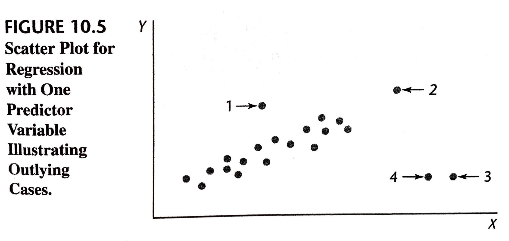
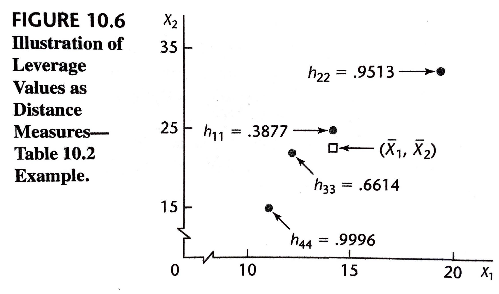

```{r xaringan-themer, include=FALSE, warning=FALSE}
library(xaringanthemer)
duo_accent(primary_color = "#006747", secondary_color = "#CFC493",   
	header_font_google = google_font("Josefin Sans"),
  text_font_google   = google_font("Montserrat", "300", "300i"),
  code_font_google   = google_font("Roboto Mono"))
```		


```{r setup, include=FALSE}
options(htmltools.dir.version = FALSE)
knitr::opts_chunk$set(fig.retina = 3, warning = FALSE, message = FALSE, fig.align="center", fig.height=5.5)
options(DT.options = list(scrollX = TRUE, pageLength=20, scrollY = 250))
options(digits = 4)
options(show.signif.stars=FALSE)

library(here)
library(sjPlot)
library(sjmisc)
library(sjlabelled)
library(tidyverse)
library(ggplot2)
library(knitr)
library(mosaic)
library(DT)
library(car)
library(psych)
library(olsrr)
library(GGally)

#params
spending_subset_all = read.csv(here("data", "spending_subset.csv"))

spending_subset=spending_subset_all[1:500,]

par(lwd=3,cex=1.5) 
cdi = as_tibble(read.delim(here("data", "CDI.txt"), sep=" ", header=FALSE)[,-c(1:2)] %>% mutate(V18 = recode_factor(V18, "NE", "NC", "S", "W")))
names(cdi) = c("county", "state", "land_area", "population", "pop_18_to_34", "pop_65", "number_physicians", "number_hospital_beds", "total_serious_crimes", "high_school_grads", "bachelor_degrees", "poverty_rate", "unemployment_rate", "per_capita_income", "total_personal_income", "region")

life_insurance <- read.delim(here("data", "CH10TA01.txt"), sep=" ", header=FALSE)
names(life_insurance) <- c("income", "risk_aversion", "insurance")


tab_model <- function(...,  show.ci=.95){sjPlot::tab_model(...,  show.ci=show.ci, show.se=TRUE, collapse.ci=TRUE, show.stat=TRUE)}
```


### Learning Objectives for Sections 10.1-10.2

After Sections 10.1-10.2, you should be able to 

- Create and analyze added-variable plots to examine model adequacy  
- Define studentized deleted residuals and use them to examine model adequacy  


---

### 10.1: Model Adequacy for a Predictor Variable $-$ Added-Variable Plots

*Added-variable plots*, also called *partial regression plots* and *adjusted variable plots*, are refined residual plots that provide graphic information about the marginal importance of a predictor variable $X_k$, given the other predictor variables already in the model.


---

Recall the following from Chapter 7:

Consider a multiple regression model with two $X$ variables. Suppose we regress $Y$ on $X_2$ and obtain the residuals:
$$e(Y|X_2) = Y_i - \hat{Y}_i(X_2)$$
where $\hat{Y}_i(X_2)$ denotes the fitted values of $Y$ when $X_2$ is in the model.  

Suppose we further regress $X_1$ on $X_2$ and obtain the residuals:
$$e(X_1|X_2) = X_{i1} - \hat{X}_{i1}(X_2)$$
where $\hat{X}_{i1}(X_2)$ denotes the fitted values of $X_1$ 	in the regression of $X_1$ on $X_2$.  


* The coefficient of simple determination $R^2$ between these two sets of residuals equals the coefficient of partial determination $R_{Y 1 | 2}$

* The plot of the residuals $e(Y|X_2)$ against $e(X_1|X_2)$ provides a graphical representation of the strength of the relationship between $Y$ and $X_1$, adjusted for $X_2$. Such plots of residuals are called added variable plots or partial regression plots.


---


These plots are analogous to the scatterplots for simple linear regression; the residuals displayed in added-variable plots are exactly the residuals from the multiple regression.

These plots are useful for identifying

* outliers
* non-constant variance
* influential points
* non-linearity

In addition, these plots can at times be useful for identifying the nature of the marginal relation for a predictor variable in the regression model, though we need to recognize that the $X$-axis is not displaying the $X$ variable (so we may be able to identify a non-linear relationship, but probably not what the functional relationship actually is).


<!-- A lot of the value of an added variable plot comes at the regression diagnostic stage, especially since the residuals in the added variable plot are precisely the residuals from the original multiple regression. This means outliers and heteroskedasticity can be identified in a similar way to when looking at the plot of a simple rather than multiple regression model. Influential points can also be seen - this is useful in multiple regression since some influential points are not obvious in the original data before you take the other variables into account.   -->


---

```{r}
fit <- lm(insurance ~ ., life_insurance)

life_insurance %>% datatable()
```

---

```{r}
A <- resid(lm(insurance ~ risk_aversion, life_insurance))
B <- resid(lm(income ~ risk_aversion, life_insurance))
par(mfrow = c(1, 2), pch = 19)

plot(resid(fit) ~ income, life_insurance, xlab = "income", ylab = "Residual")
title("(a) Residual Plot against income")
abline(0, 0, lty = 2)

plot(A ~ B, xlab = "e(X1|X2)", ylab = "e(Y|X2)")
title("(b) Added-Variable Plot for income")
abline(lm(A ~ B))
abline(0, 0, lty = 2)
```
<!-- replicating 10.3 from book as per https://rpubs.com/bryangoodrich/5224 (highlighting that we are finding residuals and then regressing them). -->
<!-- Comment that apparent non-linearity is not a big problem marginally (that, after accounting for X1, adding a curvilinear component to x2 won't improve things much), and highlight the potentially-influential point at the top right -->

---
```{r}

avPlots(fit)

```

---

```{r}
msummary(fit)
```

--

```{r}
msummary(lm(insurance ~ risk_aversion + income+I(income^2), life_insurance))
```

---
layout: true
class: inverse
---

```{r}
clothing_model = lm(clothing_expenditure~income+sex+food_expenditure+recreation_expenditure+ miscellaneous_expenditure+I(marital_status=="married"), data=spending_subset)
msummary(clothing_model)
```

---
```{r, echo=FALSE, out.width="100%"}
avPlots(clothing_model)
```

---
```{r, echo=FALSE, out.width="100%"}
par(mfrow=c(3,2))
plot(clothing_expenditure~income, data=spending_subset); abline(lm(clothing_expenditure~income, data=spending_subset))
plot(clothing_expenditure~I(sex=="male"), data=spending_subset); abline(lm(clothing_expenditure~sex, data=spending_subset))
plot(clothing_expenditure~food_expenditure, data=spending_subset); abline(lm(clothing_expenditure~food_expenditure, data=spending_subset))
plot(clothing_expenditure~recreation_expenditure, data=spending_subset); abline(lm(clothing_expenditure~recreation_expenditure, data=spending_subset))
plot(clothing_expenditure~miscellaneous_expenditure, data=spending_subset); abline(lm(clothing_expenditure~miscellaneous_expenditure, data=spending_subset))
plot(clothing_expenditure~I(marital_status=="married"), data=spending_subset); abline(lm(clothing_expenditure~I(marital_status=="married"), data=spending_subset))
```

---
layout: false

### 10.2: Identifyiug Outlying $Y$ Observations - Studentized Deleted Residuals


```{r, fig.cap="", include=TRUE, message=FALSE, echo=FALSE, out.width="90%"}

```

---

* Case 1 may not be too influential because a number of other cases have similar $X$ values that will keep the fitted regression function from being displaced too far by the outlying case. 

* Case 2 may not be too influential because its $Y$ value is consistent with the regression relation displayed by the nonextreme cases. 

* Cases 3 and 4, on the other hand, are likely to be very influential in affecting the fit of the regression function. They are outlying with regard to their $X$ values, and their $Y$ values are not consistent with the regression relation for the other cases.

--

Some univariate outliers may not be extreme in a multiple regression model, and, conversely, some multivariable outliers may not be detectable in single-variable or two-variable analyses

---

### Residuals and Semistudentized Residuals


The detection of outlying or extreme $Y$ observations based on an examination of the residual has been considered in earlier chapters. We utilized there either the residual 
$$e_i = Y_i - \hat Y_i$$
or the semistudentized residuals 
$$e_i^\ast = \frac{e_i}{\sqrt{MSE}}$$

--

Large residuals give evidence of outlying $Y$ observations. 

Semistudentized residuals made it easier to determine which residuals were "large".
However, the (semistudentized) residuals actually have different variances, so the cutoffs for being "large" should differ.

---
Recall that $\hat{\mathbb{Y}} = \mathbb{H} \mathbb{Y}$ where
$${\mathbb{H}} = {\mathbb{X}} \  (\mathbb{X}' \mathbb{X})^{-1} \mathbb{X}',$$

so 
$$\mathbb{e} = \mathbb{(I - H) Y},$$
and
$$\sigma^2\{\mathbb{e}\} = \sigma^2 \mathbb{(I - H)}.$$

---

Therefore, the variance of residual $e_i$ is determined by $h_{ii}$, the $i$th element on the diagonal of $\mathbb{H}$:
$$\sigma^2\{e_i\} = \sigma^2 (1 - h_{ii}).$$

<!-- Similarly, the covariance of residuals is based on $h_{ij}$, the element in the $i$th row and $j$th column of $\mathbb{H}$: -->
<!-- $$\sigma\{e_i, e_j\} = \sigma^2 (0 - h_{ij}) = - h_{ij} \sigma^2, \qquad i \neq j.$$ -->

<!-- --- -->

Therefore, if we wish to scale the residuals to have constant variance, we can consider internally **studentized residuals**
$$r_i = \frac{e_i}{s\{e_i\}} = \frac{e_i}{\sqrt{MSE (1 - h_{ii})}}$$

Large studentized residuals give evidence of outlying $Y$ observations.

---

However, if a point influences the regression function strongly enough, the resulting residual will be small. So we may be better off focusing on **deleted residuals**
$$d_i = Y_i - \hat{Y}_{i(i)}$$
where $Y_{i(i)}$ is (as before) the estimated expected value at $X_i$ found using a model built using all sample data *except* for the point $(x_i, y_i)$. 

--

It turns out that we don't actually need to fit $n$ different regression models to get the $n$ deleted residuals because
$$d_i = \frac{e_i}{1-h_{ii}}$$

Notice that $h_{ii}$ tells us how different the residual $e_i$ and deleted residual $d_i$ will be: they would be the same if $h_{ii}=0$; $d_i$ will be much more extreme if $h_{ii}$ is close to 1 (note that $0 \leq h_{ii} \leq 1)$.


---

Notice that a deleted residual is the prediction error for an observation that was not used to build the model, so we know the variance is 
$$s^2\{d_i\} = MSE_{(i)} (1 + {X}_i'(\mathbb{X}_{(i)}'\mathbb{X}_{(i)})^{-1}X_i),$$
where 

* ${X}_i$ is the design matrix row corresponding to individual $i$, 
* $\mathbb{X}_{(i)}$ is the design matrix with row $i$ deleted, and 
* $MSE_{(i)}$ is the mean square error when the $i$th case is omitted in fitting the regression function

--

Therefore

$$\frac{d_i}{s\{ d_i \}} \sim t_{n-p-1}$$
$(n-1$ cases are used to estimate the $p$ parameters here, hence the degrees of freedom).

--

Note that, again, it turns out that we can compute this standard error more easily:
$$s^2\{d_i\} = \frac{MSE_{(i)}}{1- h_{ii}}.$$

---

### Studentized Deleted Residuals

The **Studentized Deleted Residual** is (or *externally studentized residual*)
$$t_i = \frac{d_i}{s\{ d_i \}} = \frac{e_i/(1-h_{ii})}{\sqrt{MSE_{(i)} /(1-h_{ii})}} = \frac{e_i}{\sqrt{MSE_{(i)}(1-h_{ii})}}$$
and follows a $t$ distribution with $n-p-1$ degrees of freedom if the model assumptions hold. 

So, if any of the $t_i, i=1, \ldots, n$ exceeds $t(1 - \alpha/(2 n); n -p-1)$ in absolute value, then it is an outlier and may be unduly influencing the regression fit. This is a conservative test; often people consider any point with $|t_i| > 3$ to be an outlier.

---

The **Studentized Deleted Residual** is (or *externally studentized residual*)
$$t_i = \frac{d_i}{s\{ d_i \}} = \frac{e_i/(1-h_{ii})}{\sqrt{MSE_{(i)} /(1-h_{ii})}} = \frac{e_i}{\sqrt{MSE_{(i)}(1-h_{ii})}}$$

The internally **studentized residual** is
$$r_i = \frac{e_i}{s\{e_i\}} = \frac{e_i}{\sqrt{MSE (1 - h_{ii})}}$$
--
Again, we don't actually need to refit the model $n$ times to find these studentized deleted residuals because
$$MSE_{(i)} = \frac{(n-p) MSE - e_i^2/(1-h_{ii})}{(n-p-1)}$$
so 
$$t_i = e_i \left[\frac{n-p-1}{SSE(1-h_{ii}) - e_i^2} \right]^{1/2}$$
---

```{r}
insurance_model = lm(insurance ~ risk_aversion + income, life_insurance)
olsrr::ols_plot_resid_stud(insurance_model)
qt(1-.05/(2*dim(life_insurance)[1]), df=insurance_model$df.residual-1)
```

---

```{r}
insurance_model = lm(insurance ~ risk_aversion + income+I(income^2), life_insurance)
olsrr::ols_plot_resid_stud(insurance_model)
qt(1-.05/(2*dim(life_insurance)[1]), df=insurance_model$df.residual-1)
```

---

```{r}
avPlots(insurance_model)
```

---
```{r}
life_insurance %>% datatable()
```

---

```{r, include=FALSE}
# scatter3d(insurance ~ risk_aversion + income, life_insurance, fit="quad")
# rgl::movie3d(rgl::spin3d(axis = c(0, 1, 0)), duration = 12, dir=here("img"), movie="insurance", convert=TRUE)
```

.center[
`)
]

---

```{r}
insurance_model = lm(insurance ~ risk_aversion* income*I(income^2)*I(risk_aversion^2), life_insurance)
rstandard(insurance_model)
olsrr::ols_plot_resid_stud(insurance_model)
qt(1-.05/(2*dim(life_insurance)[1]), df=insurance_model$df.residual-1)
```

---
layout: true
class: inverse
---
```{r, echo=FALSE}
spending_subset=spending_subset_all
```

```{r}
clothing_model = lm(clothing_expenditure~income+marital_status + age_group + sex + food_expenditure + transportation_expenditure + personal_care_expenditure + recreation_expenditure + tobacco_alcohol_expenditure + miscellaneous_expenditure + total_consumption_expenditure + total_expenditure + weeks_worked + type_of_dwelling, data=spending_subset)

anova(clothing_model) 
```

---

```{r, out.width="100%"}
car::avPlots(clothing_model, layout=c(3,5), ask = F)
```

---

```{r}
olsrr::ols_plot_resid_stud(clothing_model)

qt(1-.05/(2*dim(spending_subset)[1]), df=clothing_model$df.residual-1)
```

---


* **Based on the given output, what is the best model for our exploratory regression analysis? Justify your reasoning.**


<!-- PUT SELECT WARM UP RESPONSES HEREHERE (preceded by a ">"): -->
<!-- warm up question 10) 1 -->

*  Based on the F-test values and p-values, we assume that the best model for our exploratory regression includes the following exploratory variables: other than income; marital_status, age_group, sex, food_expenditure, transportation_expenditure, personal_care_expenditure, recreation_expenditure, and type_of_dwelling. Note that total_consumption_expenditure is not included in the model besides having a large F value and small p-value. This is because total_consumption_expenditure's GVIF is high, meaning it could cause multicollinearity.

* There is no best model, but the set of best models would include the following 7 variables: age group, type of dwelling, food expenditure, transportation expenditure, personal care expenditure, total consumption expenditure, recreation expenditure. These variables should be in the model because, according to their Added-Variable plots, the points of the residuals e(Y|everything other than Xi) plotted versus e(Xi| everything other than Xi) form a linear band with a slope that is either negative or positive, but different than 0, so Xi is helpful to the model, given everything else already in it. Moreover, I included all groups of age because it is a qualitative variable and some of the groups are significant to the model and others are not, but the comparison between different age groups can be helpful for making inferences. I excluded: income, marital status, sexmale, tobacco alcohol expenditure, weeks worked, total expenditure because the points in their respective Added-Variable plots form a band with a slope very close to 0, so those predictor variables do not contain any additional information that is useful for predicting Y beyond the variables already in the model. (The reason I removed some qualitative variables is because the plots for each of their cases do not give any additional help in predicting Y, given everything else in the model. However, no matter the variable we include in the model, the marginal strength of the linear relation of Xi to Y, given everything else in the model is not strong, since the points in the Added-Variable plots are not tightly gathered around the line in the center of the band that they form.

---

* **Based on the given output, do you suspect there are any outliers that might be unduly influencing our regression model? Justify your reasoning.**


<!-- PUT SELECT WARM UP RESPONSES HEREHERE (preceded by a ">"): -->
<!-- warm up question 10) 2 -->

* Yes, I think there are outliers which would influence our model. There is a point in studentized residual plot which is classified as outlier. The Rstudent vs outlier and leverage diagnostics for clothing expenditure as well as DFFITS vs influence diagnostics also shows some outliers. In each plot, there are some points which are above threshold, we can say that these are outliers. This outliers have lots of influence in the regression model. Some outliers would change our regression line however other does not make much difference.


* there are definetly some outliers as we can see from our plots, but they do not seem to be influencing our regression model a great deal.
---
layout:false

### Recap Sections 10.1-10.2

After Sections 10.1-10.2, you should be able to 

- Create and analyze added-variable plots to examine model adequacy  
- Define studentized deleted residuals and use them to examine model adequacy  


---

### Learning Objectives for Sections 10.3-10.4

After Sections 10.3-10.4, you should be able to 

- Define leverage and use it to examine model adequacy  
-	Define influential observations and use DFFITS, Cook’s, and DFBETAS to examine model adequacy  


---
### 10.3: Identifying Outlying $X$ Observations $-$ Hat Matrix Leverage Values

Recall that the variance of residual $e_i$ is determined by $h_{ii}$, the $i$th element on the diagonal of $\mathbb{H}= {\mathbb{X}} \  (\mathbb{X}' \mathbb{X})^{-1} \mathbb{X}'$:
$$\sigma^2\{e_i\} = \sigma^2 (1 - h_{ii}).$$
$$0 \leq h_{ii} \leq 1 \qquad \qquad \sum_{i=1}^n h_{ii} =p$$

* The **Studentized Deleted Residual** is (or *externally studentized residual*)
$$t_i = \frac{d_i}{s\{ d_i \}} = \frac{e_i/(1-h_{ii})}{\sqrt{MSE_{(i)} /(1-h_{ii})}} = \frac{e_i}{\sqrt{MSE_{(i)}(1-h_{ii})}}$$

* The internally **studentized residual** is
$$r_i = \frac{e_i}{s\{e_i\}} = \frac{e_i}{\sqrt{MSE (1 - h_{ii})}}$$

---


1. $h_{ii}$ is a function of only the $X$ values

2. The fitted value $Y_i$ is a linear combination of the observed $Y$ values, and $h_{ii}$ is the weight of observation $Y_i$ in determining this fitted value. 
  + the larger $h_{ii}$ the more important is $Y_i$ in determining $\hat Y_i$

3. The larger $h_{ii}$, the smaller is the variance of the residual $e_i$
  + Hence, the larger $h_{ii}$, the closer the fitted value $\hat Y_i$ will tend to be to the observed value $Y_i$
  + In the extreme case where $h_{ii} = 1$, $\sigma^2\{e_i\}= 0$, so the fitted value $\hat Y_i$ is then forced to equal the observed value $Y_i.$

---

```{r, fig.cap="", include=TRUE, message=FALSE, echo=FALSE, out.width="90%"}

```

---

A leverage value $h_{ii}$ is usually considered to be large if it is more than twice as large as the mean leverage value; i.e., if
$$h_{ii} > 2 \bar{h} = 2 \frac{\sum_{i=1}^n h_{ii}}{n} = 2 \frac{p}{n}$$

Other suggested guidelines are 
$$h_{ii} > 0.5$$
or
$$h_{ii} > 0.2$$

---

### Use of Hat Matrix to Identify Hidden Extrapolation

To spot hidden extrapolations in settings with many predictor variables, we can utilize the direct leverage calculation for the new set of predictor values, $\mathbb{X}_{new}$ for which inferences are to be made:

$$h_{new, new} = \mathbb{X}'_{new} (\mathbb{X}'\mathbb{X})^{-1} \mathbb{X}_{new}$$

If $h_{new, new}$ is within the range of leverage values $h_{ii}$ for the cases in the data set, no extrapolation is involved. 

On the other hand, if $h_{new, new}$ is much larger than the leverage values for the cases in the data set, an extrapolation is indicated.

---

layout: true
class: inverse

---
```{r, echo=FALSE}
spending_subset=spending_subset_all[1:500,]
``` 

```{r}
clothing_model = lm(clothing_expenditure~income+marital_status +sex + personal_care_expenditure, data=spending_subset[1:30,])

clothing_data = data.frame(resid=resid(clothing_model), rstandard = rstandard(clothing_model), rstudent= rstudent(clothing_model), hatvalues=hatvalues(clothing_model)) %>% round(3) 

cbind(clothing_data, high_leverage = hatvalues(clothing_model)>2*mean(hatvalues(clothing_model))) %>% datatable()
```

---

```{r}
plot(fitted(clothing_model), rstudent(clothing_model))
```

---


```{r}
plot(fitted(clothing_model), rstandard(clothing_model))
```

---

```{r}
plot(clothing_model, which=5)
```

---
```{r}
clothing_model = lm(clothing_expenditure~income+marital_status +sex + personal_care_expenditure, data=spending_subset)

clothing_data = data.frame( resid=resid(clothing_model), rstandard = rstandard(clothing_model), rstudent= rstudent(clothing_model), hatvalues=hatvalues(clothing_model)) %>% round(3) 

cbind(clothing_data, high_leverage = hatvalues(clothing_model)>2*mean(hatvalues(clothing_model))) %>% datatable()
```

---

```{r}
plot(fitted(clothing_model), rstudent(clothing_model))
```

---

```{r}
plot(clothing_model, which=5)
```

---
```{r}
spending_subset %>% select(clothing_expenditure, income, marital_status, sex, personal_care_expenditure) %>%  datatable()
```

---
```{r}
X = model.matrix(clothing_model)

Xnew1 = t(data.frame( `(Intercept)`=1, income=68000, marital_statusnever_married=1, marital_statusother=0, sexmale=0, personal_care_expenditure=225))

Xnew2 = t(data.frame( `(Intercept)`=1, income=68000, marital_statusnever_married=0, marital_statusother=0, sexmale=0, personal_care_expenditure=225))

Xnew3 = t(data.frame( `(Intercept)`=1, income=68000, marital_statusnever_married=1, marital_statusother=0, sexmale=1, personal_care_expenditure=3300))

Xnew4 = t(data.frame( `(Intercept)`=1, income=68000, marital_statusnever_married=0, marital_statusother=0, sexmale=1, personal_care_expenditure=3300))

datatable(t(cbind(Xnew1, Xnew2, Xnew3, Xnew4)))
```

---

```{r}
t(Xnew1) %*% solve(t(X) %*% X) %*% Xnew1

t(Xnew2) %*% solve(t(X) %*% X) %*% Xnew2

t(Xnew3) %*% solve(t(X) %*% X) %*% Xnew3

t(Xnew4) %*% solve(t(X) %*% X) %*% Xnew4

```

<!-- leverage for two new observations: one extrapolating, one interpolating (use socrative to identify which is which)-->


---

```{r}
GGally::ggpairs(spending_subset %>% select(clothing_expenditure, income, marital_status, sex, personal_care_expenditure))
```

---
layout: false

### Identifying Influential Cases $-$ DFFITS, Cook's Distance, and DFBETAS

Points with high *leverage* might have undue influence on the fit of the regression surface. 

However, we can more directly measure which points are **influential**. That is, we can identify the points whose exclusion would cause major changes in the fitted regression function. 

--

To do this, we will consider removing each point $i=1, \ldots, n$ (one-at-a-time) and consider how much that effects

1. the corresponding fitted value $\hat Y_i$
2. all fitted values  $\hat Y_j, \ \ j=1, \ldots, n$
3. the estimated regression coefficients

--

We call these measures, respectively, $DFFITS$, **Cook's Distance**, and $DFBETAS$. 

---

| Influence Measure | Formula | Guideline for identifying influential cases | 
|-----------|-------------|-----------------------------------------------|
| $DFFITS_i$ | $\displaystyle \frac{\hat Y_i - \hat Y_{i(i)}}{\sqrt{MSE_{(i)} h_{ii}}}$ | exceeding $1$ for small data sets, exceeding $2\sqrt{p/n}$ for large data sets| 
| Cook's $D_i$ | $\displaystyle \frac{\sum_{j=1}^n (\hat Y_j - \hat Y_{j(i)})^2}{p MSE}$ | Near or exceeding the $50$th percetile of $F(p, n-p)$ | 
| $DFBETAS_{k(i)}$ | $\displaystyle \frac{b_k  - b_{k(i)}}{\sqrt{MSE_{(i)} (\mathbb{X'X})^{-1}_{[k,k]}}}$ | exceeding $1$ for small data sets, exceeding $2/\sqrt{n}$ for large data sets| 

--

<!-- Cook's is large if neither e_i nor h_{ii} are small (either an outlier or with high leverage) -->
<!-- DFFITS is similar, but using studentized deleted residuals t_i-->

* Note that Cook's distance can be calculated from the original model fit since $\displaystyle D_i = \frac{e_i^2}{pMSE} \frac{h_{ii}}{(1-h_{ii})^2}$. 
  + This will be large if neither $e_i$ nor $h_{ii}$ are small 
  + E.g., it will be large if the point is an outlier and has high leverage

* Similarly, $\displaystyle DFFITS_i = t_i \left( \frac{h_{ii}}{1-h_{ii}} \right)$, where $t_i$ is the studentized deleted residual


---

layout: true
class: inverse

---

```{r}
clothing_model = lm(clothing_expenditure~income+marital_status +sex + personal_care_expenditure, data=spending_subset[1:30,])

par(mfrow=c(2,2))
plot(clothing_model)
```
---
```{r}
plot(dffits(clothing_model), ylab="DFFITS", type="h")
abline(h=c(-1,1), lty=2)
```

---
```{r}
cbind(spending_subset[1:30,], round(abs(dffits(clothing_model)), 4))  %>% datatable()
```

<!-- exceeding $1$ for small data sets, exceeding $2\sqrt{p/n}$ for large data sets -->
---

```{r}
plot(cooks.distance(clothing_model), ylab="Cook's Distance", type="h")
abline(h=c(-1,1)*qf(.50, df1=length(clothing_model$coef), df2=summary(clothing_model)$df[2]), lty=2)
qf(.50, df1=length(clothing_model$coef), df2=summary(clothing_model)$df[2])
```
 <!-- Near or exceeding the $50$th percetile of $F(p, n-p)$  -->
---

```{r}
cbind(spending_subset[1:30,], round(cooks.distance(clothing_model), 4))  %>% datatable()
qf(.50, df1=length(clothing_model$coef), df2=summary(clothing_model)$df[2])
```


---

```{r}
plot(dfbetas(clothing_model)[, "income"], ylab="DFBETAS (income)", type="h")
abline(h=c(-1,1), lty=2)
```
 <!-- exceeding $1$ for small data sets, exceeding $2/\sqrt{n}$ for large data sets|  -->
---
```{r}
par(mfrow=c(2,2))
plot(dfbetas(clothing_model)[, "marital_statusnever_married"], ylab="DFBETAS (marital_statusnever_married)", type="h")
abline(h=c(-1,1), lty=2)

plot(dfbetas(clothing_model)[, "marital_statusother"], ylab="DFBETAS (marital_statusother)", type="h")
abline(h=c(-1,1), lty=2)

plot(dfbetas(clothing_model)[, "sexmale"], ylab="DFBETAS (sexmale)", type="h")
abline(h=c(-1,1), lty=2)

plot(dfbetas(clothing_model)[, "personal_care_expenditure"], ylab="DFBETAS (personal_care_expenditure)", type="h")
abline(h=c(-1,1), lty=2)
```
---

```{r}
dfbetasPlots(clothing_model)
```
---
```{r}
cbind(spending_subset[1:30,], round(abs(dfbetas(clothing_model)), 4))  %>% datatable()
```


---
```{r}
clothing_model = lm(clothing_expenditure~income+marital_status +sex + personal_care_expenditure, data=spending_subset)
```
<!-- exceeding $1$ for small data sets, exceeding $2/\sqrt{n}$ for large data sets|  -->

```{r}
ols_plot_dfbetas(clothing_model)
2/sqrt(dim(spending_subset)[1])
```
---

```{r}
cbind(spending_subset, round(abs(dfbetas(clothing_model)), 4))  %>% datatable()
```

---
layout: false

### Recap: Sections 10.3-10.4

After Sections 10.3-10.4, you should be able to 

- Define leverage and use it to examine model adequacy  
-	Define influential observations and use DFFITS, Cook’s, and DFBETAS to examine model adequacy  


---
### Learning Objectives for Section 10.5

After Section 10.5, you should be able to 

- Define multicollinearity and understand the problems it can cause
- Assess multicollinearity using informal diagnostics and VIF

---
### 10.5: Multicollinearity Diagnostics $-$ Variance Inflation Factor

When we discussed multicollinearity, we noted some key problems that typically arise when the predictor variables being considered for the regression model are highly correlated among themselves:

1. Adding or deleting a predictor variable changes the regression coefficients,
2. The extra sum of squares associated with a predictor variable varies, depending upon which other predictor variables are already included in the model.
3. The estimated standard deviations of the regression coefficients become large when the predictor variables in the regression model are highly correlated with each other.
4. The estimated regression coefficients individually may not be statistically significant even though a definite statistical relation exists between the response variable and the set of predictor variables.

---

### Variance Inflation Factor

The **variance inflation factors** $(VIF)_{k}$ measure how much the variances of the estimated regression coefficients are inflated as compared to when the predictor variables are not linearly related.

It can be shown that 

$$s^2\{b_k\} = \frac{MSE}{(n-1) s^2\{X_k\}} \frac{1}{1-R^2_k}.$$
where $R_k^2$ is the coefficient of multiple determination for the regression of $X_k$ on the other covariates. 

$$\frac{1}{1-R^2_k} \text{ is }(VIF)_{k}.$$

<!--     MSE: greater scatter in the data around the regression surface leads to proportionately more variance in the coefficient estimates -->
<!--     n: greater sample size results in proportionately less variance in the coefficient estimates -->
<!--      s^2\{X_k\}: greater variability in a particular covariate leads to proportionately less variance in the corresponding coefficient estimate -->
<!-- The remaining term, 1 / (1 − Rj2) is the VIF. -->

--

$(VIF)_{k}=1$ when $R_k^2 = 0$, i.e., when $_k$ is not linearly related to the other $X$ variables. 

When $R_k^2 \neq 0$, $(VIF)_{k}$ is greater than $1$, indicating an inflated variance for $b_k$ as a result of the intercorrelations among the $X$ variables. 

---

#### Diagnostic Uses. 

* The largest VIF value among all $X$ variables is often used as an indicator of the severity of multicollinearity. 
	+ A maximum VIF value in excess of $10$ is frequently taken as an indication that multicollinearity may be unduly influencing the least squares estimates.

* Mean VIF values considerably larger than 1 are indicative of serious multicollinearity problems.
	+ Remember that $VIF_k \geq 1$
	
> Personally, I tend to get concerned when a VIF is greater than 2.50, which corresponds to an $R^2$ of $.60$ with the other variables.  
> $-$ Paul Allison


---
layout: true
class: inverse
---
```{r, echo=FALSE}
spending_subset=spending_subset_all
```

```{r}
clothing_model = lm(clothing_expenditure~income+marital_status + age_group + sex + food_expenditure + transportation_expenditure + personal_care_expenditure + recreation_expenditure + tobacco_alcohol_expenditure + miscellaneous_expenditure + total_consumption_expenditure + total_expenditure + weeks_worked + type_of_dwelling, data=spending_subset)

anova(clothing_model) 
```

---

```{r}
car::vif(clothing_model)
```

<!-- Georges Monette and I [John Fox] introduced the GVIF in the paper "Generalized collinearity diagnostics," JASA 87:178-183, 1992 (link). As we explained, the GVIF represents the squared ratio of hypervolumes of the joint-confidence ellipsoid for a subset of coefficients to the "utopian" ellipsoid that would be obtained if the regressors in this subset were uncorrelated with regressors in the complementary subset. In the case of a single coefficient, this specializes to the usual VIF. To make GVIFs comparable across dimensions, we suggested using GVIF^(1/(2*Df)), where Df is the number of coefficients in the subset. In effect, this reduces the GVIF to a linear measure, and for the VIF, where Df = 1, is proportional to the inflation due to collinearity in the confidence interval for the coefficient. -->
<!-- https://stats.stackexchange.com/questions/70679/which-variance-inflation-factor-should-i-be-using-textgvif-or-textgvif/96584 -->

---


* **Comment on whether there appears to be multicollinearity in this model and what effect it would have in this setting if it were present.**


<!-- PUT SELECT WARM UP RESPONSES HEREHERE (preceded by a ">"): -->
<!-- warm up question 10) 3 -->

* the VIF values of total_consumption_expenditure and total_expenditure are much greater than 1 ( 7.818 and 7.492), which means they are related to the other X variables.

* total_consumption_expenditure and total_expenditure have high GVIFs. Therefore the variables' high multicollinearity could be unduly influencing the model.

* We look at the highest VIF value, 7.8186. That value does not exceed 10 so we would not say that there exists multicollinearity. If we would have multicollinearity our parameters would not be correct and the interpretations could be wrong.

--- 
* there doesn't seem to be much multicollinearity in this model, but if there was any then we wouldn't have a good model at all. Because independent variables should stay independent, they shouldn't depend on eachother

---

layout: false

### Recap: Section 10.5

After Section 10.5, you should be able to 

- Define multicollinearity and understand the problems it can cause
- Assess multicollinearity using informal diagnostics and VIF
