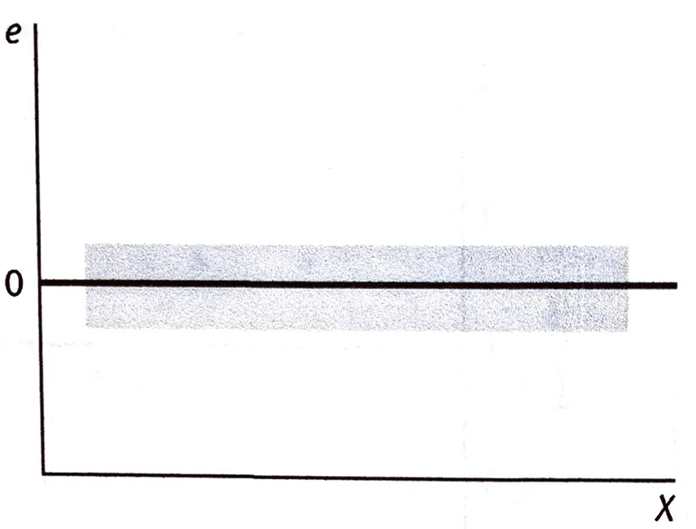
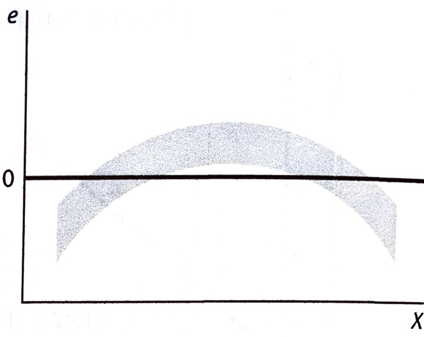
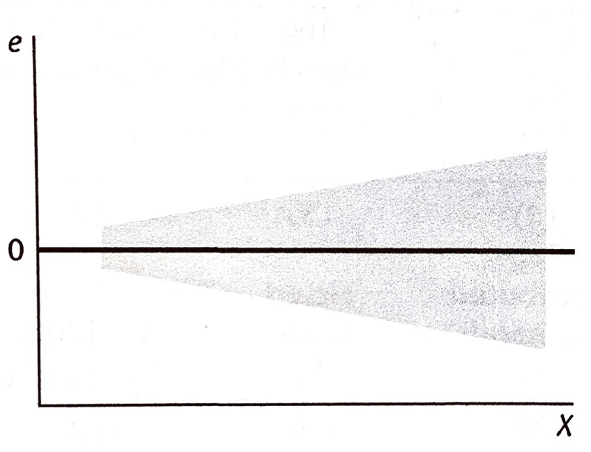
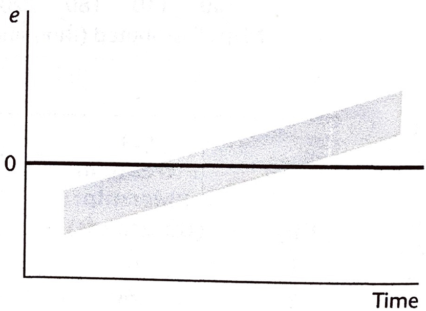
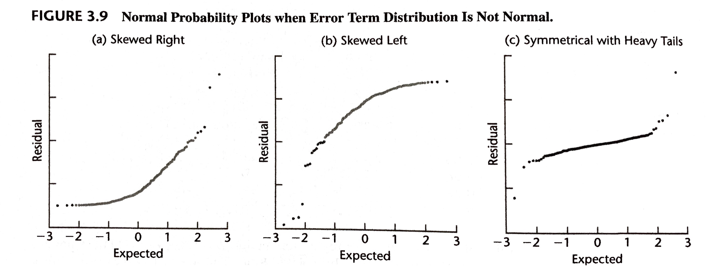
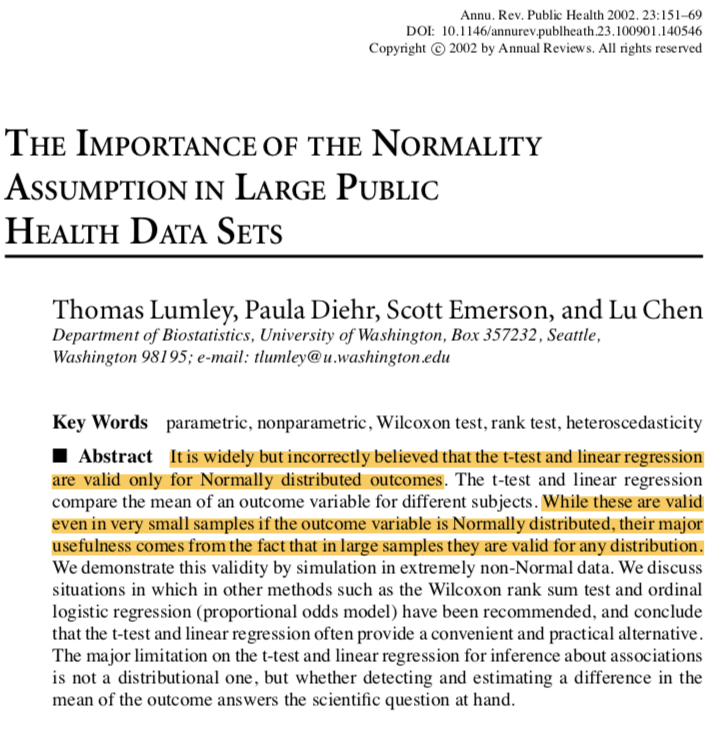
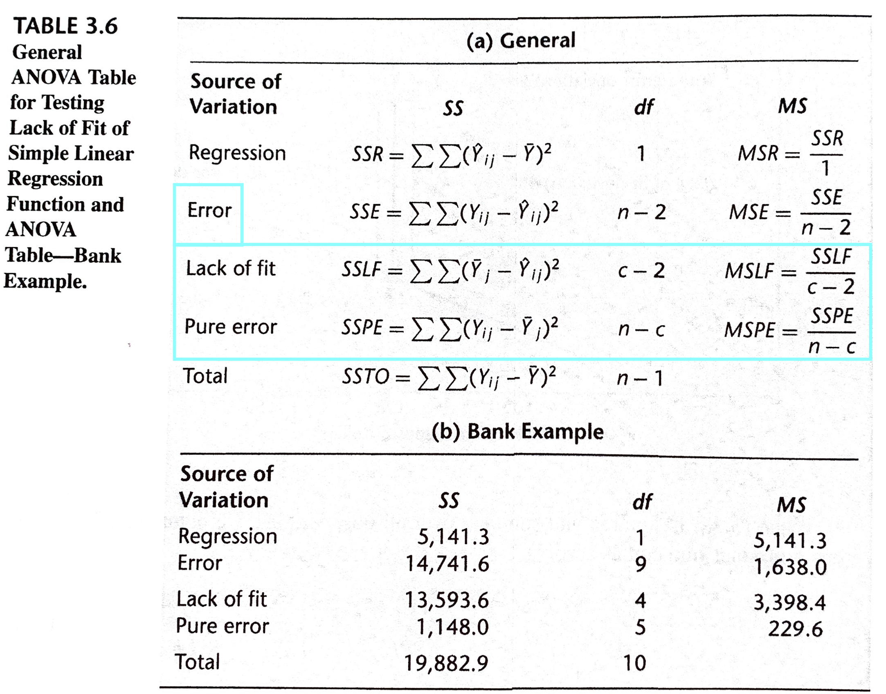

```{r xaringan-themer, include=FALSE}
library(xaringanthemer)
duo_accent(primary_color = "#006747", secondary_color = "#CFC493",   
	header_font_google = google_font("Josefin Sans"),
  text_font_google   = google_font("Montserrat", "300", "300i"),
  code_font_google   = google_font("Droid Mono"))
```


```{r setup, include=FALSE}
options(htmltools.dir.version = FALSE)
knitr::opts_chunk$set(fig.retina = 3, warning = FALSE, message = FALSE, fig.align="center", fig.height=5.5)
options(DT.options = list(scrollX = TRUE, pageLength=20, scrollY = 300))


library(here)
library(sjPlot)
library(sjmisc)
library(sjlabelled)
library(tidyverse)
library(ggplot2)
library(knitr)
library(mosaic)
library(DT)
library(car)
library(Hmisc)
library(rms)

#params
spending_subset_all = read.csv(here("data", "spending_subset.csv"))

spending_subset=spending_subset_all[1:200,]

par(lwd=3,cex=1.5) 
cdi = as_tibble(read.delim(here("data", "CDI.txt"), sep=" ", header=FALSE)[,-c(1:2)] %>% mutate(V18 = recode_factor(V18, "NE", "NC", "S", "W")))
names(cdi) = c("county", "state", "land_area", "population", "pop_18_to_34", "pop_65", "number_physicians", "number_hospital_beds", "total_serious_crimes", "high_school_grads", "bachelor_degrees", "poverty_rate", "unemployment_rate", "per_capita_income", "total_personal_income", "region")

tab_model <- function(...,  show.ci=.95){sjPlot::tab_model(...,  show.ci=show.ci, show.se=TRUE, collapse.ci=TRUE, show.stat=TRUE)}

mod_physician_beds = lm(number_physicians ~ number_hospital_beds, data=cdi)

```


### 3: Diagnostics and Remedial Measures

We can't be certain in advance that a regression model is appropriate. 

The features of the model, such as linearity of the regression function or normality of the error terms, may not be appropriate for the particular data at hand. 

It is important to examine the aptness of the model for the data before inferences based on that model are undertaken. 

---

### Learning Objectives for Sections 3.1-3.3 

After Sections 3.1-3.3, you should be able to 

- Distinguish between residual, studentized residuals, and error term
- Identify outlying $X$ values that could influence the regression function	
- Use residual plots to conduct regression diagnostics


---

### 3.1: Diagnostics for Predictor Variable

We begin by considering some graphic diagnostics for the predictor variable. 

We need diagnostic information about the predictor variable to see if there are any outlying $X$ values that could **influence** the appropriateness of the fitted regression function.


---

```{r, echo=FALSE, fig.height=4}
set.seed(42)
n =20
x <- sort(runif(n,0,10))
x[n] = x[n]+10
e <- rnorm(n,0,5)
y <- 3*x+5+e

xyplot(y~x,  type=c("p", "r"), ylim=c(0,65))
```

---

```{r, echo=FALSE, fig.height=4}
y[n] = 10
xyplot(y~x,  type=c("p", "r"), ylim=c(0,65))
```

---

```{r, echo=FALSE, fig.height=4}
set.seed(42)
n =20
x <- sort(runif(n,0,10))
x[n] = x[n]+10
e <- rnorm(n,0,5)
y <- 3*x+5+e

xyplot(y~x,  type=c("p", "r"), ylim=c(0,65))
```

---

```{r, echo=FALSE, fig.height=4}
y[(n-5):(n-1)] = 10
xyplot(y~x,  type=c("p", "r"), ylim=c(0,65))
```

---

```{r, fig.height=4}
boxplot(x, horizontal=TRUE)
```

```{r, fig.height=3}
dotPlot(~x)
```


---
layout: true
class: inverse

---

Income and Clothing Expenditure for a small subset of the Survey of Household Spending are displayed below:
 
```{r, fig.cap="", include=TRUE, message=FALSE, echo=TRUE, eval=TRUE, fig.height=4}
clothing_model = lm(clothing_expenditure~income, data=spending_subset)
xyplot(clothing_expenditure~income, data=spending_subset,  type=c("p", "r"))
```

---

```{r, fig.cap="", include=TRUE, message=FALSE, echo=TRUE, eval=TRUE, fig.height=c(4,3)}
boxplot(spending_subset$income, horizontal = TRUE)

dotPlot(~income, data=spending_subset)
```


---
### CDI: Pearson Correlation - physicians vs hospital beds

```{r,  fig.cap="", include=TRUE, fig.height=5}
xyplot(number_physicians ~ number_hospital_beds, data=cdi,  type=c("p", "r", "smooth"))
```

---

```{r, fig.cap="", include=TRUE, message=FALSE, echo=TRUE, eval=TRUE, fig.height=c(4,3)}
boxplot(cdi$number_hospital_beds, horizontal = TRUE)

dotPlot(~number_hospital_beds, data=cdi, cex=15, nint=20)
```


---
### CDI: Pearson Correlation - physicians vs population 


```{r,  fig.cap="", include=TRUE, fig.height=5}
xyplot(number_physicians ~ population, data=cdi,  type=c("p", "r", "smooth"))
```

---

```{r, fig.cap="", include=TRUE, message=FALSE, echo=TRUE, eval=TRUE, fig.height=c(4,3)}
boxplot(cdi$population, horizontal = TRUE)

dotPlot(~population, data=cdi, cex=15, nint=20)
```


---

### CDI: Pearson Correlation - physicians vs total income

```{r,  fig.cap="", include=TRUE, fig.height=5}
xyplot(number_physicians ~ total_personal_income, data=cdi,  type=c("p", "r", "smooth"))
```

---

```{r, fig.cap="", include=TRUE, message=FALSE, echo=TRUE, eval=TRUE, fig.height=c(4,3)}
boxplot(cdi$total_personal_income, horizontal = TRUE)

dotPlot(~total_personal_income, data=cdi, cex=15, nint=20)
```


<!-- Need to be VERY BRIEF in my lectures; do most explaining through examples throughout. Do not try to present everything. Let them read the book! -->

---

layout: false 

### 3.2 Residuals


The **residual** $e_i$ is the difference between the observed value and the fitted value:
$$e_i = Y_i - \hat Y_i$$

--

The residual may be regarded as the observed error, in distinction to the unknown **true error** in the regression model:
$$\varepsilon_i = Y_i - E[Y_i].$$

--

The error terms $\varepsilon_i$ are assumed to be independent normal random variables, with mean 0 and constant variance $\sigma^2$. 

If the model is appropriate for the data at hand, the observed residuals $e_i$ should then reflect these properties.


```{r, include=FALSE}
# 
# ---
# ### Properties of Residuals
# 
# **Mean:**
# 
# The mean of the $n$ residuals $e_i$ for the simple linear regression model is
# $$\bar{e} = \frac{\sum e_i}{n} = 0.$$
# Thus, since $\bar e$ is always $0$, it provides no information as to whether $E[\varepsilon_i] = 0.$
# 
# --
# 
# **Nonindependence:** 
# 
# The residuals $e_i$ are not independent random variables because they involve the fitted values $Y_i$ which are based on the same fitted regression function. This is especially problematic with small samples.
# 
# ---
```

---

### Semistudentized Residuals:


$$ e^\ast_i = \frac{e_i - \bar e}{\sqrt{MSE}} = \frac{e_i}{\sqrt{MSE}}.$$

--

<!-- If $\sqrt{MSE}$ were an estimate of the standard deviation of the residual $e_i$, we would call $e^\ast_i$ a *studentized residual*.  -->

* The standard deviation of $e_i$ is complex and varies for the different residuals $e_i$
* $\sqrt{MSE}$ is only an approximation of the standard deviation of $e_i$. 

Hence, we call the statistic $e^\ast_i$ a **semistudentized residual** 

--

Studentized residuals (which divide by the true sample standard deviation) are in Chapter 10. 

Both semistudentized residuals and studentized residuals can be very helpful in identifying outlying observations.

---

### Departures from Model to Be Studied by Residuals

Six important types of departures from the simple linear regression model with normal errors:

1. The regression function is not linear.
2. The error terms do not have constant variance.
3. The error terms are not independent.
4. The model fits all but one or a few outlier observations.
5. The error terms are not normally distributed.
6. One or several important predictor variables have been omitted from the model.

--

The following plots of residuals (or semistudentized residuals) will be used:

1. Plot of residuals against predictor variable.
2. Plot of absolute or squared residuals against predictor variable.
3. Plot of residuals against fitted values.
4. Plot of residuals against time or other sequence.
5. Plots of residuals against omitted predictor variables.
6. Box plot of residuals.
7. Normal probability plot of residuals.


<!-- herehere: basically only examples for all the following -->
---

### Nonlinearity of Regression Function

* Plot of residuals against predictor variable.
* Plot of residuals against fitted values.

We are looking at whether points fall within a band around the regression line. 

I.e., we are looking at whether residuals fall in a horizontal band around 0. 

.pull-left[
```{r, fig.cap="", include=TRUE, message=FALSE, echo=FALSE, out.width="60%"}

```
]

vs, for example, 

.pull-right[
```{r, fig.cap="", include=TRUE, message=FALSE, echo=FALSE, out.width="60%"}

```
]

---
layout: true
class: inverse

---

```{r, fig.height=4, fig.cap=""}
xyplot(resid(clothing_model)~predict(clothing_model), ylab="Residuals", xlab="Predicted Values", type=c("p", "smooth"))
```


* **Evaluate the appropriateness of the regression model based on the provided residual plots.**

---

* **Evaluate the appropriateness of the regression model based on the provided residual plots.**

<!-- PUT SELECT WARM UP RESPONSES HEREHERE (preceded by a ">"): -->
<!-- warm up question 3) 1 (answers related to linearity) -->

* Since the residual plots do not conform to a straight line and...  you can say this should not be a linear model.

* For residuals plotted against X or Y, an appropriate linear regression model should have the residuals fall within a horizontal band centered at zero displaying no systematic tendencies to be positive or negative, this would indicate linearity... The second residual plot (residuals and income) is a curve centered around zero. The residuals have a systematic tendency to vary between positive and negative, this plot indicates the linear regression is not appropriate and a curvilinear regression model would be more appropriate. The plot for residuals and food expenditure also does not have the residuals fall within a horizontal band centered at zero displaying no systematic tendencies to be positive or negative, therefore this also indicates the regression is not appropriate due to a lack of linearity in the relationship. 


---
* **Evaluate the appropriateness of the regression model based on the provided residual plots.**

<!-- PUT SELECT WARM UP RESPONSES HEREHERE (preceded by a ">"): -->
<!-- warm up question 3) 1 (answers related to linearity) -->

* the residual against the predictor variable income and the fitted value seemed similar

.pull-left[
```{r, fig.height=5, fig.cap=""}
xyplot(resid(clothing_model)~predict(clothing_model), ylab="Residuals", xlab="Predicted Values", type=c("p", "smooth"))
```
]

.pull-right[
```{r, fig.height=5, fig.cap=""}
xyplot(resid(clothing_model)~spending_subset$income, ylab="Residuals", xlab="Income", type=c("p", "smooth"))
```
]

---

* **Evaluate the appropriateness of the regression model based on the provided residual plots.**

<!-- PUT SELECT WARM UP RESPONSES HEREHERE (preceded by a ">"): -->
<!-- warm up question 3) 1 (answers related to linearity) -->

* The first residual plot (residuals and clothing expenditure) shows the residuals centered around a line with a steep slope, this indicates the relationship is not linear and therefore, model is not appropriate. 


.pull-left[
```{r, fig.height=4, fig.cap=""}
xyplot(resid(clothing_model)~spending_subset$clothing_expenditure, ylab="Residuals", xlab="Clothing Expenditure", type=c("p", "smooth"))
```
]

.pull-right[
```{r, fig.height=4, fig.cap=""}
xyplot(clothing_expenditure~income, data=spending_subset, ylab="Clothing Expenditure", xlab="Income", type=c("p", "smooth"))
```
]


---
layout: false

### Nonconstancy of Error Variance

* Plot of residuals against predictor variable.
* Plot of absolute or squared residual sagainst predictor variable.

We are looking for a constant variance in the residuals.

I.e., we are looking at whether residuals fall in a horizontal band around 0. 

.pull-left[
```{r, fig.cap="", include=TRUE, message=FALSE, echo=FALSE, out.width="60%"}

```
]

vs, for example, 

.pull-right[
```{r, fig.cap="", include=TRUE, message=FALSE, echo=FALSE, out.width="60%"}

```
]

---
layout: true
class: inverse
---

```{r, fig.height=3, fig.cap=""}
xyplot(resid(clothing_model)~predict(clothing_model), ylab="Residuals", xlab="Predicted Values", type=c("p", "smooth"))

xyplot(abs(resid(clothing_model))~predict(clothing_model), ylab="Absolute Residuals", xlab="Predicted Values", type=c("p", "smooth"))

```

---

* **Evaluate the appropriateness of the regression model based on the provided residual plots.**

<!-- PUT SELECT WARM UP RESPONSES HEREHERE (preceded by a ">"): -->
<!-- warm up question 3) 1 (answers related to homogeneity of variance) -->

* For an appropriate regression model, a plot of residuals and predicted values should fall in a straight horizontal line indicating constant error variance. This is not the case for this model, therefore the relationship has nonconstant error variance, therefore model is not appropriate. 

* the variability of error is large when the predictor variable income is small and large. the variability is smaller when the income is in the middle of the horizontal axis. we can tell it clearly when we look at it on absolute residual plot, but it indicating pretty much the similar thing that when income is small, income is large the variability of error is large

---

* **Evaluate the appropriateness of the regression model based on the provided residual plots.**

<!-- PUT SELECT WARM UP RESPONSES HEREHERE (preceded by a ">"): -->
<!-- warm up question 3) 1 (answers related to homogeneity of variance) -->

* For an appropriate model, the plot for the absolute value for the residuals and predicted value should have a cone like shape which would also indicate constant error variance. This is not the case for this model, therefore the model is not appropriate. 

* The plot for residuals v.s. predicted values shows that the distribution is far from normal, because according to the smooth curve, the distribution is skewed to the left (concave down). 

* The plot for the residuals v.s. X (income) shows ... that the error terms are independent , since the points are randomly scattered around the 0 line on both sides. 

---

<!-- ### physicians vs hospital beds -->

```{r, fig.height=3, fig.cap=""}
xyplot(resid(mod_physician_beds)~predict(mod_physician_beds), ylab="Residuals", xlab="Predicted Values", type=c("p", "smooth"))

xyplot(abs(resid(mod_physician_beds))~predict(mod_physician_beds), ylab="Absolute Residuals", xlab="Predicted Values", type=c("p", "smooth"))

```


---
layout: false


### Presence of Outliers
* Plot of residuals against predictor variable.
* Plot of residuals against fitted values.
* Box plot of (semi-studentized) residuals.

We are looking for extreme observations. 

Outliers can create great difficulty: their *squared deviation* will be huge and will disproportionately impact the least squares estimates. 

---
layout: true
class: inverse
---

```{r, fig.height=3, fig.cap=""}
boxplot(resid(clothing_model), ylab="Residuals", horizontal=TRUE)

boxplot(resid(clothing_model)/summary(clothing_model)$sigma, ylab="Residuals", horizontal=TRUE)
```
--

A rough rule of thumb ... is to consider semistudentized residuals with absolute value of four or more to be outliers.

---

* **Evaluate the appropriateness of the regression model based on the provided residual plots.**

<!-- PUT SELECT WARM UP RESPONSES HEREHERE (preceded by a ">"): -->
<!-- warm up question 3) 1 (answers related to outliers) -->

* from the box plot, we can see that there are several outliers in the data set

* The boxplot and the plot of residuals and norm quantiles indicates there are many outliers. The large number of outliers also indicates the regression model is not appropriate. Overall, the plots indicate the regression model is not appropriate.


---
<!-- ### physicians vs hospital beds -->

```{r, fig.height=3, fig.cap=""}
xyplot(number_physicians ~ number_hospital_beds, data=cdi, ylab="Residuals", xlab="Predicted Values", type=c("p", "smooth"))


boxplot(resid(mod_physician_beds)/summary(mod_physician_beds)$sigma, ylab="Semi-studentized Residuals", horizontal=TRUE)


```


---
layout: false

### Nonindependence of Error Terms
* Plot of residuals against time or other sequence.


```{r, fig.cap="", include=TRUE, message=FALSE, echo=FALSE, out.width="60%"}

```

---

This type of plot usually makes more sense for experimental studies, where we are worried that something changes over time as the experiment runs (processes change, protocols evolve, tools breakdown, etc). 

For observational studies, we normally need to explore the study design for potential violations to the independence assumption: 

* clustering of students in schools
* similar spending habits in different provinces
* etc.

---

### Nonnormality of Error Terms

* Box plot of residuals.
* Normal probability plot of residuals.

Look for linearity in a normal probability (Q-Q) plot


```{r, fig.cap="", include=TRUE, message=FALSE, echo=FALSE, fig.height=4}

```


---
layout: true
class: inverse
---

```{r, fig.height=5.5, fig.cap="", results="hide"}
car::qqPlot(resid(clothing_model), ylab="Residuals")
```


---

```{r, fig.height=3, fig.cap=""}
xyplot(resid(clothing_model)~predict(clothing_model), ylab="Residuals", xlab="Predicted Values", type=c("p", "smooth"))

boxplot(resid(clothing_model), ylab="Residuals", horizontal=TRUE)
```


---

* **Evaluate the appropriateness of the regression model based on the provided residual plots.**

<!-- PUT SELECT WARM UP RESPONSES HEREHERE (preceded by a ">"): -->
<!-- warm up question 3) 1 (answers related to normality) -->

* The distribution is far from normal... the box-and-whisper plot that shows the median (2nd quartile) dividing the box unequally, with it being closer to the 1st quartile, showing that the distribution is skewed to the right. 

* From the box plot, we can say that the data is skew to right.  From the qq plot, data in the middle tend to be normally distributed, but not for the data at the head and the tail.

---

### physicians vs hospital beds

```{r, fig.height=5.5, fig.cap="", results="hide"}
car::qqPlot(resid(mod_physician_beds), ylab="Residuals")
```

---

```{r, fig.height=3, fig.cap=""}
xyplot(resid(mod_physician_beds)~predict(mod_physician_beds), ylab="Residuals", xlab="Predicted Values", type=c("p", "smooth"))

boxplot(resid(mod_physician_beds), ylab="Residuals", horizontal=TRUE)
```

---
layout: false


### Omission of Important Predictor Variables

* Plots of residuals against omitted predictor variables.

Look at whether there are other key variables that could provide important additional descriptive and predictive power to the model.

These additional variables may make our assumptions more tenable, or they may simply make our model better at predicting. 

```{r, fig.cap="", include=TRUE, message=FALSE, echo=FALSE, fig.height=4}

```


---
layout: true
class: inverse
---

```{r, fig.height=6, fig.cap=""}
clothing_model = lm(clothing_expenditure~income, data=spending_subset)
xyplot(resid(clothing_model)~spending_subset$food_expenditure, ylab="Residuals = clothing_expenditure - (b0 + b1 income) ", xlab="Food Expenditure", type=c("p", "r"))
```

---

* **Evaluate the appropriateness of the regression model based on the provided residual plots.**

<!-- PUT SELECT WARM UP RESPONSES HEREHERE (preceded by a ">"): -->
<!-- warm up question 3) 1 (answers related to omission of "food expenditure) -->

* The plot for residuals and food expenditure also does not have the residuals fall within a horizontal band centered at zero displaying no systematic tendencies to be positive or negative, therefore this also indicates the regression is not appropriate due to a lack of linearity in the relationship.

* the error varies a lot when the food expenditure is large. 


---
```{r, fig.height=3, fig.cap=""}
xyplot(resid(mod_physician_beds)~cdi$population, ylab="Residuals", xlab="Population", type=c("p", "smooth"))

xyplot(resid(mod_physician_beds)~cdi$total_personal_income, ylab="Residuals", xlab="Total Personal Income", type=c("p", "smooth"))
```


---
layout: false

### Some Final Comments

1. Several types of departures may occur together. 

2. Although graphic analysis of residuals is only an informal method of analysis, in many cases it suffices for examining the aptness of a model.

3. The basic approach to residual analysis explained here applies not only to simple linear regression but also to more complex regression and other types of statistical models.

---

### Some Final Comments


* The presence of outliers can be serious for smaller data sets when their influence is large. 

* nonindependence of error terms results in estimators that are unbiased but whose variances are seriously biased. 

* Nonconstancy of error variance tends to be less serious, leading to less efficient estimates and invalid error variance estimates. 

---

### Recap: Sections 3.1-3.3 

After Sections 3.1-3.3, you should be able to 

- Distinguish between residual, studentized residuals, and error term
- Identify outlying $X$ values that could influence the regression function	
- Use residual plots to conduct regression diagnostics


---

### Learning Objectives for Sections 3.4-3.7

After Sections 3.4-3.7, you should be able to 

-	Understand that their are formal tests for residual diagnostics	
- Apply formal tests for normality and constant variance
- Carry out and interpret the F test for lack of fit. 


---

### 3.4: Overview of Tests Involving Residuals

Graphic analysis of residuals is inherently subjective. 

Nevertheless, subjective analysis of a variety of interrelated residual plots will frequently reveal difficulties with the model more clearly than particular formal tests. 

There are occasions, however, when one wishes to put specific questions to a test. 

We will *briefly* review some of the relevant tests.

---


### Tests for Outliers

A simple test for identifying an outlier observation involves fitting a new regression line to the other $n-1$ observations and determining the probability that, in $n$ observations, a deviation from the fitted line as great as that of the outlier will be obtained by chance. 

* We will discuss this more in Chapter 10. 

---

### Tests for Normality

Goodness of fit tests can be used for examining the normality of the error terms. 

For instance, the chi-square test or the Kolmogorov-Smirnov test and its modification, the Lilliefors test, can be employed for testing the normality of the error terms by analyzing the residuals. 

---

### 3.5: Correlation Test for Normality

In addition to visually assessing the approximate linearity of the points plotted in a normal probability plot, a formal test for normality of the error terms can be conducted by calculating the coefficient of correlation between the residuals $e_i$ and their expected values under normality. 

A high value ( $> .987$ for $n \geq 100$; see Table B.6) of the correlation coefficient is indicative of normality. 


---

layout: true
class: inverse

---


```{r} 
olsrr::ols_test_correlation(clothing_model)

olsrr::ols_test_normality(clothing_model)
```

```{r, fig.height=3, fig.cap="", results="hide"}
car::qqPlot(resid(clothing_model), ylab="Residuals")
```

---

layout: false


```{r, fig.cap="", include=TRUE, message=FALSE, echo=FALSE, out.width="60%"}

```

<!-- errors being normally distributed ==> \beta_0 and \beta_1 being normally distributed ==> \hat Y being normally distributed, so CIs and hypothesis testing are appropriate.  -->
<!-- However, we can get \beta_0 and \beta_1 being normally distributed from the CLT if n is big enough ("big enough" depends on the degree of non-normality of errors) -->


---


> The t-test and least-squares linear regression do not require any assumption of Normal distribution in sufficiently large samples. Previous simulations studies show that “sufficiently large” is often under 100, and even for our extremely non-Normal medical cost data it is less than 500.

--

> Formal  statistical  tests for Normality are especially undesirable as they will have low power in the small samples where the distribution matters and high power only in large samples where the distribution is unimportant.


---
class: inverse

### SHS: Sampling distribution of $b_1$
```{r}
b1 = lm(clothing_expenditure~income, data=spending_subset)$coef[2]
for (i in 1:1000)
{ n=200
  spending_subset_resample = dplyr::sample_n(spending_subset_all, size=n, replace=TRUE)
  b1 = c(b1, lm(clothing_expenditure~income, data=spending_subset_resample)$coef[2])}
```

.pull-left[
```{r, fig.cap="", include=TRUE, message=FALSE, echo=TRUE, fig.height=4}
histogram(b1)
```
]

.pull-right[
```{r, fig.cap="", include=TRUE, message=FALSE, results="hide", echo=TRUE, fig.height=4}
qqPlot(b1)
```
]

--

```{r}
confint(clothing_model)[2,]
```


---

> A more important assumption is that the variance of $Y$ is constant... differences in the variance of $Y$ for different values of $X$ (heteroscedasticity) result in coefficient estimates $\hat \beta$ that still have a Normal distribution, ... [but] the variance estimates may be incorrect.


---

### 3.6: Tests for Constancy of Error Variance

Simple tests for constancy of the error variance:

* look at the rank correlation between the absolute values of the residuals and the corresponding values of the predictor variable

* the Brown-Forsythe test

* the Breusch-Pagan test

---

### Brown-Forsythe test

We want to know if the variance of $e_i$ changes as $X$ changes.

1. Divide the residuals into two groups: those from small $X$ and those from large $X$

2. Find the absolute deviations of the residuals around the median 

3. Test whether these deviations have the same mean in the two different groups

--

This will tell us if the residuals tend to vary a lot more in one of the groups. 

---
layout:true

class: inverse
---

```{r}
spending_subset$income_range = gtools::quantcut(spending_subset$income, 2)

```

```{r, echo=FALSE}
spending_subset %>% datatable()
```

---

```{r}
residuals_lowest_earners = residuals(clothing_model)[spending_subset$income_range == levels(spending_subset$income_range)[1]]

residuals_highest_earners = residuals(clothing_model)[spending_subset$income_range == levels(spending_subset$income_range)[2]]

deviations_lowest_earners = abs(residuals_lowest_earners - median(residuals_lowest_earners))

deviations_highest_earners = abs(residuals_highest_earners - median(residuals_highest_earners))

t.test(deviations_lowest_earners , deviations_highest_earners)
```

---
layout: false

### Breusch-Pagan test

Determine whether there is a relationship between the squared residuals and $X$:

* Test $H_0: \gamma_1 = 0 \quad$ in $\qquad \ln \sigma_i^2 = \gamma_0 + \gamma_1 X_i$


```{r}
lmtest::bptest(clothing_model)
```

--

The Breusch-Pagan test can be modified to allow for different relationships between the error variance and the level of $X$. 

---

### 3.7: $F$ Test for Lack of Fit

We can apply the *General Linear Test Approach* to determine whether a specific type of regression function adequately fits the data.

The lack of fit test requires at least some **replication**: repeat observations at one or more $X$ levels.

---

layout: false

Notation: 

* $X_1, \ldots, X_c$ now represent the $c$ different levels of the study
* $n_1, \ldots, n_c$ represent the number of *replicates* at each level of $X$. 
* $Y_{ij}$ represents the $i$th replicate at level $X_j$. 

Full Model:

$$Y_{ij} = \mu_j + \epsilon_{ij}$$

Reduced Model:

$$Y_{ij} = \beta_0 + \beta_1 X_j + \epsilon_{ij}$$

--

Notice that in the Full model $\hat Y_{ij} = \hat \mu_j = \bar Y_j$.

In the Reduced model $\hat Y_{ij} = b_0 + b_1 X_j = \hat Y_j$	

---

$$\begin{align*}
SSE(F) &= \sum_j \sum_i (Y_{ij} - \bar Y_j)^2 = SSPE \text{ (Pure Error)}\\
SSE(R) &= \sum_j \sum_i (Y_{ij} - \hat Y_j)^2 = SSE
\end{align*}$$

* $SSE$ captures the "error" in $Y$ that cannot be explained by a linear relationship with $X$. 
* $SSPE$ captures the "pure error" in $Y$ that cannot be explained any relationship with $X$.


--

The **Lack of Fit sum of squares** captures the difference:
$$ SSLF = SSE - SSPE$$

$$\begin{align*}
F^\ast &= \frac{SSE(R)−SSE(F)}{df_R−df_F} \div \frac{SSE(F)}{df_F}\\
&= \frac{SSLF}{c−2} \div \frac{SSPE}{n-c}\\
&= \boxed{\frac{MSLF}{MSPE}}
\end{align*}$$

---

```{r, fig.cap="", include=TRUE, message=FALSE, echo=FALSE, out.width="100%"}

```

---

```{r, bank, include=FALSE}
bank_data = read.delim(here("data", "CH03TA04.txt"), header =FALSE, sep=" ")

names(bank_data) = c("size_of_minimum_deposits", "number_of_new_accounts")
```

```{r}
bank_data %>% datatable()
```

---

```{r}
bank_model = lm(number_of_new_accounts~size_of_minimum_deposits, data=bank_data)
anova(bank_model)
alr3::pureErrorAnova(lm(number_of_new_accounts~size_of_minimum_deposits, data=bank_data))
```

---
```{r}
bank_model = lm(number_of_new_accounts~size_of_minimum_deposits, data=bank_data)
anova(bank_model)
bank_model_full = lm(number_of_new_accounts~factor(size_of_minimum_deposits), data=bank_data)
anova(bank_model, bank_model_full)
```

---
```{r, fig.height=4}
plot(bank_data$size_of_minimum_deposits, bank_data$number_of_new_accounts);  abline(bank_model,col="red"); newx = 50:200; preds = predict(bank_model, newdata=data.frame(size_of_minimum_deposits=newx), interval="confidence"); lines(newx, preds[,3], lty="dashed", col="red"); lines(newx, preds[,2], lty="dashed", col="red")
```

--

* There is no *linear association* between minimum deposit size and number of new accounts. 
* However, there is a definite relationship, but the regression function is not linear. 
* A study of residuals can be helpful in identifying an appropriate function.

This illustrates the importance of always examining the appropriateness of a model before any inferences are drawn.

---

layout: true
class: inverse

---
### SHS: Lack of Fit

```{r}
clothing_model = lm(clothing_expenditure~income, data=spending_subset)

clothing_model_full = lm(clothing_expenditure~factor(income), data=spending_subset)
```

```{r, fig.cap="", include=TRUE, message=FALSE, echo=TRUE, eval=TRUE, fig.height=4}
xyplot(clothing_expenditure~income, data=spending_subset,  type=c("p", "r"))
```

---

```{r, echo=TRUE, message=FALSE}
anova(clothing_model)
anova(clothing_model, clothing_model_full)
```

Notice that the “Pure Error SS” is 351920325 and the “Lack of Fit SS” is 178809400.

* **Report the "Pure Error Mean Square" (351920325/136), and the "Lack of Fit Mean Square" (178809400/62), and the p-value testing lack of fit (0.2983)**

---

* **Interpret the p-values from both ANOVA tables in context.**

<!-- PUT SELECT WARM UP RESPONSES HEREHERE (preceded by a ">"): -->
<!-- warm up question 3) 2 -->

* From the first ANOVA table, the p-value is 0.0015915429, which is very small (smaller than 0.01), so we reject the null hypothesis, so there is a linear association between income and clothing expenditures. From the second ANOVA table, the p-value is 0.298283808, which is greater than alpha = 0.1, 0.05, 0.01. So, we fail to reject the null hypothesis, so we fail to disprove the appropriateness of the linear regression function.

* 1- P being 0.0015915429 shows that the null hypothesis of B1=0 being true is very unlikely, showing that there is a linear relationship between income and money spent on clothing in a year. 

* The p-value for the first ANOVA table is 0.0015915429. This indicates that at a significance level of 0.01 the null hypothesis can be rejected. Therefore, it can be concluded that income and clothing expenditure are related. The p-value for the second ANOVA table is 0.298283808. This indicates that at a significance level of 0.05 the null hypothesis has failed to be rejected. Therefore, there is not enough evidence at a significance level of 0.05 to conclude that there is a lack of fit in the simple linear regression model.
---

* **Interpret the p-values from both ANOVA tables in context.**

<!-- PUT SELECT WARM UP RESPONSES HEREHERE (preceded by a ">"): -->
<!-- warm up question 3) 2 -->

*  p value at the first ANOVA table is for the hypothesis testing of b1, as the p value is small we reject the null hypothesis and conclude that there is a relationship between income and clothing expenditure. While the p value in second ANOVA table is large, which we fail reject the null hypothesis and conclude the there is a linear relationship between 2 variables. as the f test is comparing the full model (mean value) with the reduced model (yhat = beta0 + beta1 * x) and null hypothesis is 2 variables have linear relationship.
  
* We have a P= 0.298283808 probability of accepting the alternate hypothesis of the B1=/=0 where there is a linear relationship between income and money spent on clothing in a year.

* The first p-value(0.0015915429) indicates that we should reject the null hypotheses B1=0, hence there is no linear relationship. The second p-value(0.298283808) is pretty high which indicates that we fail to reject the null hypothesis B1=0. From this we get two different answers regarding the income and the clothing expenditures, one p-value says that there is a linear relationship whether the other tells us that there is not a linear relationship.

---
### CDI: Lack of Fit - physicians vs hospital beds

```{r,  fig.cap="", include=TRUE}
xyplot(number_physicians ~ number_hospital_beds, data=cdi,  type=c("p", "r", "smooth"))
```

---

```{r,  echo = TRUE}
mod_physician_beds = lm(number_physicians ~ number_hospital_beds, data=cdi)
anova(mod_physician_beds)

mod_physician_beds_full = lm(number_physicians ~ factor(number_hospital_beds), data=cdi)
anova(mod_physician_beds, mod_physician_beds_full)

```

* **In your own words, interpret this output.**


---
### CDI: Lack of Fit - physicians vs population 


```{r,  fig.cap="", include=TRUE}
xyplot(number_physicians ~ population, data=cdi,  type=c("p", "r", "smooth"))
```

---

```{r,  echo = TRUE}
mod_physician_pop = lm(number_physicians ~ population, data=cdi)
anova(mod_physician_pop)

mod_physician_pop_full = lm(number_physicians ~ factor(population), data=cdi)
anova(mod_physician_pop, mod_physician_pop_full)
```


* **In your own words, interpret this output.**


---

### CDI: Lack of Fit - physicians vs total income

```{r,  fig.cap="", include=TRUE}
xyplot(number_physicians ~ total_personal_income, data=cdi,  type=c("p", "r", "smooth"))
```

---

```{r,  echo = TRUE}
mod_physician_income = lm(number_physicians ~ total_personal_income, data=cdi)
anova(mod_physician_income)

mod_physician_income_full = lm(number_physicians ~ factor(total_personal_income), data=cdi)
anova(mod_physician_income, mod_physician_income_full)
```

* **In your own words, interpret this output.**


---

layout: false

### Recap: Sections 3.4-3.7

After Sections 3.4-3.7, you should be able to 

-	Understand that their are formal tests for residual diagnostics	
- Apply formal tests for normality and constant variance
- Carry out and interpret the F test for lack of fit. 


---

### Learning Objectives for Sections 3.8-3.10

After Sections 3.8-3.10, you should be able to 

-	Understand the utility of transformations and when they could be applied.
- Assess the shape of the regression function using smoothed curves. 


---

### 3.8: Overview of Remedial Measures

If the simple linear regression model is not appropriate for a data set, there are two basic choices:

1. Develop a more complex model on the original data
2. Employ some transformation on the data so that regression model (2.1) is appropriate for the transformed data.

--

Successful use of transformations leads to relatively simple methods of estimation and may involve fewer parameters than a complex model, an advantage when the sample size is small. 

Transformations may obscure the fundamental interconnections between the variables, though at other times they may illuminate them.

```{r, include=FALSE}
# 
# --
# 
# We consider the use of transformations in this chapter and the use of more complex models in later chapters. First, we provide a brief overview of remedial measures.
# 
# ---
# 
# ### Nonlinearity of Regression Function
# 
# 
# When the regression function is not linear, we might use a polynomial regression function (Chapter 7):
# $$ E[Y] = \beta_0 + \beta_1 X  + \beta_1 X^2$$
# or a nonlinear regression function (Part III):
# $$ E[Y] = \beta_0 \cdot \beta_1^X$$
# 
# --
# Today, we will discuss 
# 
# * employing a transformation to approximately linearize a nonlinear regression function, and
# * exploratory analysis that does not require specifying a particular type of function
# 
# ---
# 
# ### Nonconstancy of Error Variance
# 
# When the error variance is not constant but varies in a systematic fashion, a direct approach is to modify the model to allow for this and use the method of **weighted least squares** to obtain the estimators of the parameters (Chapter 11).
# 
# Transformations can also be effective in stabilizing the variance.
# 
# ---
# 
# ### Nonindependence of Error Terms
# 
# When the error terms are correlated, a direct remedial measure is to work with a model that calls for correlated error terms (Chapter 12). 
# 
# ---
# 
# ### Nonnormality of Error Terms
# 
# Lack of normality and nonconstant error variances frequently go hand in hand. 
# 
# Fortunately, it is often the case that the same transformation that helps stabilize the variance is also helpful in approximately normalizing the error terms. 
# 
# It is therefore desirable that the transformation for stabilizing the error variance be utilized first, and then the residuals studied to see if serious departures from normality are still present. 
# 
# ---
# 
# ### Omission of Important Predictor Variables
# 
# When residual analysis indicates that an important predictor variable has been omitted from the model, the solution is to modify the model. In Chapter 6 and later chapters, we discuss multiple regression analysis in which two or more predictor variables are utilized.
# 
# ---
# 
# ### Outlying Observations
# 
# When outlying observations are present, as in Figure 3.7a, use of the least squares and maximum likelihood estimators (1.10) for regression model (2.1) may lead to serious dis- tortions in the estimated regression function. When the outlying observations do not repre- sent recording errors and should not be discarded, it may be desirable to use aruestimation procedure that places less emphasis on such outlying observations. We discuss one such robust estimation procedure in Chapter 11.
```

---

### 3.9: Transformations

Simple transformations of either the response variable $Y$ or the predictor variable $X$, or of both, are often sufficient to make the simple linear regression model appropriate for the transformed data.


---

### Transformations for Nonlinear Relation Only

Consider transformations for linearizing a nonlinear regression relation when 

* the distribution of the error terms is reasonably close to a normal distribution and 
* the error terms have approximately constant variance. 

--

In this situation, transformations on $X$ should be attempted. 

Transformations on $Y$ may not be desirable here because something like $Y' = \sqrt{y}$, may materially change the shape of the distribution of the error terms from the normal distribution and may also lead to substantially differing error term variances.


---
.pull-left[
```{r, fig.height=4}
n=500
X = runif(n, min=1, max=20)
Y = rnorm(n, mean=X^2, sd=10)
xyplot(Y~X, type=c("p", "r"))
xyplot(Y~X^2, type=c("p", "r"))
```
]

.pull-right[
```{r, fig.height=4}
n=500
X = runif(n, min=1, max=5)
Y = rnorm(n, mean=exp(X), sd=5)
xyplot(Y~X, type=c("p", "r"))
xyplot(Y~exp(X), type=c("p", "r"))
```
]


---

.pull-left[
```{r, fig.height=4}
n=500
X = runif(n, min=1, max=20)
Y = rnorm(n, mean=sqrt(X), sd=.1)
xyplot(Y~X, type=c("p", "r"))
xyplot(Y~sqrt(X), type=c("p", "r"))
```
]

.pull-right[
```{r, fig.height=4}
n=500
X = runif(n, min=1, max=20)
Y = rnorm(n, mean=log(X), sd=.1)
xyplot(Y~X, type=c("p", "r"))
xyplot(Y~log(X), type=c("p", "r"))
```
]

```{r spline, include=FALSE}
Y = Y[order(X)]
X = sort(X)
mod = lm(Y~rcs(X,5))

plot(X,mod$fitted.values,
     col = "red",
     xlim = c(min(X),max(X)),
     ylim = c(min(Y),max(Y)), type="l", lwd=3)
points(X,Y)
```

---

.pull-left[
```{r, fig.height=4}
n=500
X = runif(n, min=.1, max=2)
Y = rnorm(n, mean=1/X, sd=.2)
xyplot(Y~X, type=c("p", "r"))
xyplot(Y~1/X, type=c("p", "r"))
```
]

.pull-right[
```{r, fig.height=4}
n=500
X = runif(n, min=.1, max=2)
Y = rnorm(n, mean=exp(-X), sd=.02)
xyplot(Y~X, type=c("p", "r"))
xyplot(Y~exp(-X), type=c("p", "r"))
```
]

---

Several alternative transformations may be tried. 

Scatter plots and residual plots based on each transformation should then be prepared and analyzed, to decide which transformation is most effective.

---

### Transformations for Nonnormality and Unequal Error Variances


To remedy unequal error variances and nonnormality of the error terms, we can try a transformation on $Y$.

A transformation on $Y$ may also at the same time help to linearize a curvilinear regression relation. 

At other times, a simultaneous transformation on $X$ may be needed to obtain or maintain a linear regression relation.

--

Frequently, the skewness and variability of the distributions of the error terms increasing as $E[Y]$ increases. 


For example, in a regression of yearly household expenditures for vacations (Y) on household income (X), there will tend to be more variation and greater positive skewness (i.e., some very high yearly vacation expenditures) for high-income households than for low-income households, who tend to consistently spend much less for vacations. 


---

.pull-left[
```{r, fig.height=4}
n=500
X = runif(n, min=2, max=20)
sqrtY = rnorm(n, mean=X, sd=1)
Y = sqrtY^2
xyplot(Y~X, type=c("p", "r"))
xyplot(sqrt(Y)~X, type=c("p", "r"))
```
]

```{r XvsY, include=FALSE}
xyplot(Y~X, type=c("p", "r"))
xyplot(Y~X^2, type=c("p", "r"))
mod = lm(Y~I(X^2)); 
xyplot(residuals(mod)~predict(mod), type=c("p", "r"))
xyplot(abs(residuals(mod))~predict(mod), type=c("p", "r"))
```

.pull-right[
```{r, fig.height=4}
n=500
X = runif(n, min=5, max=10)
logY = rnorm(n, mean=X, sd=.1)
Y = exp(logY)
xyplot(Y~X, type=c("p", "r"))
xyplot(log(Y)~X, type=c("p", "r"))
```
]


---

.pull-left[
```{r, fig.height=4}
n=500
X = runif(n, min=5, max=20)
invY = rnorm(n, mean=X, sd=1)
Y = 1/invY
xyplot(Y~X, type=c("p", "r"))
xyplot((1/Y)~X, type=c("p", "r"))
```
]

.pull-right[
```{r, fig.height=4}
n=500
X = runif(n, min=5, max=30)
expY = rnorm(n, mean=X, sd=1)
Y = log(expY)
xyplot(Y~X, type=c("p", "r"))
xyplot(exp(Y)~X, type=c("p", "r"))
```
]

---

1. At times it may be desirable to introduce a constant into a transformation of $Y$, such as when $Y$ may be negative.
	+ For instance, the logarithmic transformation to shift the origin in $Y$ and make all $Y$ observations positive would be $Y' = log(Y+k)$, where $k$ is an appropriately chosen constant.

2. When unequal error variances are present but the regression relation is linear, a transformation on $Y$ may not be sufficient. While such a transformation may stabilize the error variance, it will also change the linear relationship to a curvilinear one. A transformation on $X$ may therefore also be required. 
	+ This case can also be handled by using weighted least squares (Chapter 11).

---

```{r, fig.height=3}
n=500
logX = runif(n, min=1, max=4)
X = exp(logX)
logY = rnorm(n, mean=logX, sd=.1)
Y = exp(logY)
xyplot(Y~X, type=c("p", "r"))
```

.pull-left[
```{r, fig.height=3}
xyplot(log(Y)~X, type=c("p", "r"))
```
]

.pull-right[
```{r, fig.height=3}
xyplot(log(Y)~log(X), type=c("p", "r"))
```
]

```{r logvsqrt, include=FALSE}
xyplot(sqrt(Y)~sqrt(X), type=c("p", "r"))
```
---
### Box-Cox Transformations


It is often difficult to determine from diagnostic plots which transformation of $Y$ is most appropriate for correcting skewness of the distributions of error terms, unequal error variances, and nonlinearity of the regression function.

The Box-Cox procedure automatically identifies a transformation from the family of power transformations on $Y$:
$$Y(\lambda) = \beta_0 + \beta_1 X + \varepsilon,$$
where

$${Y(\lambda) = \left \{ \begin{array}{ll} (Y^\lambda-1)/\lambda, & \text{ if } \lambda \neq 0 \\ \log Y, & \text{ if } \lambda = 0 \\ \end{array} \right. }$$

--

Note that the transformation $(Y^\lambda-1)/\lambda$ essentially amounts to using the transformation $Y^\lambda$.


---

.pull-left[
```{r, fig.height=4}
n=500
X = runif(n, min=2, max=20)
sqrtY = rnorm(n, mean=X, sd=1)
Y = sqrtY^2
xyplot(Y~X, type=c("p", "r"))
MASS::boxcox(lm(Y~X))
```
]

.pull-right[
```{r, fig.height=4}
n=500
X = runif(n, min=5, max=10)
invY = rnorm(n, mean=X, sd=1)
Y = 1/invY
xyplot(Y~X, type=c("p", "r"))
MASS::boxcox(lm(Y~X))
```
]


---

.pull-left[
```{r, fig.height=4}
n=500
X = runif(n, min=5, max=10)
logY = rnorm(n, mean=X, sd=.1)
Y = exp(logY)
xyplot(Y~X, type=c("p", "r"))
MASS::boxcox(lm(Y~X))
```
]

.pull-right[
```{r, fig.height=4}
n=500
X = runif(n, min=5, max=30)
expY = rnorm(n, mean=X, sd=1)
Y = log(expY)
xyplot(Y~X, type=c("p", "r"))
MASS::boxcox(lm(Y~X), seq(-5, 5, 1/10))
```
]

---

.pull-left[
```{r, fig.height=5}
n=500
X = runif(n, min=5, max=30)
expY = rnorm(n, mean=X, sd=1)
Y = log(expY)
xyplot(Y^4~X, type=c("p", "r"))
```
]

.pull-right[
```{r, fig.height=5}
MASS::boxcox(lm(Y^4~X), seq(-5, 5, 1/10))
```
]


---
layout: true
class: inverse

---

### SHS: Transformations


The Canadian Survey of Household Spending is carried out annually across Canada. 

(http://dli-idd-nesstar.statcan.gc.ca.proxy.library.upei.ca/webview/) 

The main purpose of the survey is to obtain detailed information about household spending. Information is also collected about dwelling characteristics as well as household equipment. 

The survey data are used by the following groups:

* Government departments use the data to help formulate policy; 
* Community groups, social agencies and consumer groups use the data to support their positions and to lobby governments for social changes; 
* Lawyers and their clients use the data to determine what is fair for child support and other compensation; 
* Labour and contract negotiators rely on the data when discussing wage and cost-of-living clauses; 
* Individuals and families can use the data to compare their spending habits with those of similar types of households. 

---

```{r, include=TRUE}
###A subset of the latest Survey of Household Spending data are displayed below:
spending_subset %>% datatable()
```

We are interested in the potential relationship between the income of working Canadians and the amount that they spend on clothing in a year.


---

Income and Clothing Expenditure for a small subset of the Survey of Household Spending are displayed below:
 
```{r, fig.cap="", include=TRUE, message=FALSE, echo=TRUE, eval=TRUE}
xyplot(clothing_expenditure~income, data=spending_subset,  type=c("p", "r", "smooth"))
```


* **What transformations might result in a more appropriate linear regression model? Explain your reasoning. **

<!-- PUT SELECT WARM UP RESPONSES HEREHERE (preceded by a ">"): -->
<!-- warm up question 3) 3 -->

---

* **What transformations might result in a more appropriate linear regression model? Explain your reasoning. **

<!-- PUT SELECT WARM UP RESPONSES HEREHERE (preceded by a ">"): -->
<!-- warm up question 3) 3 -->

.small[
* If I look at the residual plot agains clothing expenditure the plot seems to be linear, I cannot think of any function that will fit the points better than the line we have.

* A transformation on Y (clothing expenditures) is needed to fix the issue of non-normality and unequal error variances (as discussed in question 2). A Box-Cox transformation can be used to find the right transformation form. If the Y transformation linearizes the nonlinear regression relation, then no other transformation is needed. Otherwise, we will need to make another transformation on X (income).

*  it depends on whether there are unequal error variance and non-normality. if yes, then transformations of Y might be a good choice, but sometimes when we also need to transformed X when we transformed Y. if only the unequal variance occurred, then transform X would be good, coz at this situation, transform Y might affect the linearity.

* Since the residual plots indicate the relationship is not linear, one transformation that may result in a more appropriate model would be to use a quadratic or exponential regression model. The residual plots also indicate that the error variance is not constant, therefore another transformation that could be used is to use the method of weighted least squares to obtain the estimators of the parameters. 
]


---


```{r,  echo = TRUE}
clothing_model = lm(clothing_expenditure~income, data=spending_subset)
out = MASS::boxcox(clothing_model)
range(out$x[out$y > max(out$y)-qchisq(0.95,1)/2])
```

---


```{r,  echo = TRUE, fig.height=4}
xyplot(I(clothing_expenditure^(.25))~income, data=spending_subset,  type=c("p", "r", "smooth"))
clothing_model_25 = lm(I(clothing_expenditure^(.25))~income, data=spending_subset)
msummary(clothing_model_25)
```

---

```{r,  echo = TRUE, fig.height=4}
xyplot(I(log(clothing_expenditure))~income, data=spending_subset,  type=c("p", "r", "smooth"))
clothing_model_log = lm(I(log(clothing_expenditure))~income, data=spending_subset)
msummary(clothing_model_log)
```

---

```{r,  echo = TRUE, fig.height=4}
xyplot(clothing_expenditure~I(income^4), data=spending_subset,  type=c("p", "r", "smooth"))
clothing_model_x4 = lm(clothing_expenditure~I(income^4), data=spending_subset)
msummary(clothing_model_x4)
```
---

```{r}
plot(spending_subset$income, spending_subset$clothing_expenditure)
abline(clothing_model, col="black", lwd=3)
orderX = order(clothing_model_25$model[,2])
lines(clothing_model_25$model[orderX,2], (predict(clothing_model_25)^4)[orderX], col="blue", lwd=3)
lines(clothing_model_log$model[orderX,2], exp(predict(clothing_model_log))[orderX], col="green", lwd=3)
lines((clothing_model_x4$model[orderX,2])^(1/4), predict(clothing_model_x4)[orderX], col="red", lwd=3)
```
---
### CDI: Transformations - physicians vs hospital beds

This data set provides selected county demographic information (CDI) for 440 of the most populous counties in the United States. 

Each line of the data set has an identification number with a county name and state abbreviation and provides information on 14 variables for a single county. 

Counties with missing data were deleted from the data set.

---
```{r , echo = TRUE}
cdi %>% datatable()
```

---

```{r,  fig.cap="", include=TRUE}
xyplot(number_physicians ~ number_hospital_beds, data=cdi,  type=c("p", "r", "smooth"))
```

---

```{r,  echo = TRUE}
mod_physician_beds = lm(number_physicians ~ number_hospital_beds, data=cdi)
out = MASS::boxcox(mod_physician_beds)
range(out$x[out$y > max(out$y)-qchisq(0.95,1)/2])
```

---

```{r,  fig.cap="", include=TRUE}
xyplot(I(number_physicians^(.25)) ~ number_hospital_beds, data=cdi,  type=c("p", "r", "smooth"))
```

---

```{r,  fig.cap="", include=TRUE}
xyplot(I(number_physicians^(.25)) ~ I(number_hospital_beds^(.25)), data=cdi,  type=c("p", "r", "smooth"))
```


---
### CDI: Transformations - physicians vs population 

.pull-left[
```{r,  fig.cap="", include=TRUE}
xyplot(number_physicians ~ population, data=cdi,  type=c("p", "r", "smooth"))
```
]

.pull-right[
```{r,  fig.cap="", include=TRUE}
out = MASS::boxcox(lm(number_physicians ~ population, data=cdi))
range(out$x[out$y > max(out$y)-qchisq(0.95,1)/2])
```
]

---

```{r,  fig.cap="", include=TRUE, fig.height=3}
xyplot(log(number_physicians) ~ population, data=cdi,  type=c("p", "r"))
xyplot(log(number_physicians) ~ log(population), data=cdi,  type=c("p", "r"))
```


---

```{r,  fig.cap="", include=TRUE, fig.height=3}
mod_physician_pop = lm(number_physicians ~ population, data=cdi)
msummary(mod_physician_pop)
mod_physician_pop_loglog = lm(I(log(number_physicians)) ~ I(log(population)), data=cdi)
msummary(mod_physician_pop_loglog)
```

<!-- Every time x increases exp(D) fold, Y increases exp(\beta * D) fold.  -->

```{r,  fig.cap="", fig.height=3, include=FALSE}
# mod_physician_pop_log10log10 = lm(I(log10(number_physicians)) ~ I(log10(population)), data=cdi)
# msummary(mod_physician_pop_log10log10)
```
---

```{r}
plot(cdi$population, cdi$number_physicians)
abline(mod_physician_pop, col="red", lwd=3)
lines(exp(mod_physician_pop_loglog$model[,2]), exp(predict(mod_physician_pop_loglog)), col="blue", lwd=3)
```

```{r,  fig.cap="", fig.height=3, include=FALSE}
# lines(10^(mod_physician_pop_log10log10$model[,2]), 10^(predict(mod_physician_pop_log10log10)), col="green", lwd=3, lty=2)
```

---
layout: false


### 3.10: Exploration of Shape of Regression Function

**Lowess Method**:

* *LOcally WEighted Scatterplot Smoothing*
*  It obtains a smoothed curve by fitting successive linear regression functions in local neighborhoods.

--

* Smoothed curves, such as the lowess curve, do not provide an analytical expression for the functional form of the regression relationship. They only suggest the shape of the regression curve
* If the smoothed curve falls within the confidence band for the regression line, then it supports the appropriateness of the regression function.

---

layout: true
class: inverse

---

### SHS: Lowess Smoothing Curve


Income and Clothing Expenditure for a small subset of the Survey of Household Spending are displayed below:
 
```{r, fig.cap="", include=TRUE, message=FALSE, echo=TRUE, eval=TRUE}
xyplot(clothing_expenditure~income, data=spending_subset,  type=c("p", "r", "smooth"))
```


---

```{r, fig.cap="", include=TRUE, message=FALSE, echo=TRUE, eval=TRUE}
clothing_model = lm(clothing_expenditure~income, data=spending_subset)
x_values= c(5000:100000)
clothing_band = ALSM::ci.reg(clothing_model, newdata=data.frame(infection_risk=x_values), type="w", alpha=.05)
scatter.smooth(spending_subset$income, spending_subset$clothing_expenditure)
lines(clothing_band$income, clothing_band$Lower.Band, lty=2, col="blue")
lines(clothing_band$income, clothing_band$Upper.Band, lty=2, col="blue")
```

---

```{r, fig.cap="", include=TRUE, message=FALSE, echo=TRUE, eval=TRUE}
x_values= c(5000:100000)
clothing_model_25 = lm(I(clothing_expenditure^(.25))~income, data=spending_subset)
clothing_band_25 = ALSM::ci.reg(clothing_model_25, newdata=data.frame(infection_risk=x_values), type="w", alpha=.05)
scatter.smooth(spending_subset$income, I(spending_subset$clothing_expenditure^(.25)))
lines(clothing_band_25$income, clothing_band_25$Lower.Band, lty=2, col="blue")
lines(clothing_band_25$income, clothing_band_25$Upper.Band, lty=2, col="blue")
```

---

### CDI: Transformations - physicians vs population 

.pull-left[
```{r,  fig.cap="", include=TRUE, fig.height=5}
x_values= seq(0,8000000, 1000)
mod_physician_pop = lm(number_physicians ~ population, data=cdi)
pop_band = ALSM::ci.reg(mod_physician_pop, newdata=data.frame(infection_risk=x_values), type="w", alpha=.05)
scatter.smooth(cdi$population, cdi$number_physicians)
lines(pop_band$population, pop_band$Lower.Band, lty=2, col="blue")
lines(pop_band$population, pop_band$Upper.Band, lty=2, col="blue")
```
]

.pull-right[
```{r,  fig.cap="", include=TRUE, fig.height=5}
x_values= seq(10, 16, out.length=1000); cdi$logpopulation = log(cdi$population)
mod_physician_pop_log = lm(log(number_physicians) ~ logpopulation, data=cdi)
pop_band = ALSM::ci.reg(mod_physician_pop_log, newdata=data.frame(logpopulation=x_values), type="w", alpha=.05)
scatter.smooth(log(cdi$population), log(cdi$number_physicians), lwd=2)
lines(pop_band$logpopulation, pop_band$Lower.Band, lty=2, col="blue", lwd=2)
lines(pop_band$logpopulation, pop_band$Upper.Band, lty=2, col="blue", lwd=2)
```
]


---
layout: false


### Recap: Sections 3.8-3.10

After Sections 3.8-3.10, you should be able to 

-	Understand the utility of transformations and when they could be applied.
- Assess the shape of the regression function using smoothed curves. 


