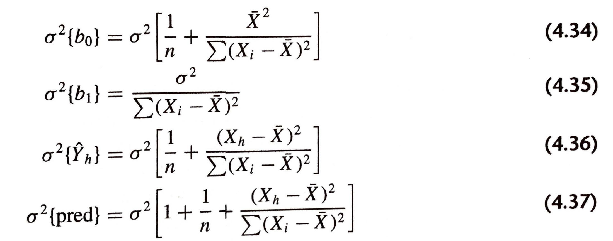

```{r xaringan-themer, include=FALSE, warning=FALSE}
library(xaringanthemer)
duo_accent(primary_color = "#006747", secondary_color = "#CFC493",   
	header_font_google = google_font("Josefin Sans"),
  text_font_google   = google_font("Montserrat", "300", "300i"),
  code_font_google   = google_font("Roboto Mono"))
```		


```{r setup, include=FALSE}
options(htmltools.dir.version = FALSE)
knitr::opts_chunk$set(fig.retina = 3, warning = FALSE, message = FALSE, fig.align="center", fig.height=5.5)
options(DT.options = list(scrollX = TRUE, pageLength=20, scrollY = 300))


library(here)
library(sjPlot)
library(sjmisc)
library(sjlabelled)
library(tidyverse)
library(ggplot2)
library(knitr)
library(mosaic)
library(DT)
library(car)
library(ALSM)

#params
spending_subset_all = read.csv(here("data", "spending_subset.csv"))

spending_subset=spending_subset_all[1:30,]

par(lwd=3,cex=1.5) 
cdi = as_tibble(read.delim(here("data", "CDI.txt"), sep=" ", header=FALSE)[,-c(1:2)] %>% mutate(V18 = recode_factor(V18, "NE", "NC", "S", "W")))
names(cdi) = c("county", "state", "land_area", "population", "pop_18_to_34", "pop_65", "number_physicians", "number_hospital_beds", "total_serious_crimes", "high_school_grads", "bachelor_degrees", "poverty_rate", "unemployment_rate", "per_capita_income", "total_personal_income", "region")

tab_model <- function(...,  show.ci=.95){sjPlot::tab_model(...,  show.ci=show.ci, show.se=TRUE, collapse.ci=TRUE, show.stat=TRUE)}
```


### 4: Simultaneous Inferences and Other Topics in Regression Analysis

### Learning Objectives for Sections 4.1-4.3 

After Sections 4.1-4.3, you should be able to 

- Compute and interpret Bonferroni and Working-Hotelling simultaneous CIs
- Compute and interpret simultaneous prediction intervals
	
	
---

### 4.1 Joint Estimation of $\beta_0$ and $\beta_1$

A procedure that provides a family confidence coefficient when estimating both $\beta_0$ and $\beta_1$ is often highly desirable since it permits the analyst to weave the two separate results together into an integrated set of conclusions, with an assurance that the entire set of estimates is correct. 

---

### Bonferroni Joint Confidence Intervals

One procedure for constructing simultaneous confidence intervals for $\beta_0$ and $\beta_1$ with a specified family confidence coefficient is the Bonferroni procedure:

$$\boxed{b_0 \pm t(1-(\alpha/2)/2; n-2)s \{ b_0 \}  }.$$
$$\boxed{b_1 \pm t(1-(\alpha/2)/2; n-2)s \{ b_1 \}  }.$$

I.e., we use the usual CIs, but at a level of $1-\alpha/2$, so that together we have at least a simultaneous confidence of $1-\alpha$.

--

We reiterate that the Bonferroni $1-\alpha$ family confidence coefficient is actually a lower bound on the true (but often unknown) family confidence coefficient. 

To the extent that incorrect interval estimates of $\beta_0$ and $\beta_1$ tend to pair up in the family, the families of statements will tend to be correct more than $(1-\alpha) 100$ percent of the time. 

---

### 4.2 Simultaneous Estimation of Mean Responses


Often the mean responses at a number of $X$ levels need to be estimated from the same sample data.

The combination of sampling errors in $b_0$ and $b_1$ may be such that the interval estimates of $E[Y_h]$ will be correct over some range of $X$ levels and incorrect elsewhere.


---

### Working-Hotelling Procedure

The Working-Hotelling procedure is based on the confidence band for the regression line discussed in Section 2.6. 


The *confidence band* contains the entire regression line and therefore contains the mean responses at all $X$ levels. Hence, we can use the boundary values of the confidence band at selected $X$ levels as simultaneous estimates of the mean responses at these $X$ levels. 

The family confidence coefficient for these simultaneous estimates will be at least $1-\alpha$ because the confidence coefficient that the entire confidence band for the regression line is correct is $1-\alpha$.

$$\boxed{\hat{Y}_h \pm \sqrt{2 F(1-\alpha; 2; n-2)} s \{ \hat{Y}_h \}  }$$

---

### Bonferroni Procedure

The Bonferroni procedure, discussed earlier for simultaneous estimation of $\beta_0$ and $\beta_1$ is a completely general procedure. 

To construct a family of confidence intervals for mean responses at $g$ different $X$ levels with this procedure with family confidence coefficient $1-\alpha$, we use  

$$\boxed{\hat{Y}_h \pm t(1-(\alpha/2)/g; n-2) s \{ \hat{Y}_h \}  }$$

---

For larger families, the Working-Hotelling confidence limits will always be the tighter, since $\sqrt{2 F(1-\alpha; 2; n-2)}$ stays the same for any number of statements in the family,  whereas $t(1-(\alpha/2)/g; n-2)$ becomes larger as the number of statements increases. 

In practice, once the family confidence coefficient has been decided upon, one can calculate both of these terms to determine which procedure leads to tighter confidence limits.

Note that both the Working-Hotelling and Bonferroni procedures provide lower bounds to the actual family confidence coefficient.

---
layout: true
class: inverse

---

### SHS: Simultaneous Estimation


The Canadian Survey of Household Spending is carried out annually across Canada. 

(http://dli-idd-nesstar.statcan.gc.ca.proxy.library.upei.ca/webview/) 

The main purpose of the survey is to obtain detailed information about household spending. Information is also collected about dwelling characteristics as well as household equipment. 

The survey data are used by the following groups:

* Government departments use the data to help formulate policy; 
* Community groups, social agencies and consumer groups use the data to support their positions and to lobby governments for social changes; 
* Lawyers and their clients use the data to determine what is fair for child support and other compensation; 
* Labour and contract negotiators rely on the data when discussing wage and cost-of-living clauses; 
* Individuals and families can use the data to compare their spending habits with those of similar types of households. 

---

```{r, include=TRUE}
###A subset of the latest Survey of Household Spending data are displayed below:
spending_subset %>% datatable()
```

We are interested in the potential relationship between the income of working Canadians and the amount that they spend on clothing in a year.


---

Income and Clothing Expenditure for a small subset of the Survey of Household Spending are displayed below:
 
```{r, fig.cap="", include=TRUE, message=FALSE, echo=TRUE, eval=TRUE}
xyplot(clothing_expenditure~income, data=spending_subset,  type=c("p", "r", "smooth"))
```

---
 
```{r, fig.cap="", include=TRUE, message=FALSE, echo=TRUE, eval=TRUE}
clothing_model = lm(clothing_expenditure~income, data=spending_subset)
confint(clothing_model, level=.95) %>% round(4)
confint(clothing_model, level=.975) %>% round(4)
```

--

* **Interpret the confidence intervals in your own words.**

--

Notice that the $[1-(\alpha/2)] \cdot 100$ percentile of the $t$-distribution is used in order to get a confidence level of $1-\alpha$. 


Similarly the $[1-(\alpha/2)/2] \cdot 100$ percentile of the $t$-distribution is used in order to get a joint confidence level of $1-(\alpha/2)$. 

---

A family of *confidence intervals* for simultaneous estimation of $E[Y_h]$ corresponding to $X_h =$ 40000, 50000, and 60000 can be found using the following code in `R`:
```{r,include=TRUE}
bonf_ci=predict(clothing_model, newdata=data.frame(income=c(40000, 50000, 60000)), interval="confidence", level=1-0.1/3); bonf_ci
WH_ci=ALSM::ci.reg(clothing_model, newdata=data.frame(income=c(40000, 50000, 60000)), alpha=0.1, type="w"); WH_ci

B = qt(1-0.1/(2*3), clothing_model$df.residual); B
W = sqrt(2* qf(1-.1, 2, clothing_model$df.residual)); W
```

---

* **Interpret the confidence intervals in your own words.**

<!-- PUT SELECT WARM UP RESPONSES HEREHERE (preceded by a ">"): -->
<!-- warm up question 4) 1 -->

* For each individual confidence interval we can be 96.7 percent confident our Y value lies between the interval. When the confidence intervals for the three X values are run simultaneously we can say with 90% confidence that the family of statements will be correct.

* With family confidence coefficient 0.90, we conclude that the mean clothing expenditure is between (1590.177929, 2976.915035) for income = 40000`$`, between (1870.634534, 3306.387990) for income = 50000`$`, and between (1986.288259, 3800.663827) for income = 60000`$`, all at once.

*  We are 90% confident that all three averages of clothing expenditures lays within respective interval at the same time.

---

* **Interpret the confidence intervals in your own words.**

<!-- PUT SELECT WARM UP RESPONSES HEREHERE (preceded by a ">"): -->
<!-- warm up question 4) 1 -->

* We can say that with 97% confidence that as X increase Y does as well meaning, that beta1 is positive.

*  we are 90% confident at income equals 4000 the population mean is between 1590.177929 and 2976.915035. We are 90% confident at income equals 5000 the population mean is between 1870.634534 and 3306.387990. We are 90% confident at income equals 6000 the population mean is between 1986.288259 and 3800.663827.

* We are 90% confident that for an income of $40,000 the mean clothing expenditure is between $1590 and $2977. As the income values increase, the confidence intervals increase in value and therefore we can make the assumption that the more income people make, the more they spend on clothing.


---
layout: false

### 4.3: Simultaneous Prediction Intervals for New Observations

Two procedures for making simultaneous predictions will be considered here: the Scheffe and Bonferroni procedures. Both utilize the same type of limits as those for predicting a single observation, and only the multiple of the estimated standard deviation is changed. 

The Scheffe procedure uses the $F$ distribution, whereas the Bonferroni procedure uses the $t$ distribution. 

The simultaneous prediction limits for $g$ predictions with the Scheffe procedure with family confidence coefficient $1 - \alpha$ are:

$$\hat Y_h \pm S \cdot s\{pred\},$$
where $S^2= g \cdot F(1 - \alpha; g, n-2)$. 

The Bonferroni procedure uses
$$\hat Y_h \pm B \cdot s\{pred\},$$
where $B= t(1 - (\alpha/2)/g; n-2)$.

---

The $S$ and $B$ multiples can be evaluated in advance to see which procedure provides tighter prediction limits.

Note that both the $B$ and $S$ multiples for simultaneous predictions become larger as $g$ increases. 

This contrasts with simultaneous estimation of mean responses where the $B$ multiple becomes larger but not the $W$ (Working-Hotelling) multiple. 

When $g$ is large, both the $B$ and $S$ multiples for simultaneous predictions may become so large that the prediction intervals will be too wide to be useful. 

Other simultaneous estimation techniques might then be considered, as discussed in Reference 4.1.


---
layout: true
class: inverse

---

### SHS: Simultaneous Prediction

Income and Clothing Expenditure for a small subset of the Survey of Household Spending are displayed below:
 
```{r, fig.cap="", include=TRUE, message=FALSE, echo=TRUE, eval=TRUE}
xyplot(clothing_expenditure~income, data=spending_subset,  type=c("p", "r", "smooth"))
```

---

A family of *prediction intervals* for simultaneous prediction of $Y_h$:

```{r, include=TRUE}
bonf_ci = predict(clothing_model, newdata=data.frame(income=c(40000, 50000, 60000)), interval="predict", level=1-0.1/3); bonf_ci
bonf_ci2 = ALSM::ci.reg(clothing_model, newdata=data.frame(income=c(40000, 50000, 60000)), alpha=0.1, type="gn"); bonf_ci2
  scheffe_ci = ALSM::ci.reg(clothing_model, newdata=data.frame(income=c(40000, 50000, 60000)), alpha=0.1, type="s"); scheffe_ci
```

--

Those `type="s"` intervals do not seem plausible...

---
Let's look at what `ci.reg` is doing when `type="s"`:

```{r, eval=TRUE}
ALSM::ci.reg
```

---

```{r, out.height=6} 
ci.reg_fixed = function (model, newdata, type = c("b", "s", "w", "n", "m", "nm", "gn"), alpha = 0.05, m = 1) 
{
    type <- match.arg(type)
    newdata <- as.data.frame(newdata)
    if (dim(newdata)[2] == length(names(model$coeff))) {
        colnames(newdata) <- names(model$coeff)
    }
    else {
        colnames(newdata) <- names(model$coeff)[-1]
    }
    CI <- predict(model, newdata, se.fit = T)
    g <- nrow(newdata)
    p <- ncol(newdata) + 1
    syh <- CI$se.fit
    spred <- sqrt(CI$residual.scale^2 + (CI$se.fit)^2)
    spredmean <- sqrt((CI$residual.scale^2)/m + (CI$se.fit)^2)
    b <- qt(1 - alpha/(2 * g), model$df)
    s <- sqrt(g * qf(1 - alpha, g, model$df))
    w <- sqrt(p * qf(1 - alpha, p, model$df))
    if (match.arg(type) == "b") {
        s <- syh
        z <- b
    }
    else if (match.arg(type) == "s") {
        {{z <- s}}
        {{s <- spred}}
    }
    else if (match.arg(type) == "w") {
        s <- syh
        z <- w
    }
    else if (match.arg(type) == "n") {
        s <- spred
        z <- qt(1 - alpha/2, model$df)
    }
    else if (match.arg(type) == "nm") {
        s <- spredmean
        z <- qt(1 - alpha/2, model$df)
    }
    else if (match.arg(type) == "m") {
        s <- syh
        z <- qt(1 - alpha/2, model$df)
    }
    else if (match.arg(type) == "gn") {
        s <- spred
        z <- b
    }
    x <- data.frame(newdata, Fit = CI$fit, Lower.Band = CI$fit - z * s, Upper.Band = CI$fit + z * s)
    return(x)
}
```

---

A family of *prediction intervals* for simultaneous prediction of $Y_h$:

.pull-left[
```{r, include=TRUE}
bonf_ci = predict(clothing_model, newdata=data.frame(income=c(40000, 50000, 60000)), interval="predict", level=1-0.1/3); bonf_ci
scheffe_ci = ALSM::ci.reg(clothing_model, newdata=data.frame(income=c(40000, 50000, 60000)), alpha=0.1, type="s"); scheffe_ci[,c(3,4)]
S = sqrt(3*qf(1-.1, 3, clothing_model$df.residual)); S
(6717.366- -2150.273) / (6069.400- -1502.3075)
```
]

.pull-right[
```{r, include=TRUE}
bonf_ci2 = ALSM::ci.reg(clothing_model, newdata=data.frame(income=c(40000, 50000, 60000)), alpha=0.1, type="gn"); bonf_ci2[,c(3,4)]
scheffe_ci = ci.reg_fixed(clothing_model, newdata=data.frame(income=c(40000, 50000, 60000)), alpha=0.1, type="s"); scheffe_ci[,c(3,4)]
B = qt(1-.1/(2*3), clothing_model$df.residual); B
S/B
```
]

---

* **Interpret the prediction intervals in your own words.**

<!-- PUT SELECT WARM UP RESPONSES HEREHERE (preceded by a ">"): -->
<!-- warm up question 4) 2 -->

* we are 90% confident that if we were to ask 3 people whose income fall in the range of the 3 levels 40000, 50000, and 60000), their corresponding clothing expenditure would ... be in the 3 obtained PIs, respectively.

* we predict that in the next sample taken, the observed Y(new) value of clothing expenditure will be between (-1502.3074691, 6069.400433) for income = 40000$, between (-1201.9078682, 6378.930393) for income = 50000$, and between (-937.3097597, 6724.261845) for income = 60000$, all at once.

* We are 90% confident that our next observation for an income of $40,000 will fall between -1502 and 6069, and so on for our other observations of Xh. 
	+ In this case, we disregard the negative values as it is not possible to spend negative dollars.
---

* **Interpret the prediction intervals in your own words.**

<!-- PUT SELECT WARM UP RESPONSES HEREHERE (preceded by a ">"): -->
<!-- warm up question 4) 2 -->

* With confidences of 97% you can say that when some ones income is 40000$ they are likely to spend between -1502.31$ and 6069.40$. You can say the same about each of the other points as well.

* we conclude that the predicted mean clothing expenditure is between -1502.3074691 and 6069.400433 when income is 40000, between -1201.9078682 and 6378.930393 when income is 50000 and between -937.3097597 and 6724.261845 when income is 60000. 

* We are 90% sure that a person with income 40000, 50000 or 60000 will spend (-1502,6069), (-1201,6378) or (-937,6724) on clothes.

* For the first prediction interval, we can conclude with 90% confidence that the expected amount spent on clothes for an income of `$`40000 is between -`$`1502.3074691 and `$`6069.400433. Similarly, for the second prediction interval, we can conclude with 90% confidence that the expected amount spent on clothes for an income of `$`50000 is between -`$`1201.9078682 and `$`6378.930393. Finally, for the third prediction interval, we can conclude with 90% confidence that the expected amount spent on clothes for an income of `$`60000 is between -`$`937.3097597 and `$`6724.261845.
---

### CDI: Simultaneous CIs and PIs - physicians vs hospital beds

This data set provides selected county demographic information (CDI) for 440 of the most populous counties in the United States. 

Each line of the data set has an identification number with a county name and state abbreviation and provides information on 14 variables for a single county. 

Counties with missing data were deleted from the data set.

---
```{r , echo = TRUE}
cdi %>% datatable()
```

---

```{r,  fig.cap="", include=TRUE}
xyplot(number_physicians ~ number_hospital_beds, data=cdi,  type=c("p", "r", "smooth"))
```

---

```{r,  echo = TRUE}
mod_physician_beds = lm(number_physicians ~ number_hospital_beds, data=cdi)
predict(mod_physician_beds, newdata=data.frame(number_hospital_beds=c(1500, 5000, 15000, 25000)), interval="confidence", level=1-0.1/4)
predict(mod_physician_beds, newdata=data.frame(number_hospital_beds=c(1500, 5000, 15000, 25000)), interval="predict", level=1-0.1/4)
```


* **Interpret these intervals in your own words.**


---
### CDI: physicians vs population 


```{r,  fig.cap="", include=TRUE, fig.height=4}
xyplot(number_physicians ~ population, data=cdi,  type=c("p", "r", "smooth"))
```

---

```{r,  echo = TRUE}
mod_physician_pop = lm(number_physicians ~ population, data=cdi)
predict(mod_physician_pop, newdata=data.frame(population=c(200000, 400000, 4000000, 6000000, 8000000)), interval="confidence", level=1-0.05/5)
ci.reg(mod_physician_pop, newdata=data.frame(population=c(200000, 400000, 4000000, 6000000, 8000000)), alpha=0.05, type="w")
B = qt(1-0.05/(2*5), mod_physician_pop$df.residual); B
W = sqrt(2* qf(1-.05, 2, mod_physician_pop$df.residual)); W
```

---

```{r,  echo = TRUE}
mod_physician_pop = lm(number_physicians ~ population, data=cdi)
predict(mod_physician_pop, newdata=data.frame(population=c(200000, 400000, 4000000, 6000000, 8000000)), interval="predict", level=1-0.05/5)
ci.reg_fixed(mod_physician_pop, newdata=data.frame(population=c(200000, 400000, 4000000, 6000000, 8000000)), alpha=0.05, type="s")
B = qt(1-.05/(2*5), mod_physician_pop$df.residual); B
S = sqrt(5*qf(1-.05, 5, mod_physician_pop$df.residual)); S
```


---
layout: false


### Recap: Sections 4.1-4.3 

After Sections 4.1-4.3, you should be able to 

- Compute and interpret Bonferroni and Working-Hotelling simultaneous CIs
- Compute and interpret simultaneous prediction intervals
	
	


---
### Learning Objectives for Sections 4.5, 4.7 

After Sections 4.5 and 4.7, you should be able to 

- Understand the potential impact of measurement error
- Understand the challenges of choosing X levels when designing an experiment
	

---
###  4.5: Effects of Measurement Errors

---

### Measurement Errors in $Y$

When random measurement errors are present in the observations on the response variable $Y$, no new problems are created when these errors are uncorrelated and not biased (positive and negative measurement errors tend to cancel out). 

--

Consider, for example, a study of the relation between the time required to complete a task $(Y)$ and the complexity of the task $(X)$. The time to complete the task may not be measured accurately because the person operating the stopwatch may not do so at the precise instants called for. 

As long as such measurement errors are of a random nature, uncorrelated, and not biased, these measurement errors are simply absorbed in the model error term $\varepsilon$. 

--

The model error term always reflects the composite effects of a large number of factors not considered in the model, one of which now would be the random variation due to inaccuracy in the process of measuring $Y$.


---

layout: true
class: inverse

---
### SHS: Measurement Error in $Y$

Income and Clothing Expenditure for a small subset of the Survey of Household Spending are displayed below:

```{r, echo=FALSE}
spending_subset=spending_subset_all[1:500,]
```

```{r}
random_error = rnorm(n=length(spending_subset$income), mean=0, sd=sd(spending_subset$clothing_expenditure)/2)
spending_subset$clothing_expenditure_plus_error = spending_subset$clothing_expenditure + random_error

spending_subset[, c("income", "clothing_expenditure", "clothing_expenditure_plus_error")] %>% round(3) %>% datatable()
```

---

```{r, fig.cap="", include=TRUE, message=FALSE, echo=TRUE, eval=TRUE}
xyplot(clothing_expenditure~income, data=spending_subset,  type=c("p", "r"), ylim=c(-2000, 10000))
```

---

```{r, fig.cap="", include=TRUE, message=FALSE, echo=TRUE, eval=TRUE}
xyplot(clothing_expenditure_plus_error~income, data=spending_subset,  type=c("p", "r"),  ylim=c(-2000, 10000))
```


---
```{r, echo=TRUE, message=FALSE}
msummary(lm(clothing_expenditure~income, data=spending_subset)) 
msummary(lm(clothing_expenditure_plus_error~income, data=spending_subset))
```

---
```{r, echo=TRUE, message=FALSE}
anova(lm(clothing_expenditure~income, data=spending_subset)) 
anova(lm(clothing_expenditure_plus_error~income, data=spending_subset))
```


---
layout: false

### Measurement Errors in X

Unfortunately, a different situation holds when the observations on the predictor variable $X$ are subject to measurement errors. 

At times measurement errors may enter the value observed for the predictor variable, for instance, when the predictor variable is pressure in a tank, temperature in an oven, speed of a production line, or reported age of a person.

---

layout: true
class: inverse

---
### SHS: Measurement Error in $X$

Income and Clothing Expenditure for a small subset of the Survey of Household Spending are displayed below:

```{r}
random_error = rnorm(n=length(spending_subset$income), mean=0, sd=sd(spending_subset$income)/2)
spending_subset$income_plus_error = spending_subset$income + random_error

spending_subset[, c("income", "income_plus_error", "clothing_expenditure")] %>% datatable()
```

---

```{r, fig.cap="", include=TRUE, message=FALSE, echo=TRUE, eval=TRUE}
xyplot(clothing_expenditure~income, data=spending_subset,  type=c("p", "r"), xlim=c(0, 100000))
```

---
```{r, fig.cap="", include=TRUE, message=FALSE, echo=TRUE, eval=TRUE}
xyplot(clothing_expenditure~income_plus_error, data=spending_subset,  type=c("p", "r"), xlim=c(0, 100000))
```


---
```{r, echo=TRUE, message=FALSE}
msummary(lm(clothing_expenditure~income, data=spending_subset)) 
msummary(lm(clothing_expenditure~income_plus_error, data=spending_subset))
```


---
```{r, echo=TRUE, message=FALSE}
anova(lm(clothing_expenditure~income, data=spending_subset)) 
anova(lm(clothing_expenditure~income_plus_error, data=spending_subset))
```


---

.pull-left[
Introducing measurement error into $Y$
```{r , eval=c(1:3)}
X = 1:100
Y = X
plot(X, Y, ylim=c(-10, 110), xlim=c(-10, 110))

for (i in 1:1000) { 
Y = Y + rnorm(100)
plot(X, Y, ylim=c(-10, 110), xlim=c(-10, 110))
abline(lm(Y~X))
lines(c(-10, 110), c(-10, 110), col="grey", lty=2)}
```
]

.pull-right[
Introducing measurement error into $X$
```{r, eval=c(1:3)}
X = 1:100
Y = X
plot(X, Y, ylim=c(-10, 110), xlim=c(-10, 110))

for (i in 1:1000) { 
X = X + rnorm(100)
plot(X, Y, ylim=c(-10, 110), xlim=c(-10, 110))
abline(lm(Y~X))
lines(c(-10, 110), c(-10, 110), col="grey", lty=2)}
```
]

---

```{r, echo=FALSE}
set.seed(354)
```

.pull-left[
Introducing measurement error into $Y$
```{r measurement_error_Y, eval=TRUE, fig.show='animate', ffmpeg.format='gif', dev='jpeg', cache=TRUE, interval=0.025, aniopts="controls"}
X = 1:100
Y = X
plot(X, Y, ylim=c(-10, 110), xlim=c(-10, 110))

for (i in 1:5000) { 
Y = Y + rnorm(100)
plot(X, Y, ylim=c(-10, 110), xlim=c(-10, 110))
abline(lm(Y~X), lwd=2)
lines(c(-10, 110), c(-10, 110), col="grey", lty=2, lwd=2)}
```
]

.pull-right[
Introducing measurement error into $X$
```{r measurement_error_X, eval=TRUE, fig.show='animate', ffmpeg.format='gif', dev='jpeg', cache=TRUE, interval=0.025, aniopts="controls"}
X = 1:100
Y = X
plot(X, Y, ylim=c(-10, 110), xlim=c(-10, 110))

for (i in 1:5000) { 
X = X + rnorm(100)
plot(X, Y, ylim=c(-10, 110), xlim=c(-10, 110))
abline(lm(Y~X), lwd=2)
lines(c(-10, 110), c(-10, 110), col="grey", lty=2, lwd=2)}
```
]

---
layout: false

### Classical Measurement Error

The regression model that we would like to study is
$$ Y_i = \beta_0 + \beta_1 X_i + \varepsilon_i$$

However, we observe only $X_i^\ast = X + \delta_i$, so we actually study $Y_i = \beta_0^\ast + \beta_1^\ast X_i^\ast + \varepsilon_i^\ast$  
--

Even if $E[X_i^\ast] = X_i$, we will not get the same estimates from these models. 

--

Notice that 
$$\begin{align*} Y_i &= \beta_0 + \beta_1 X_i + \varepsilon_i \\ &= \beta_0 + \beta_1 (X_i^\ast - \delta) + \varepsilon_i \\ &= \beta_0 + \beta_1 X_i^\ast + (\varepsilon_i  - \beta_1 \delta) \end{align*}$$
isn't an ordinary regression model because $X_i^\ast$ and $\delta$ are correlated. 

This leads to an *attenuation* of the parameter estimate.
In fact, we can show that 
$$\beta_1^\ast = \beta_1 \frac{\sigma_X^2}{\sigma_X^2 + \sigma_\delta^2}$$

---
layout: true
class: inverse
---


```{r, echo=TRUE, message=FALSE}
msummary(lm(clothing_expenditure~income, data=spending_subset)) 
msummary(lm(clothing_expenditure~income_plus_error, data=spending_subset))
```

$$\begin{align*} \beta_1^\ast &= \beta_1 \frac{\sigma_X^2}{\sigma_X^2 + \sigma_\delta^2} \\ &= \beta_1 \frac{\sigma_X^2}{\sigma_X^2 + \sigma_X^2/4} \\ &= \beta_1 (.8) \end{align*}$$

---
```{r, echo=FALSE}
spending_subset=spending_subset_all[1:30,]
```

* **If it was discovered that income was measured with error, how would that impact your interpretation of the regression output given above? **

<!-- PUT SELECT WARM UP RESPONSES HEREHERE (preceded by a ">"): -->
<!-- warm up question 4) 3 -->

* If income was measured with error, we would not be able to rely on the regression output given to us and therefore we would not be able to make an accurate analysis with this data.

* If it was discovered that income was measured with error, the β1 estimate in the provided regression would be smaller than the β1 of a regression conducted without error in measuring income.

* the output is misrepresenting reality, as observed clothing expenditure will be matched to an incorrect amount of income

* The regression coefficient would then be biased (always smaller than the true coefficient), with magnitude depending on the relative size of variance of X and Y (income and clothing expenditure).

---

* **If it was discovered that income was measured with error, how would that impact your interpretation of the regression output given above? **

<!-- PUT SELECT WARM UP RESPONSES HEREHERE (preceded by a ">"): -->
<!-- warm up question 4) 3 -->

* Then the assumption that the data at each point is normal would be wrong meaning that the way the data was analyzed was . wrong give us an inaccurate model.

*  This depends on the circumstances under which this error was recorded. If the income levels we use in our study come from self-reports, this error should not be of any major concern. Some participants may accidentally report their income as being higher and others will report it as being lower. Overall, these errors should cancel out and the data should maintain its validity. In this case, I would not have to change my interpretation of the above data. 

* if the income was measured with error then the regression output will not be helpful to provide the describe and predict function as the result is based on wrong data.

---

* **If it was discovered that income was measured with error, how would that impact your interpretation of the regression output given above? **

<!-- PUT SELECT WARM UP RESPONSES HEREHERE (preceded by a ">"): -->
<!-- warm up question 4) 3 -->

*  If income was measured with error, our formula for regression would be different. This would mean that we need to use berkson model where we will set the predicted variable(50000,60000,70000). When the predictor variable(income) is a constant, and hence the error terms are not correlated with it. So it would provide us fixed value.

* Our interpretation of the regression output would not change. If we consider the Berkson Model, the reported income $X^\ast_i$ would be the person's salary mentioned on their contract. However, the true income $X_i$ would be variable, because income can vary based on sick days and overtime. So, $X_i$ would be a random variable and $X^\ast_i$ would be a fixed quantity. Thus, $X^\ast_i$ and the new error term are uncorrelated, so our regression model above can still be used to conduct tests, after applying the Least Squares procedures so that bo and b1 are considered unbiased.

---

layout: false

### 4.7: Choice of $X$ Levels

Consider the impact of the choice of $X$ levels:

```{r, fig.cap="", include=TRUE, message=FALSE, echo=FALSE, out.width="60%"}

```

---


Although the number and spacing of $X$ levels depends very much on the major purpose of the regression analysis, the general advice given by D. R. Cox is still relevant:

> Use two levels when the object is primarily to examine whether or not ... (the predictor variable) . . . has an effect and in which direction that effect is. 

> Use three levels whenever a description of the response curve by its slope and curvature is likely to be adequate; this should cover most cases. 

> Use four levels if further examination of the shape of the response curve is important. 

> Use more than four levels when it is required to estimate the detailed shape of the response curve, or when the curve is expected to rise to an asymptotic value, or in general to show features not adequately described by slope and curvature. Except in these last cases it is generally satisfactory to use equally spaced levels with equal numbers of observations per level.

---

layout: true
class: inverse

---
### SHS: Choice of $X$ Levels

Income and Clothing Expenditure for a small subset of the Survey of Household Spending are displayed below:

```{r, fig.height=3}
xyplot(clothing_expenditure~income, data=spending_subset,  type=c("p", "r"))
```

---

* ** If you could design an experiment where you controlled the values of income, how could that change your regression findings?  **

<!-- PUT SELECT WARM UP RESPONSES HEREHERE (preceded by a ">"): -->
<!-- warm up question 4) 4 -->

* Since we are interested in wether there is a relationship between income and clothing expenditures we want to estimate B1. Then I would choose two levels of X, the two extremes, and put one half of the population at one X and the other half at the other X. That could give us a better understanding if there is a linear relationship or not.

*  For a more accurate β1, two levels of X from two different extremes (really low income and really high income) should be chosen and half the observations should be at each of the two levels. For a more accurate β0, observations should be made at X=0. This is not a goal of our model since no income means no money to spend on clothes. Therefore, the most practical goal for our model in finding β1, therefore the first method is the most useful in this case.


---


* ** If you could design an experiment where you controlled the values of income, how could that change your regression findings?  **

<!-- PUT SELECT WARM UP RESPONSES HEREHERE (preceded by a ">"): -->
<!-- warm up question 4) 4 -->

* That would change the study from observational to experimental, making the regression findings more predictive of future data, 
	+ and a stronger correlation would be implied
	+ This could mean external factors could have an effect on the data.

* Using regression analysis which will minimize the effect of confounding variables.

* If you were able to control the income values then the findings could be more narrow or broad 
depending on how you changed them.


* ... Berkson Model... 


---


* ** If you could design an experiment where you controlled the values of income, how could that change your regression findings?  **

<!-- PUT SELECT WARM UP RESPONSES HEREHERE (preceded by a ">"): -->
<!-- warm up question 4) 4 -->


* By applying the Berkson model, ...

* I would focus on certain range of income and make the range of the X small. That means I will have larger sample size and small range of predictor variable. So that the prediction and description will be more accurate.

*  the change of the values of income will change the slope of regression line.

* You can minimize variance by using income values that are equal to the mean income value of the regression analysis done above.

* If the experiment was in a controlled environment then we could control the X value getting rid of part of the random factor making the data more accurate.

---
layout: false

### Recap: Sections 4.5, 4.7 

After Sections 4.5 and 4.7, you should be able to 

- Understand the potential impact of measurement error
- Understand the challenges of choosing $X$ levels when designing an experiment


---

### Examples of Measurement Error: 

*  Lester F, Arbuckle TE, Peng P, and McIsaac MA (2018). Impact of exposure to phenols during early pregnancy on birth weight in two Canadian Cohort studies subject to measurement errors. *Environment International*, 120, 231-237.

* Addressing measurement error in a cumulative exposure variable: the relationship between light
at night and breast cancer risk
