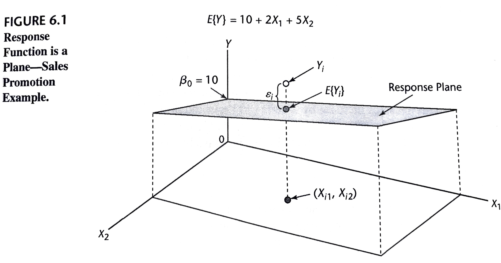
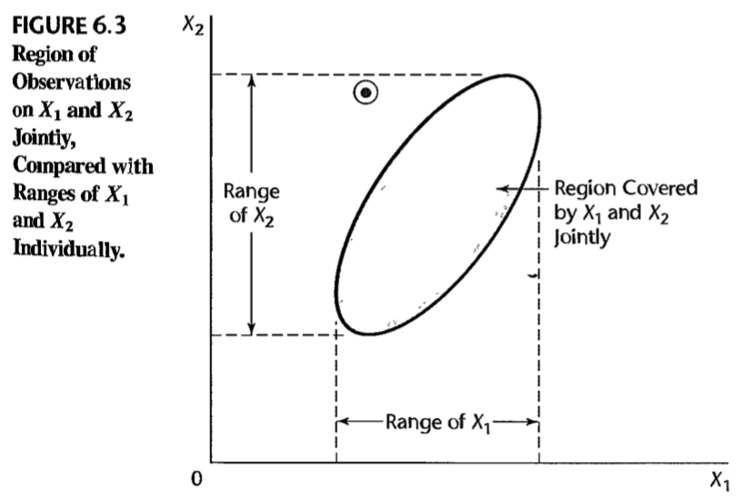

```{r xaringan-themer, include=FALSE, warning=FALSE}
library(xaringanthemer)
duo_accent(primary_color = "#006747", secondary_color = "#CFC493",   
	header_font_google = google_font("Josefin Sans"),
  text_font_google   = google_font("Montserrat", "300", "300i"),
  code_font_google   = google_font("Droid Mono"))
```		


```{r setup, include=FALSE}
options(htmltools.dir.version = FALSE)
knitr::opts_chunk$set(fig.retina = 3, warning = FALSE, message = FALSE, fig.align="center", fig.height=5.5)
options(DT.options = list(scrollX = TRUE, pageLength=20, scrollY = 300))
options(digits = 4)
options(show.signif.stars=FALSE)

library(here)
library(sjPlot)
library(sjmisc)
library(sjlabelled)
library(tidyverse)
library(ggplot2)
library(knitr)
library(mosaic)
library(DT)
library(car)

#params
spending_subset_all = read.csv(here("data", "spending_subset.csv"))

spending_subset=spending_subset_all[1:200,]

par(lwd=3,cex=1.5) 
cdi = as_tibble(read.delim(here("data", "CDI.txt"), sep=" ", header=FALSE)[,-c(1:2)] %>% mutate(V18 = recode_factor(V18, "NE", "NC", "S", "W")))
names(cdi) = c("county", "state", "land_area", "population", "pop_18_to_34", "pop_65", "number_physicians", "number_hospital_beds", "total_serious_crimes", "high_school_grads", "bachelor_degrees", "poverty_rate", "unemployment_rate", "per_capita_income", "total_personal_income", "region")

tab_model <- function(...,  show.ci=.95){sjPlot::tab_model(...,  show.ci=show.ci, show.se=TRUE, collapse.ci=TRUE, show.stat=TRUE)}
```


### 6: Multiple Regression I

Multiple regression analysis is one of the most widely used of all statistical methods.


Since the matrix expressions for multiple regression are the same as for simple linear regression, we state the results without much discussion. 

---

### Learning Objectives for Section 6.1

After Section 6.1, you should be able to 

- Understand the concept and utility of multiple linear regression
- Interpret general linear regression coefficients
- Be aware of qualitative predictors, polynomial regression, and interactions
	
---

### 6.1: Multiple Regression Models

When there are two predictor variables $X_1$ and $X_2$, the regression model:
$$Y_i = \beta_0+ \beta_1 X_{i1} + \beta_2 X_{i2} + \varepsilon_i$$
is called a first-order model with two predictor variables. 

* it is linear in the predictor variables
* $Y_i$ denotes the response in the $i$th trial
* $X_{i1}$ and $X_{i2}$ are the values of the two predictor variables in the $i$th trial. 
* The parameters of the model are $\beta_0$, $\beta_1$, and $\beta_2$, and the error term is $\varepsilon_i$


---

Assuming that $E[\varepsilon] = 0$, the regression function for model is

$$E[Y]= \beta_0+ \beta_1 X_1 + \beta_2 X_2$$

```{r, fig.cap="", include=TRUE, message=FALSE, echo=FALSE, out.width="60%"}

```

<!-- explain residuals and \beta_0 in that figure -->

---

class: inverse

```{r, include=FALSE}
# scatter3d(clothing_expenditure~income+food_expenditure, data=spending_subset)
# rgl::movie3d(rgl::spin3d(axis = c(0, 1, 0)), duration = 12, dir=here("src/img"), movie="clothing_food_income", convert=TRUE)
```

```{r, results='hide', eval=FALSE}
car::scatter3d(clothing_expenditure~income+food_expenditure, data=spending_subset)
```

.center[
`)
]

---

### Meaning of (Partial) Regression Coefficients:

$$E[Y]= 10 + 2 X_1 + 5 X_2$$

--
	
$$E[Y | X_2=2]= 10 + 2 X_1 + 5 (2) = 20 + 2 X_1$$
$$E[Y | X_2=1]= 10 + 2 X_1 + 5 (1) = 15 + 2 X_1$$
$$E[Y | X_2=0]= 10 + 2 X_1 + 5 (0) = 10 + 2 X_1$$

--
$$E[Y | X_1=2]= 10 + 2 (2) + 5 X_2 = 14 + 5 X_2$$
$$E[Y | X_1=1]= 10 + 2 (1) + 5 X_2 = 12 + 5 X_2$$
$$E[Y | X_1=0]= 10 + 2 (0) + 5 X_2 = 10 + 5 X_2$$

--
$$E[Y | X_1=0, X_2=0]= 10 + 2 (0) + 5 (0) = 10$$
--

Note that these are *additive effects*. They do not *interact*. 

---

### Interaction Effects

$$Y_i = \beta_0+ \beta_1 X_{i1} + \beta_2 X_{i2} + \beta_3 X_{i1} X_{i2} + \varepsilon_i$$
--

$$E[Y]= 10 + 2 X_1 + 5 X_2 + 7 X_1 X_2$$
--

$$E[Y | X_2=2]= 10 + 2 X_1 + 5 (2) + 7 X_1 (2) = 20 + 16 X_1$$
$$E[Y | X_2=1]= 10 + 2 X_1 + 5 (1) + 7 X_1 (1) = 15 + 9 X_1$$

$$E[Y | X_2=0]= 10 + 2 X_1 + 5 (0) + 7 X_1 (0) = 10 + 2 X_1$$
--

$$E[Y | X_1=2]= 10 + 2 (2) + 5 X_2 + 7 (2) X_2 = 14 + 19 X_2$$
$$E[Y | X_1=1]= 10 + 2 (1) + 5 X_2 + 7 (1) X_2 = 12 + 12 X_2$$
$$E[Y | X_1=0]= 10 + 2 (0) + 5 X_2 + 7 (0) X_2 = 10 + 5 X_2$$

$$E[Y | X_1=0, X_2=0]= 10 + 2 (0) + 5 (0) + 7 (0) (0) = 10$$


---

### General Linear Regression Model

$$Y_i = \beta_0+ \beta_1 X_{i1} + \beta_2 X_{i2} + \cdots + \beta_{p-1} X_{i, {p-1}} + \varepsilon_i,$$
where 

* $\beta_0, \beta_1, \ldots, \beta_{p-1}$ are parameters
* $X_{i1}, \ldots , X_{i, {p-1}}$ are known constants (but not necessarily completely different predictor variables). 
* $\varepsilon_i$ are independent $N(0, \sigma^2)$. 
* $i = 1, \ldots, n$

--

The response function for this regression model is 
$$E[Y] = \beta_0+ \beta_1 X_{i1} + \beta_2 X_{i2} + \cdots + \beta_{p-1} X_{i, {p-1}}.$$

---

### Qualitative Predictor Variables

We use indicator variables that take on the values 0 and 1 to identify the classes of a qualitative variable.

Consider a regression analysis to predict the length of hospital stay $(Y)$ based on the age $(X_1)$ and gender $(X_2)$ of the patient. 
We define $X_2$ as follows:
$$X_2 = \left \{ \begin{array}{cl} 1 & \text{if patient is female} \\  0 & \text{if patient is male} \end{array} \right.$$
The first-order regression model then is as follows:

$$Y_i =\beta_0+ \beta_1 X_{i1} + \beta_2 X_{i2} + \varepsilon_i$$
where $X_{i1} =$ patient $i$'s age. 

---

Consider a regression analysis to predict the length of hospital stay $(Y)$ based on the age $(X_1)$ and gender $(X_2)$ of the patient. 
We define $X_2$ as follows:
$$X_2 = \left \{ \begin{array}{cl} 1 & \text{if patient is female} \\  0 & \text{if patient is male} \end{array} \right.$$
The first-order regression model then is as follows:

$$Y_i =\beta_0+ \beta_1 X_{i1} + \beta_2 X_{i2} + \varepsilon_i$$
where $X_{i1} =$ patient $i$'s age.


The response function for this regression model is:
$$E[Y] =\beta_0+ \beta_1 X_{1} + \beta_2 X_{2}.$$
For male patients, $X_2 = 0$ and 
$$E[Y] =\beta_0+ \beta_1 X_{1}.$$
For female patients, $X_2 = 1$ and the response function becomes
$$E[Y] = (\beta_0 + \beta_2) + \beta_1 X_{1}.$$

These two response functions represent parallel straight lines with different intercepts.

---

Note that if we had included an interaction between $X_1$ and $X_2$ we would have the model

$$Y_i =\beta_0+ \beta_1 X_{i1} + \beta_2 X_{i2} + \beta_3 X_{i1} X_{i2} + \varepsilon_i$$
and response function
$$E[Y] =\beta_0+ \beta_1 X_{1} + \beta_2 X_{2} + \beta_3 X_{1} X_{2}$$
--

For male patients, $X_2 = 0$ and 
$$E[Y] =\beta_0+ \beta_1 X_{1}$$

For female patients, $X_2 = 1$ and the response function becomes
$$E[Y] = (\beta_0  + \beta_2) + (\beta_1 + \beta_3) X_{1}.$$

These two response functions represent lines with different slopes and intercepts. 

* $\beta_2$ tells us about the difference in intercepts between males and females. 
* $\beta_3$ tells us about the difference in slopes (i.e., the difference in the effect of age on average length of hospital stay between males and females). 

---
layout: true
class: inverse

---

### SHS: Multiple Regression


The Canadian Survey of Household Spending is carried out annually across Canada. 

(http://dli-idd-nesstar.statcan.gc.ca.proxy.library.upei.ca/webview/) 

The main purpose of the survey is to obtain detailed information about household spending. Information is also collected about dwelling characteristics as well as household equipment. 

The survey data are used by the following groups:

* Government departments use the data to help formulate policy; 
* Community groups, social agencies and consumer groups use the data to support their positions and to lobby governments for social changes; 
* Lawyers and their clients use the data to determine what is fair for child support and other compensation; 
* Labour and contract negotiators rely on the data when discussing wage and cost-of-living clauses; 
* Individuals and families can use the data to compare their spending habits with those of similar types of households. 

---

```{r, include=TRUE}
###A subset of the latest Survey of Household Spending data are displayed below:
spending_subset %>% datatable()
```

We are interested in the potential relationship between the income of working Canadians and the amount that they spend on clothing in a year.


---


```{r, fig.cap="", include=TRUE, message=FALSE, echo=TRUE, eval=TRUE}
clothing_model = lm(clothing_expenditure~income, data=spending_subset)
msummary(clothing_model)
```

---

```{r, fig.cap="", include=TRUE, message=FALSE, echo=TRUE, eval=TRUE}
plot(spending_subset$income, spending_subset$clothing_expenditure)
abline(clothing_model)
```


---

 
```{r, fig.cap="", include=TRUE, message=FALSE, echo=TRUE, eval=TRUE}
clothing_sex_model = lm(clothing_expenditure~income + sex, data=spending_subset)
msummary(clothing_sex_model)
```


---

```{r, fig.cap="", include=TRUE, message=FALSE, echo=TRUE, eval=TRUE}
plot(spending_subset$income, spending_subset$clothing_expenditure)
newIncome = 5000:100000
lines(newIncome, predict(clothing_sex_model, newdata=data.frame(income=newIncome, sex="male")), col="red")
lines(newIncome, predict(clothing_sex_model, newdata=data.frame(income=newIncome, sex="female")), col="blue")
```

---

```{r, fig.cap="", include=TRUE, message=FALSE, echo=TRUE, eval=TRUE}
plot(spending_subset$income, spending_subset$clothing_expenditure, col="red")
points(spending_subset$income[spending_subset$sex=="female"], spending_subset$clothing_expenditure[spending_subset$sex=="female"], col="blue")
newIncome = 5000:100000
lines(newIncome, predict(clothing_sex_model, newdata=data.frame(income=newIncome, sex="male")), col="red")
lines(newIncome, predict(clothing_sex_model, newdata=data.frame(income=newIncome, sex="female")), col="blue")
```

---
 
```{r, fig.cap="", include=TRUE, message=FALSE, echo=TRUE, eval=TRUE}
clothing_sex_int_model = lm(clothing_expenditure~income + sex + income:sex, data=spending_subset)
msummary(clothing_sex_int_model)
```


---

```{r, fig.cap="", include=TRUE, message=FALSE, echo=TRUE, eval=TRUE}
plot(spending_subset$income, spending_subset$clothing_expenditure, col="red")
points(spending_subset$income[spending_subset$sex=="female"], spending_subset$clothing_expenditure[spending_subset$sex=="female"], col="blue")
newIncome = 5000:100000
lines(newIncome, predict(clothing_sex_int_model, newdata=data.frame(income=newIncome, sex="male")), col="red")
lines(newIncome, predict(clothing_sex_int_model, newdata=data.frame(income=newIncome, sex="female")), col="blue")
```


---
layout: false


### Polynomial Regression

Consider 

$$Y_i = \beta_0+ \beta_1 X_{i} + \beta_2 X_{i} ^{2} + \varepsilon_i.$$

```{r, fig.height=4}
n=500
X = runif(n, min=-10, max=10)
Y = rnorm(n, mean=X+I(X^2), sd=10)
xyplot(Y~X, type=c("p", "r", "smooth"))
```

---


Note that despite the curvilinear nature of the response function, this is a special case of general linear regression model.

If we let $X_{i1} = X_i$ and $X_{i2}=X_i^2$, we can write this model as 
$$Y_i = \beta_0+ \beta_1 X_{i1} + \beta_2 X_{i2} + \varepsilon_i.$$

--

The term **linear model** refers to the fact that the model is linear in the *parameters*; it does not refer to the shape of the response surface.

--

Similarly, we can capture many non-linear relationships using general linear models via *transformations*. E.g., 

$$Y_i' = \beta_0+ \beta_1 X_{i1} + \beta_2 X_{i2} + \varepsilon_i, \qquad \text{ where } Y_i'= \log Y_i \ \text{ or } \ Y_i'= 1/ Y_i, \ \text{ etc}$$

---
layout: true
class: inverse

---


```{r, fig.cap="", include=TRUE, message=FALSE, echo=TRUE, eval=TRUE}
clothing_model = lm(clothing_expenditure~income, data=spending_subset)
msummary(clothing_model)

spending_subset$income_c = (spending_subset$income-mean(spending_subset$income))
clothing_model = lm(clothing_expenditure~income_c, data=spending_subset)
msummary(clothing_model)
```


---

```{r, fig.cap="", include=TRUE, message=FALSE, echo=TRUE, eval=TRUE}
plot(spending_subset$income, spending_subset$clothing_expenditure)
abline(clothing_model)
```


---


```{r, fig.cap="", include=TRUE, message=FALSE, echo=TRUE, eval=TRUE}
spending_subset$income_c = (spending_subset$income-mean(spending_subset$income))
spending_subset$income_c2 = (spending_subset$income-mean(spending_subset$income))^2
clothing_2_model = lm(clothing_expenditure~income_c + income_c2, data=spending_subset)
msummary(clothing_2_model)
```


---

```{r, fig.cap="", include=TRUE, message=FALSE, echo=TRUE, eval=TRUE}
plot(spending_subset$income, spending_subset$clothing_expenditure)
newIncome = 5000:100000
lines(newIncome, predict(clothing_2_model, newdata=data.frame(income_c=newIncome-mean(spending_subset$income), income_c2=(newIncome-mean(spending_subset$income))^2)))
```

---


```{r, fig.cap="", include=TRUE, message=FALSE, echo=TRUE, eval=TRUE}
spending_subset$income_c = (spending_subset$income-mean(spending_subset$income))
spending_subset$income_c2 = (spending_subset$income-mean(spending_subset$income))^2
spending_subset$income_c3 = (spending_subset$income-mean(spending_subset$income))^3
clothing_3_model = lm(clothing_expenditure~income_c + income_c2 + income_c3, data=spending_subset)
msummary(clothing_3_model)
```


---

```{r, fig.cap="", include=TRUE, message=FALSE, echo=TRUE, eval=TRUE}
plot(spending_subset$income, spending_subset$clothing_expenditure)
newIncome = 5000:100000
lines(newIncome, predict(clothing_3_model, newdata=data.frame(income_c=newIncome-mean(spending_subset$income), income_c2=(newIncome-mean(spending_subset$income))^2, income_c3=(newIncome-mean(spending_subset$income))^3)))
```

---


```{r, fig.cap="", include=TRUE, message=FALSE, echo=TRUE, eval=TRUE}
clothing_sex_3_model = lm(clothing_expenditure~income_c + income_c2 + income_c3 + sex, data=spending_subset)
msummary(clothing_sex_3_model)
```

--

```{r, fig.cap="", include=TRUE, message=FALSE, echo=TRUE, eval=TRUE}
clothing_sex = lm(clothing_expenditure~sex, data=spending_subset)
msummary(clothing_sex)$r.squared
```

---

```{r, fig.cap="", include=TRUE, message=FALSE, echo=TRUE, eval=TRUE}
anova(clothing_sex, clothing_sex_3_model)
```

---

```{r, fig.cap="", include=TRUE, message=FALSE, echo=TRUE, eval=TRUE}
plot(spending_subset$income, spending_subset$clothing_expenditure, col="red")
points(spending_subset$income[spending_subset$sex=="female"], spending_subset$clothing_expenditure[spending_subset$sex=="female"], col="blue")
newIncome = 5000:100000
lines(newIncome, predict(clothing_sex_3_model, newdata=data.frame(income_c=newIncome-mean(spending_subset$income), income_c2=(newIncome-mean(spending_subset$income))^2, income_c3=(newIncome-mean(spending_subset$income))^3, sex="male")), col="red")
lines(newIncome, predict(clothing_sex_3_model, newdata=data.frame(income_c=newIncome-mean(spending_subset$income), income_c2=(newIncome-mean(spending_subset$income))^2, income_c3=(newIncome-mean(spending_subset$income))^3, sex="female")), col="blue")
```


---


```{r, fig.cap="", include=TRUE, message=FALSE, echo=TRUE, eval=TRUE}
spending_subset$income_c = (spending_subset$income-mean(spending_subset$income))
spending_subset$income_c2 = (spending_subset$income-mean(spending_subset$income))^2
spending_subset$income_c3 = (spending_subset$income-mean(spending_subset$income))^3
clothing_sex_int_3_model = lm(clothing_expenditure~sex * (income_c + income_c2 + income_c3), data=spending_subset)
msummary(clothing_sex_int_3_model)
```


---

```{r, fig.cap="", include=TRUE, message=FALSE, echo=TRUE, eval=TRUE}
plot(spending_subset$income, spending_subset$clothing_expenditure, col="red")
points(spending_subset$income[spending_subset$sex=="female"], spending_subset$clothing_expenditure[spending_subset$sex=="female"], col="blue")
newIncome = 5000:100000
lines(newIncome, predict(clothing_sex_int_3_model, newdata=data.frame(income_c=newIncome-mean(spending_subset$income), income_c2=(newIncome-mean(spending_subset$income))^2, income_c3=(newIncome-mean(spending_subset$income))^3, sex="male")), col="red")
lines(newIncome, predict(clothing_sex_int_3_model, newdata=data.frame(income_c=newIncome-mean(spending_subset$income), income_c2=(newIncome-mean(spending_subset$income))^2, income_c3=(newIncome-mean(spending_subset$income))^3, sex="female")), col="blue")
```

---
layout: false

### Recap: Section 6.1

After Section 6.1, you should be able to 

- Understand the concept and utility of multiple linear regression
- Interpret general linear regression coefficients
- Be aware of qualitative predictors, polynomial regression, and interactions

---

### Learning Objectives for Sections 6.2-6.6

After Sections 6.2-6.6, you should be able to 

- Express model, estimation, fitted values, residuals, and ANOVA in matrix form
- Conduct and interpret a general linear regression ANOVA F test
- Calculate and interpret multiple $R^2$ and $r$
- Conduct and interpret inference and joint inference	on specific parameters
	
---
### 6.2-6.6: General Linear Regression in Matrix Terms

$$Y_i = \beta_0+ \beta_1 X_{i1} + \beta_2 X_{i2} + \cdots + \beta_{p-1} X_{i, {p-1}} + \varepsilon_i,$$

In matrix terms, 
$$\underset{n\times 1}{\mathbb{Y}} = \underset{n\times p}{\mathbb{X}} \  \underset{p \times 1}{\mathbb{\beta}} + \underset{n\times 1}{\mathbb{\varepsilon}}$$

$$\left[\begin{array}{c} Y_1\\  Y_2\\ \vdots\\ Y_n \end{array}\right] = \left[ \begin{array}{ccccc} 1 & X_{11} & X_{12} & \cdots & X_{1, p-1}\\ 1 & X_{21} & X_{22} & \cdots & X_{2, p-1}\\ \vdots&\vdots &\vdots &\ddots &\vdots \\ 1 & X_{n1} & X_{n2} & \cdots & X_{n, p-1} \end{array}\right] \left[\begin{array}{c} \beta_0\\ \beta_1 \\ \vdots \\ \beta_{p-1} \end{array}\right] + \left[\begin{array}{c} \varepsilon_1\\ \varepsilon_2\\ \vdots\\ \varepsilon_n \end{array}\right]$$

---

In matrix terms, things are just like in Chapter 5, except now instead of there being 2 parameters, there are $p$. For example, we still have

$$\mathbb{b} = (\mathbb{X}' \mathbb{X})^{-1} \mathbb{X}'  \mathbb{Y},$$
but now $\mathbb{b}$ is a vector of length $p$.

--

Similarly, 

* SSE has $n-p$ degrees of freedom
* SSR has $p-1$ degrees of freedom
* Otherwise ANOVA works as before:

---

### Analysis of Variance Table


| Source of Variation | SS                                                                                            | df          |     MS                  |        $F_{n-p,\ p-1}$  |
| :-----------------: |:---------------------------------------------------------------------------------------------:| :----------:|:-----------------------:|:----------------------:|
| Regression          | $SSR =  \mathbb{b}' \mathbb{X}' \mathbb{Y} - \frac{1}{n} \mathbb{Y}' \mathbb{J}  \mathbb{Y}$  | $p-1$       | $MSR = \frac{SSR}{p-1}$ | $F^\ast=\frac{MSR}{MSE}$|
| Error               | $SSE = \mathbb{Y}'\mathbb{Y}  -  \mathbb{b}' \mathbb{X}' \mathbb{Y}$                          | $n-p$       | $MSE = \frac{SSE}{n-p}$ |                        |
| Total               | $SSTO = \mathbb{Y}'\mathbb{Y} - \frac{1}{n} \mathbb{Y}' \mathbb{J}  \mathbb{Y}$               | $n-1$       |                         |                        |

Note: ANOVA is now testing 

$H_0: \beta_1 = \beta_2 = \cdots = \beta_{p-1} = 0$ 
vs 
$H_a: \text{ not all } \beta_k \ (k=1, \ldots, p-1) = 0$ 

This is now different than the $t$-test, which can be used to test for the significance of specific regression parameters (e.g., $\beta_1=0$). 
---

### Coefficient of Multiple Determination


The **coefficient of multiple determination** is
$$R^2= \frac{SSR}{SSTO} = 1-\frac{SSE}{SSTO}$$
It measures the proportionate reduction of total variation in $Y$ associated with the use of the *set of $X$ variables* as included in our linear model. 

--

The coefficient of multiple determination $R^2$ reduces to what we will now call the **coefficient of simple determination** for simple linear regression when $p-1 = 1$.

Notice also that the coefficient of multiple determination is equivalent to the coefficient of simple determination between the responses $Y_i$ and the fitted values $\hat{Y_i}$.

---

Just as before, we have 
$$ 0 \leq R^2 \leq 1$$
where $R^2$ assumes the value $0$ when all $b_k = 0 \ (k= 1, \ldots, p-1)$, and the value $1$ when all $Y$ observations fall directly on the fitted regression surface, i.e., when $Y_i = \hat{Y_i}$ for all $i$. 

--

Adding more $X$ variables to the regression model can only increase $R^2$ and never reduce it, because SSE can never become larger with more $X$ variables and SSTO is always the same for a given set of responses. 

The **adjusted coefficient of multiple determination** adjusts $R^2$ by dividing each sum of squares by its associated degrees of freedom:
$$R_a^2 = 1 - \frac{ \frac{SSE}{n-p}}{\frac{SSTO}{n-1}} = 1 - \left(\frac{n-1}{n-p}\right) \frac{SSE}{SSTO}.$$

---
layout: true
class: inverse
---

```{r}
X=seq(from=-50, to=50, by=1)
Y = rnorm(n=101, mean=0, sd=1)
mod_1 = lm(Y~X); msummary(mod_1)
mod_2 = lm(Y~X + I(X^2)); msummary(mod_2)
```

---
```{r}
mod_5 = lm(Y~X + I(X^2) + I(X^3) + I(X^4)+ I(X^5)); msummary(mod_5)
```

---
```{r}
mod_10= lm(Y~X + I(X^2) + I(X^3) + I(X^4)+ I(X^5) + I(X^6) + I(X^7) + I(X^8)+ I(X^9) + I(X^10)); msummary(mod_10)
```
---

```{r}
mod_20 = lm(Y~X + I(X^2) + I(X^3) + I(X^4)+ I(X^5) + I(X^6) + I(X^7) + I(X^8)+ I(X^9) + I(X^10) + I(X^11) + I(X^12) + I(X^13) + I(X^14)+ I(X^15) + I(X^16) + I(X^17) + I(X^18)+ I(X^19) + I(X^20))
c(msummary(mod_20)$r.squared, msummary(mod_20)$adj.r.squared)

mod_30 = lm(Y~X + I(X^2) + I(X^3) + I(X^4)+ I(X^5) + I(X^6) + I(X^7) + I(X^8)+ I(X^9) + I(X^10) + I(X^11) + I(X^12) + I(X^13) + I(X^14)+ I(X^15) + I(X^16) + I(X^17) + I(X^18)+ I(X^19) + I(X^20) + I(X^21) + I(X^22) + I(X^23) + I(X^24)+ I(X^25) + I(X^26) + I(X^27) + I(X^28)+ I(X^29) + I(X^30))
c(msummary(mod_30)$r.squared, msummary(mod_30)$adj.r.squared)

mod_40 = lm(Y~X + I(X^2) + I(X^3) + I(X^4)+ I(X^5) + I(X^6) + I(X^7) + I(X^8)+ I(X^9) + I(X^10) + I(X^11) + I(X^12) + I(X^13) + I(X^14)+ I(X^15) + I(X^16) + I(X^17) + I(X^18)+ I(X^19) + I(X^20) + I(X^21) + I(X^22) + I(X^23) + I(X^24)+ I(X^25) + I(X^26) + I(X^27) + I(X^28)+ I(X^29) + I(X^30) + I(X^31) + I(X^32) + I(X^33) + I(X^34)+ I(X^35) + I(X^36) + I(X^37) + I(X^38)+ I(X^39) + I(X^40))
c(msummary(mod_40)$r.squared, msummary(mod_40)$adj.r.squared)
```
---

```{r}
plot(X, Y)
lines(X, predict(mod_1), col="black", lwd=4, type='l')
lines(X, predict(mod_2), col="grey", lwd=4, type='l')
lines(X, predict(mod_5), col="darkgreen", lwd=3, type='l')
lines(X, predict(mod_10), col="green", lwd=3, type='l')
lines(X, predict(mod_20), col="blue", lwd=2, type='l')
lines(X, predict(mod_30), col="red", lwd=2, type='l')
lines(X, predict(mod_40), col="magenta", lwd=1, type='l')
```
---
layout: false

### Inferences about Regression Parameters

$$\boxed{b_k \pm t(1-\alpha/2; n-p) s \{ b_k \}  }$$
Nothing new here except for the degrees of freedom and the need for $s \{ b_k \}$.

However, even that is a simple expansion on what we've seen previously: 

$$\underset{p \times p}{\sigma^2\{\mathbb{b}\}} =   \left[ \begin{array}{cccc} \sigma^2\{\mathbb{b_0}\} & \sigma\{\mathbb{b_0, b_1}\} & \cdots & \sigma\{\mathbb{b_0, b_{p-1}}\}  \\ \sigma\{\mathbb{b_1, b_0}\}  & \sigma^2\{\mathbb{b_1}\} & \cdots & \sigma\{\mathbb{b_1, b_{p-1}}\} \\ \vdots & \vdots & \ddots & \vdots \\ \sigma\{\mathbb{b_{p-1}, b_0}\}  & \sigma\{\mathbb{b_{p-1}, b_1}\} & \cdots & \sigma^2\{\mathbb{b_{p-1}}\} \end{array}\right] = \sigma^2 (\mathbb{X}'\mathbb{X})^{-1}$$

and 
$$\underset{p \times p}{s^2\{\mathbb{b}\}} = MSE (\mathbb{X}'\mathbb{X})^{-1}$$
---

### Recap: Sections 6.2-6.6

After Sections 6.2-6.6, you should be able to 

- Express model, estimation, fitted values, residuals, and ANOVA in matrix form
- Conduct and interpret a general linear regression ANOVA F test
- Calculate and interpret multiple $R^2$ and $r$
- Conduct and interpret inference and joint inference	on specific parameters

---

### Learning Objectives for Sections 6.7-6.8

After Sections 6.7-6.8, you should be able to 

- Compute and interpret independent and simultatneous CIs for $E[Y_h]$ and PIs for new observations
- Apply regression diagnostics to the multiple regression setting. 
	
---

### 6.7: Estimation of Mean Response and Prediction of New Observation

For given values of $X_1, \ldots, X_{p-1}$, denoted by $X_{h1}, \ldots, X_{h,p-1}$ the mean response is denoted by $E[Y_h].$

We define the vector

$$\underset{p \times 1}{\mathbb{X_{h}}} = \left[ \begin{array}{c} 1\\ X_{h1} \\ X_{h2}\\ \vdots \\ X_{h, p-1}  \end{array}\right]$$
so that the mean response to be estimated is:
$$E[\mathbb{Y_h}] = 	\mathbb{X_{h}}' \mathbb{\beta}$$
The estimated mean response corresponding to $\mathbb{X_h}$, denoted by $\mathbb{\hat{Y}_h}$ is:
$$\mathbb{\hat{Y}_h} = 	\mathbb{X_{h}}' \mathbb{b}.$$

---

As you should suspect, this estimator is unbiased:
$$E[\mathbb{\hat{Y}_h}] = 	\mathbb{X_{h}}' \mathbb{\beta} =E[\mathbb{Y_h}]$$
and its variance is 
$$\sigma^2 \{\hat{Y}_h \} = 	 \mathbb{X_{h}}' \sigma^2 \{ \mathbb{b} \} \mathbb{X_{h}} = \sigma^2 \mathbb{X_{h}}' (\mathbb{X}'\mathbb{X})^{-1} \mathbb{X_{h}}$$

Note that the variance $\sigma^2 \{\hat{Y}_h \}$ is a function of the variances $\sigma^2 \{\beta_k \}$ of the regression coefficients and of the covariances $\sigma \{\beta_k, \beta_{k'} \}$ between pairs of regression coefficients, just as in simple linear regression.


--

The $1-\alpha$ confidence limits for $E[Y_h]$ are:
$$\hat{Y}_h \pm t(1 - \alpha/2; n-p) \cdot s \{\hat{Y}_h \}, \qquad \text{ where } s \{\hat{Y}_h \} = MSE \ (\mathbb{X_{h}}' (\mathbb{X}'\mathbb{X})^{-1} \mathbb{X_{h}})$$
---

### Confidence Region for Regression Surface

The $1 - \alpha$ confidence region for the entire regression surface is an extension of the Working-Hotelling confidence band:

$$\hat{Y}_h \pm W \cdot s \{ \hat{Y}_h \}, \qquad \text{ where } W^2 = p \cdot F(1 - \alpha;\  p, \ n-p)$$

The confidence coefficient $1 - \alpha$ provides assurance that the region contains the entire regression surface over all combinations of values of the $X$ variables.

---

### Simultaneous Confidence Intervals for Several Mean Responses

1. Working-Hotelling: 
$\hat{Y}_h \pm  W \cdot s \{\hat{Y}_h \}, \quad \text{ where } W^2 = p \cdot F(1 - \alpha;\  p, \ n-p)$

2. Bonferroni: 
$\hat{Y}_h \pm  B \cdot s \{\hat{Y}_h \}, \quad \text{ where } B= t(1 - (\alpha/2)/g; n-p)$


---

#### Prediction of New Observation $Y_{h(new)}$

$$\hat{Y}_h \pm  t(1 - \alpha/2; n-p) \cdot s \{pred \}$$
$\text{ where } s \{pred \} = MSE \ (1 + \mathbb{X_{h}}' (\mathbb{X}'\mathbb{X})^{-1} \mathbb{X_{h}})$

#### Prediction of Mean of $m$ New Observations at $X_h$

$$\hat{Y}_h \pm  t(1 - \alpha/2; n-p) \cdot s \{predmean \}$$
$\text{ where } s \{predmean \} = MSE \ (\frac{1}{m} + \mathbb{X_{h}}' (\mathbb{X}'\mathbb{X})^{-1} \mathbb{X_{h}})$

#### Prediction of $g$ New Observations

1. Scheffe: $\hat{Y}_h \pm  S \cdot s \{pred \}, \qquad \text{ where } S = g \cdot F(1 - \alpha; \ g; \ n-p)$

2. Bonferroni: $\hat{Y}_h \pm  B \cdot s \{pred \}, \qquad \text{ where } B = t(1 - (\alpha/2)/	g; \ n-p)$

---

### Caution about Hidden Extrapolations


```{r, fig.cap="", include=TRUE, message=FALSE, echo=FALSE, out.width="100%"}

```


---

### 6.8: Diagnostics and Remedial Measures


Diagnostics play an important role in the development and evaluation of multiple regression models. Most of the diagnostic procedures for simple linear regression that we described in Chapter 3 carry over directly to multiple regression. 

Some specialized diagnostics and remedial procedures for multiple regression will be discussed in Chapters 10


---

### Scatter Plot Matrix

```{r}
pairs(~clothing_expenditure + income + food_expenditure, data=spending_subset, main="Simple Scatterplot Matrix")
```
---

#### Correlation Matrix

```{r}
cor(spending_subset[, c("clothing_expenditure", "income", "food_expenditure")])
```

---

### $F$ Test for Lack of Fit

$H_0: E[Y] = \beta_0 + \beta_1 X_1 + \cdots + \beta_{p-1} X_{p-1} { }$
vs
${ } H_a: E[Y] \neq \beta_0 + \beta_1 X_1 + \cdots + \beta_{p-1} X_{p-1}$


$$F^\ast = \frac{SSLF}{c−p} \div \frac{SSPE}{n-c} = \boxed{\frac{MSLF}{MSPE}}$$

where, just as before, $c$ denotes the number of groups with distinct sets of levels of the $X$ variables. 

Note that now a **replicate** is one which has the exact same *vector* of $X$ values. 


---

layout: true
class: inverse

---


### SHS: An Example -- Multiple Regression with Two Predictor Variables (n=50)


The Canadian Survey of Household Spending is carried out annually across Canada. 

(http://dli-idd-nesstar.statcan.gc.ca.proxy.library.upei.ca/webview/) 

The main purpose of the survey is to obtain detailed information about household spending. Information is also collected about dwelling characteristics as well as household equipment. 

The survey data are used by the following groups:

* Government departments use the data to help formulate policy; 
* Community groups, social agencies and consumer groups use the data to support their positions and to lobby governments for social changes; 
* Lawyers and their clients use the data to determine what is fair for child support and other compensation; 
* Labour and contract negotiators rely on the data when discussing wage and cost-of-living clauses; 
* Individuals and families can use the data to compare their spending habits with those of similar types of households. 

---

```{r, include=TRUE, echo=FALSE}
###A subset of the latest Survey of Household Spending data are displayed below:
spending_subset=spending_subset_all[1:50,]
spending_subset %>% datatable(options=list(scrollY = 200))
```

We are interested in the potential relationship between the income of working Canadians and the amount that they spend on clothing in a year. 

Now we want to also account for annual food expenditure.

---

```{r, fig.cap="", include=TRUE, message=FALSE, echo=TRUE, eval=TRUE}
clothing_model = lm(clothing_expenditure~income + food_expenditure, data=spending_subset)
msummary(clothing_model)
```

```{r, fig.cap="", include=TRUE, message=FALSE, echo=TRUE, eval=TRUE, fig.height=3}
plot(spending_subset$income, spending_subset$clothing_expenditure)
newIncome = 5000:100000
lines(newIncome, predict(clothing_model, newdata=data.frame(income=newIncome, food_expenditure=2800)), col="red")
lines(newIncome, predict(clothing_model, newdata=data.frame(income=newIncome, food_expenditure=6000)), col="blue")
lines(newIncome, predict(clothing_model, newdata=data.frame(income=newIncome, food_expenditure=10000)), col="green")
```

---

```{r, results='hide', eval=FALSE}
car::scatter3d(clothing_expenditure~income+food_expenditure, data=spending_subset)
```

.center[
`)
]


---
```{r}
X = cbind(1, spending_subset$income, spending_subset$food_expenditure)
Y = cbind(spending_subset$clothing_expenditure)
```
.pull-left[
```{r, echo=FALSE}
#X
X %>% datatable()
```
]

.pull-right[
```{r, echo=FALSE}
#Y
Y %>% datatable()
```
]

---


.pull-left[
```{r}
# X'X
t(X) %*% X %>% round()

# X'Y
t(X)%*% Y
```
]

.pull-right[
```{r}
# (X'X)^(-1)
solve(t(X) %*% X)

# (X'X)^(-1) X'Y
b= solve(t(X) %*% X) %*% t(X)%*% Y; b
```
]

---


.pull-left[
```{r}
# hatY = Xb
hatY = X %*% b
hatY %>% round(1) %>% datatable()
```
]

.pull-right[
```{r}
# e = Y - hatY
e = Y - hatY
e %>% round(1) %>% datatable()
```
]

---

.pull-left[
```{r, fig.height=4.5}
xyplot(e~hatY, type=c("p", "r"), xlab="fitted", ylab="residuals")
xyplot(e~X[,2], type=c("p", "r"), xlab="income", ylab="residuals")
```
]

.pull-right[
```{r, fig.height=4.5}
xyplot(e~X[,3], type=c("p", "r"), xlab="food_expenditure", ylab="residuals")
xyplot(e~X[,2]*X[,3], type=c("p", "r"), xlab="income*food_expenditure", ylab="residuals")
```
]

---

.pull-left[
```{r}
xyplot(abs(e)~hatY, type=c("p", "r"), xlab="fitted", ylab="absolute residuals")
```
]

.pull-right[
```{r, results="hide", echo=FALSE}
pairs(~clothing_expenditure + income + food_expenditure, data=spending_subset, main="Simple Scatterplot Matrix")
qqPlot(e)
```
]

---


```{r chunk-label, fig.show='animate', ffmpeg.format='gif', dev='jpeg', cache=TRUE, interval=0.4, aniopts="controls"}
for (i in 1:100) qqPlot(rnorm(50))
```

---

### ANOVA: test of regression relation

```{r}
n = dim(Y)[1]

# SSTO = Y'Y - (1/n) Y'JY
SSTO = t(Y) %*% Y - 1/(n) * t(Y) %*% matrix(1, ncol=n, nrow=n) %*% Y
SSTO

# SSE = Y'Y - b' X' Y
SSE = t(Y) %*% Y - t(b) %*%  t(X) %*% Y
SSE

# SSR = SSTO - SSE
SSR = SSTO - SSE
SSR
```

---

Remember that ANOVA here is testing whether the entire model explains a significant amount of variation in $Y$:

$$ H_0: \beta_1 = 0 \quad AND \quad  \beta_2 = 0$$

```{r}
p = dim(X)[2]

# F = MSR / MSE
F = (SSR/(p-1)) / (SSE/(n-p))
F

pf(F, p-1, n-p, lower.tail=FALSE)
```

---

```{r}
msummary(clothing_model)
```

---

### Coefficient of Multiple Determination

```{r}
R2 = SSR / SSTO
R2
1- SSE/ SSTO

R2adj = 1- (SSE/(n-p)) / (SSTO/(n-1))
R2adj

```

---

### Estimation of Regression Parameters

We found the parameter estimates: 

```{r}
# (X'X)^(-1) X'Y
b= solve(t(X) %*% X) %*% t(X)%*% Y
b
```

We can estimate the corresponding variance:
```{r}
# MSE (X'X)^(-1)
s2_b= c(SSE/(n-p)) * solve(t(X) %*% X)
s2_b
```

---

Therefore, we can get confidence intervals for our parameters:
```{r}
# b +- t(1-alpha/2, n-p)*s_b
cbind(b - qt(.975, n-p)*sqrt(diag(s2_b)), b + qt(.975, n-p)*sqrt(diag(s2_b)))
```

--
```{r}
confint(clothing_model)
```

---

### Estimation of Mean Response

Suppose that we wanted to estimate the mean response for someone with an income of `$`40000 and an annual clothing expenditure of `$`2500:

```{r}
Xh = rbind(1, 40000, 2500)
Xh

hatYh = t(Xh)%*%b
hatYh
```

---

The standard deviation for this predicted mean response is 
$$s^2\{\hat {Y_h}\} = MSE\  \mathbb{X_h'} \mathbb{(X'X)^{-1}} \mathbb{X_h} = \mathbb{X_h'} \mathbb{s^2\{b\}} \mathbb{X_h}$$
```{r}
s2_hatYh = t(Xh) %*% s2_b %*% Xh
s2_hatYh
```

--

Therefore, we can get a confidence interval using
```{r}
# hatYh +- t(1-alpha/2, n-p)*s_hatYh
cbind(hatYh - qt(.975, n-p)*sqrt(s2_hatYh), hatYh + qt(.975, n-p)*sqrt(s2_hatYh))
```

--
```{r}
predict(clothing_model, newdata=data.frame(income=40000, food_expenditure=2500), interval="confidence")
```

---

### Prediction limits for New Observations

If, in the previous problem, we were concerned with *prediction intervals*, we would have used the variance associated with predictions for new observations: 

$$s^2 \{pred \}  = MSE + s^2 \{\hat {Y_h} \}$$
--

```{r}
s2_pred = SSE/(n-p) + s2_hatYh

cbind(hatYh - qt(.975, n-p)*sqrt(s2_pred), hatYh + qt(.975, n-p)*sqrt(s2_pred))

predict(clothing_model, newdata=data.frame(income=40000, food_expenditure=2500), interval="prediction")
```


---
layout: false

### Recap: Sections 6.7-6.8

After Sections 6.7-6.8, you should be able to 

- Compute and interpret independent and simultatneous CIs for $E[Y_h]$ and PIs for new observations
- Apply regression diagnostics to the multiple regression setting. 


---
layout: true
class: inverse
---

### SHS: Example using all data

```{r, echo=TRUE}
## Use all data from now on. 
spending_subset=spending_subset_all[1:3892,]
spending_subset %>% datatable()
```

---

 
```{r, fig.cap="", include=TRUE, message=FALSE, echo=TRUE, eval=TRUE}
clothing_model = lm(clothing_expenditure~income+sex+food_expenditure+recreation_expenditure+ miscellaneous_expenditure+province, data=spending_subset)
msummary(clothing_model)
```

---
```{r, fig.cap="", include=TRUE, message=FALSE, echo=TRUE, eval=TRUE}
anova_table=anova(clothing_model)
anova_table
```

---

* **In the context of this problem, interpret each of the p-values associated with F-tests in the output above**


<!-- PUT SELECT WARM UP RESPONSES HEREHERE (preceded by a ">"): -->
<!-- warm up question 6a) 1 -->

* The p-value associated with the F* statistics = 52.97 is much smaller than 0. So, clothing_expenditures is related to each of the predictor variables stated, simultaneously (accept the alternative hypothesis that there is a relationship).

* The p-values associated with the F* statistics = 134.16, 25.74, 388.22, 238.13, 10.06, 4.65 are much smaller than 0. So, there is a relationship between clothing_expenditures and each of the predictor variables individually (income, sex, food_expenditure, recreation_expenditure, miscellaneous_expenditure, and province), since we reject the null hypothesis and conclude that Bi for each of the predictor variables is different than 0.

---

* **In this expanded model, how do we interpret $b_1$, the coefficient related to the explanatory variable *income*? How does it differ from our interpretation in the simple linear regression models we examined previously?**

<!-- PUT SELECT WARM UP RESPONSES HEREHERE (preceded by a ">"): -->
<!-- warm up question 6a) 2 -->

* In this model b1 is the least square estimator of slope of X1 variable. It is the least square estimate of slope of income. In multiple regression model, b1 is the change in Y, relative to change in one unit of income and keeping all the independent variable constant. Where as in simple linear regression b1 is the unit change in Y when there is a unit change in independent variable.

---

* **In your own words, describe the potential advantages and disadvantages of incorporating all of these additional explanatory variables in our regression model.**

<!-- PUT SELECT WARM UP RESPONSES HEREHERE (preceded by a ">"): -->
<!-- warm up question 6a) 3 -->

* The additional variables help us explain the relative effect of all the chosen variables on the expected mean response. The disadvantage would lie in the incorrect incorporation of an explanatory variable that would lead us to a biased and incorrect result

* The more complex your model, the better you capture the true story of the data however it may also result in overfitting and making it more difficult to see what is really important in the data. 


---

* **In your own words, briefly describe the advantages and disadvantages of including interaction effects and polynomial terms in our model.* **

<!-- PUT SELECT WARM UP RESPONSES HEREHERE (preceded by a ">"): -->
<!-- warm up question 6a) 4 -->

*  The model that includes both interaction effects and polynomial terms is more flexible but may be more difficult to interpret. 

---

### SHS: Another Example

```{r, echo=FALSE}
###A subset of the latest Survey of Household Spending data are displayed below:
spending_subset=spending_subset_all[1:300,]
```

```{r, fig.cap="", include=TRUE, message=FALSE, echo=TRUE, eval=TRUE}
clothing_model = lm(clothing_expenditure~income+sex+food_expenditure+recreation_expenditure+ miscellaneous_expenditure, data=spending_subset)
msummary(clothing_model)
```

---
```{r, fig.cap="", include=TRUE, message=FALSE, echo=TRUE, eval=TRUE}
anova_table=anova(clothing_model)
anova_table
```

---
.pull-left[
```{r, fig.height=4.5}
xyplot(clothing_expenditure~income, data=spending_subset, ylab="Clothing Expenditure", xlab="Income", type=c("p", "r", "smooth"), lwd=3)
pairs(~clothing_expenditure+income+food_expenditure+recreation_expenditure+ miscellaneous_expenditure,data=spending_subset, main="Simple Scatterplot Matrix")
```
]

.pull-right[
```{r, fig.height=4.5}
xyplot(resid(clothing_model)~predict(clothing_model), ylab="Residuals", xlab="Predicted Values", type=c("p", "smooth"), lwd=3)
xyplot(abs(resid(clothing_model))~predict(clothing_model), ylab="Absolute Residuals", xlab="Predicted Values", type=c("p", "smooth"), lwd=3)
```
]

---
	
.pull-left[
```{r, fig.height=4.5}
xyplot(resid(clothing_model)~spending_subset$clothing_expenditure, ylab="Residuals", xlab="Clothing Expenditure", type=c("p", "smooth"), lwd=3)
xyplot(resid(clothing_model)~spending_subset$food_expenditure, ylab="Residuals", xlab="Food Expenditure", type=c("p", "smooth"), lwd=3)
```
]

.pull-right[
```{r, fig.height=4.5}
xyplot(resid(clothing_model)~spending_subset$recreation_expenditure, ylab="Residuals", xlab="Recreation Expenditure", type=c("p", "smooth"), lwd=3)
xyplot(resid(clothing_model)~spending_subset$miscellaneous_expenditure, ylab="Residuals", xlab="Miscellaneous Expenditure", type=c("p", "smooth"), lwd=3)
```
]


---
	
.pull-left[
```{r, fig.height=4.5}
xyplot(resid(clothing_model)~spending_subset$income, ylab="Residuals", xlab="Income", type=c("p", "smooth"), lwd=3)
xyplot(resid(clothing_model)~spending_subset$transportation_expenditure, ylab="Residuals", xlab="Transportation Expenditure", type=c("p", "smooth"), lwd=3)
```
]

.pull-right[
```{r, fig.height=4.5}
xyplot(clothing_expenditure~income, groups=sex, data=spending_subset,  type=c("p","smooth"), ylab="Clothing Expenditure", xlab="Income x Sex", lwd=3, auto.key=TRUE)
xyplot(resid(clothing_model)~income*miscellaneous_expenditure, data=spending_subset,  type=c("p","smooth"), ylab="Residuals", xlab="Income x Food Expenditure", lwd=3, auto.key=TRUE)
```
]

---
	
.pull-left[
```{r, fig.height=4.5}
boxplot(resid(clothing_model), ylab="Residuals")
```
]

.pull-right[
```{r, fig.height=4.5, results="hide"}
qqPlot(resid(clothing_model), ylab="Residuals")
```
]


* **Evaluate the appropriateness of the regression model based on the provided information:**

<!-- PUT SELECT WARM UP RESPONSES HEREHERE (preceded by a ">"): -->
<!-- warm up question 6b) 1 -->

* The residual plots are not centered around zero and they have clear patterns. For example, residuals vs clothing expenditure has a linear relationship with an upwards slope. Also, the box plot shows outliers. These outliers will have a high influence on the model. Also, the norm quantile plot shows many points outside the bounds indicating the residuals are not normally distributed. All of this indicates the regression model is not appropriate.

---

* **Evaluate the appropriateness of the regression model based on the provided information:**

<!-- PUT SELECT WARM UP RESPONSES HEREHERE (preceded by a ">"): -->
<!-- warm up question 6b) 1 -->

* This does not seem to be a good model the R squared is around 20% meaning only 20% of the data is explained by the predictor variables. Also some of p-values would suggest that a few of the predictor variables have no relation to Y at all.

* From the plot of residuals against norm quantiles, we see that the data is skewed right, showing the nonnormality of the error terms. From the linear regression analysis we see that only food expenditure and recreation expenditure as predictor variables have a p value low enough to pass our significance level of .01, meaning that income, sex and miscellaneous expenditure should be removed from the model's predictor variables. Furthermore our F test gives us a p value of 3.14e-14, showing that this model predicts clothing expenditure better than the mean of clothing expenditure. The p values of the anova table reinforce the notion that only food expenditure and recreation expenditure need to be kept in the model, as their p values are significant.


---


*Confidence intervals* for estimation of $E[Y_h]$ can be found using the following code in `R`:
```{r}
ci = predict(clothing_model, newdata=data.frame(sex="male", income=60000, food_expenditure=median(spending_subset$food_expenditure), recreation_expenditure=median(spending_subset$recreation_expenditure), miscellaneous_expenditure=median(spending_subset$miscellaneous_expenditure)), interval="confidence", level=1-0.1); ci
```

* **Interpret the confidence intervals in your own words.**

<!-- PUT SELECT WARM UP RESPONSES HEREHERE (preceded by a ">"): -->
<!-- warm up question 6b) 2 -->

* The confidence interval indicates that for males with an income of `$`60000 and median food, recreation, and miscellaneous expenditure, we are 90% confident that their average clothing expenditure would be between `$`2172.520922 and `$`2671.603148.

* For males earning 60K, with median food, recreation and misc. spending behaviors, we can say that the mean clothing expenditure will be between 2172.52 and 2671.60 with 90% probability.

---

* **Interpret the confidence intervals in your own words.**

<!-- PUT SELECT WARM UP RESPONSES HEREHERE (preceded by a ">"): -->
<!-- warm up question 6b) 2 -->

* We are 90% confident that men whose income is 60k/year spend from `$`2172.520922 to `$`2671.603148 on clothing on average

* The confidence intervals tell us that we can say with 90% confidence that the average clothing expenditure of someone who earns `$`60000 will fall between `$`2172.52 and `$`2671.60.

* We are 90% confident that when income = `$`60,000 , sex, food expenditure, recreation expenditure and miscellaneous expenditure are taken into account our confidence interval for clothing expenditure for male lies between 2172.520922 and 2671.603148. 


---

A family of *prediction intervals* can be found using the following code in `R`:
```{r}
pi = predict(clothing_model, newdata=data.frame(sex=c("male", "female"), income=60000, food_expenditure=median(spending_subset$food_expenditure), recreation_expenditure=median(spending_subset$recreation_expenditure), miscellaneous_expenditure=median(spending_subset$miscellaneous_expenditure)), interval="prediction", level=1-0.1/2); pi
```

* **Interpret the prediction intervals in your own words.**

<!-- PUT SELECT WARM UP RESPONSES HEREHERE (preceded by a ">"): -->
<!-- warm up question 6b) 3 -->

* We can predict that in a new sample, with a 0.9 family confidence coefficient, that clothing expenditure for males and females; each with income=60000, and spend the median of food_expenditure from the data set, the median of recreation_expenditure from the data set, and the median of miscellaneous_expenditure from the data set; will respectively be between (-520.4918697, 5364.615939) and (-162.6283872, 5735.533189), all at once in the same sample. However, the PIs have a negative area which probably can be explained by the nonnormal distribution of the error terms mentioned in question 1.

---

* **Interpret the prediction intervals in your own words.**

<!-- PUT SELECT WARM UP RESPONSES HEREHERE (preceded by a ">"): -->
<!-- warm up question 6b) 3 -->

* There is a 90% chance that if the subject is male the true value is found within the interval[-520.4918697, 5364.615939] and the subject is female the value is found within [-162.6283872, 5735.533189]

* We are 90% confident that we are able to predict that a female with 60000 income would spend between [-520,5364] on clothing at the same time as we are able to predict that a man with 60000 income would spend between [-162,5735] on clothing.

---

### CDI:  Mulitple Linear Regression

This data set provides selected county demographic information (CDI) for 440 of the most populous counties in the United States. 

Each line of the data set has an identification number with a county name and state abbreviation and provides information on 14 variables for a single county. 

Counties with missing data were deleted from the data set.

---
```{r , echo = TRUE}
cdi %>% datatable()
```

---

```{r,  fig.cap="", include=TRUE}
xyplot(number_physicians ~ number_hospital_beds, data=cdi,  type=c("p", "r", "smooth"))
```

---

```{r,  echo = TRUE}
mod_physician = lm(number_physicians ~ number_hospital_beds + population + total_personal_income, data=cdi)
msummary(mod_physician)
anova(mod_physician)
```


* **Interpret these in your own words.**


---

```{r,  echo = TRUE}
mod_physician_region = lm(number_physicians ~ number_hospital_beds + population + total_personal_income + region, data=cdi)
msummary(mod_physician_region)
anova(mod_physician_region)
```


* **Interpret these in your own words.**


---

```{r,  echo = TRUE}
mod_physician_region_full = lm(number_physicians ~ (number_hospital_beds + population + total_personal_income)*region, data=cdi)
msummary(mod_physician_region_full)
```


* **Interpret these in your own words.**


---

```{r,  echo = TRUE}
anova(mod_physician_region, mod_physician_region_full)
```


* **Interpret these in your own words.**
