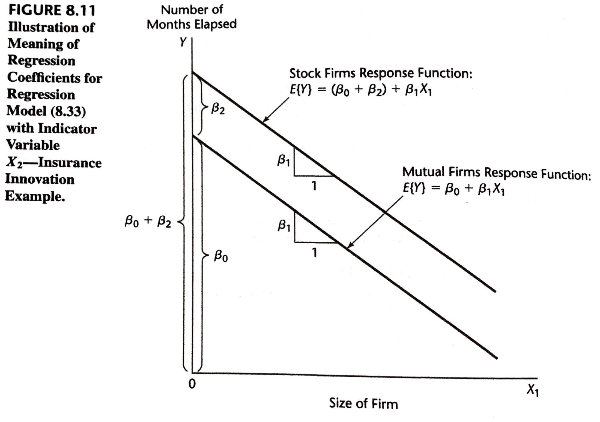
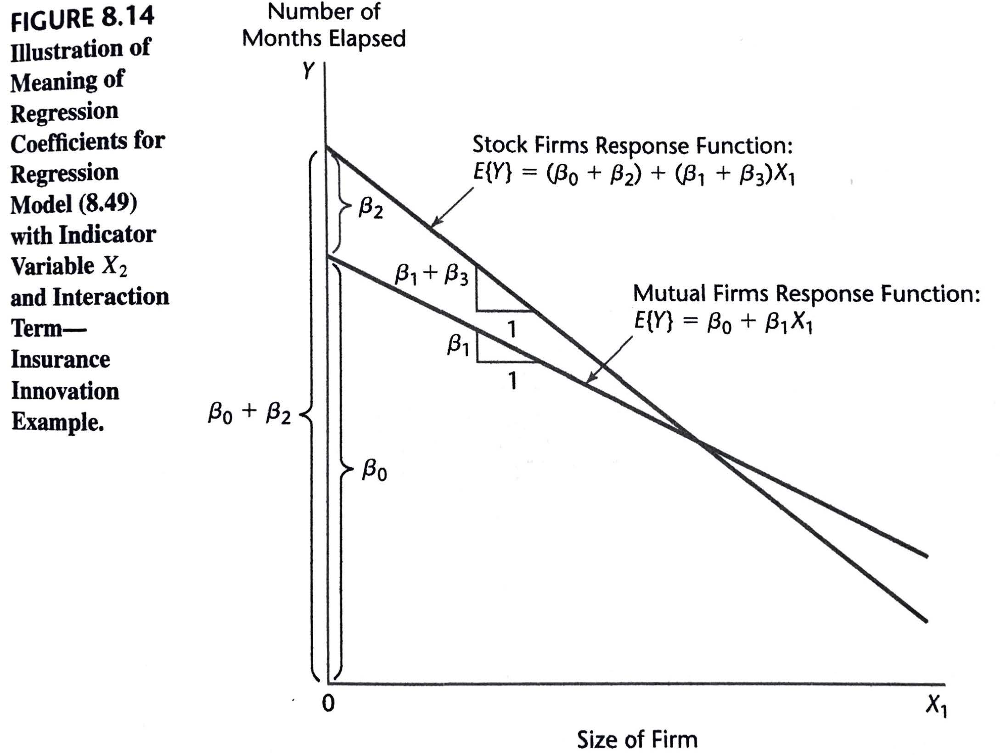
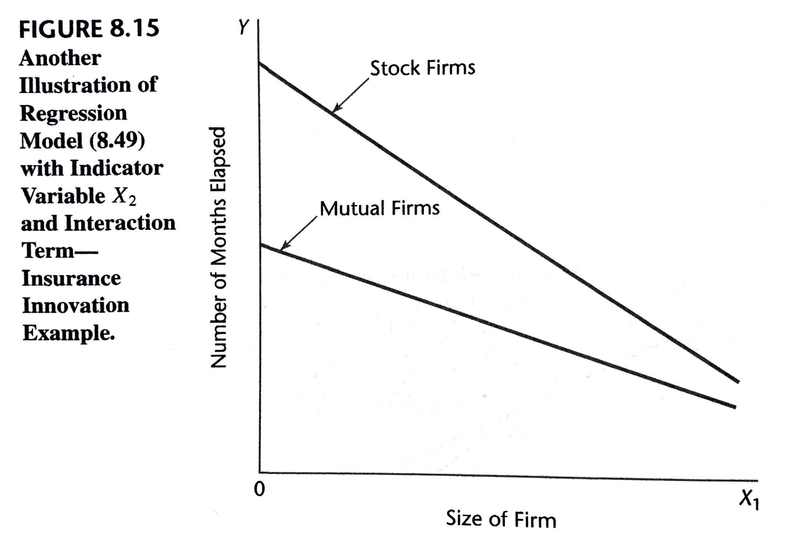

```{r xaringan-themer, include=FALSE, warning=FALSE}
library(xaringanthemer)
duo_accent(primary_color = "#006747", secondary_color = "#CFC493",   
	header_font_google = google_font("Josefin Sans"),
  text_font_google   = google_font("Montserrat", "300", "300i"),
  code_font_google   = google_font("Roboto Mono"))
```		


```{r setup, include=FALSE}
options(htmltools.dir.version = FALSE)
knitr::opts_chunk$set(fig.retina = 3, warning = FALSE, message = FALSE, fig.align="center", fig.height=5.5)
options(DT.options = list(scrollX = TRUE, pageLength=20, scrollY = 250))
options(digits = 4)
options(show.signif.stars=FALSE)

library(here)
library(sjPlot)
library(sjmisc)
library(sjlabelled)
library(tidyverse)
library(ggplot2)
library(knitr)
	library(mosaic)
	library(DT)
library(car)

#params
spending_subset_all = read.csv(here("data", "spending_subset.csv"))
spending_subset_all$age_group <- as.factor(spending_subset_all$age_group)

spending_subset=spending_subset_all[1:200,]

par(lwd=3,cex=1.5) 
cdi = as_tibble(read.delim(here("data", "CDI.txt"), sep=" ", header=FALSE)[,-c(1:2)] %>% mutate(V18 = recode_factor(V18, "NE", "NC", "S", "W")))
names(cdi) = c("county", "state", "land_area", "population", "pop_18_to_34", "pop_65", "number_physicians", "number_hospital_beds", "total_serious_crimes", "high_school_grads", "bachelor_degrees", "poverty_rate", "unemployment_rate", "per_capita_income", "total_personal_income", "region")

tab_model <- function(...,  show.ci=.95){sjPlot::tab_model(...,  show.ci=show.ci, show.se=TRUE, collapse.ci=TRUE, show.stat=TRUE)}


```


### Learning Objectives for Section 8.1

After Section 8.1, you should be able to 

- Understand the utility and disadvantages of polynomial regression
- Understand the need for centering
- Understand the danger of overfitting
- Compute and interpret parameters in a polynomial regression model

---

### 8.1: Polynonrial Regression Models

Polynomial regression models have two basic types of uses:

1. When the true curvilinear response function is indeed a polynomial function.
2. When the true curvilinear response function is unknown (or complex) but a polynomial function is a good approximation to the true function.

---
layout: true
class: inverse

---

```{r, echo=FALSE}
spending_subset=spending_subset_all[1:500,]
spending_subset %>% datatable()
```

---

Suppose that we are not sure about the nature of the response function in the range of the factors studied, so we decide to fit the second-order polynomial regression model: 
$$Y_i = \beta_0 + \beta_1 x_{i1} + \beta_2 x_{i2} + \beta_{11} x_{i1}^2 + \beta_{22} x_{i2}^2 + \beta_{12} x_{i1}x_{i2} + \varepsilon_i$$
We are particularly interested in whether interaction effects and curvature effects are required  in the model for the range of $X$ values considered. 

---

We will center the predictors in order to avoid the computational inaccuracies that arise with highly collinear predictors: 

* $income\_c_{i} = income_i - \overline{income}$
* ${food\_expenditure\_c}_i = food\_expenditure_i - \overline{food\_expenditure}$

---

```{r}
with(spending_subset, data.frame(clothing= clothing_expenditure, income, food=food_expenditure, income2=I(income^2), food2 = I(food_expenditure^2), income_food = income*food_expenditure)) %>% cor() %>% round(3)

spending_subset_c = with(spending_subset, data.frame(clothing= clothing_expenditure, income_c = income-mean(income), food_c=food_expenditure-mean(food_expenditure), income_c2=I((income - mean(income))^2), food_c2 = I((food_expenditure-mean(food_expenditure))^2), incomec_foodc = (income-mean(income))*(food_expenditure-mean(food_expenditure))))
spending_subset_c %>% cor() %>% round(3)
```

---
An even better approach is to use **Orthogonal Polynomials**

This approach involves using new variables

* $z_1 = a_1 + m_{11} x$
* $z_2 = a_2 + m_{21} x + m_{22} x^2$
* $z_3 = a_3 + m_{31} x + m_{32} x^2 + m_{33} x^3$
* etc

Where these variables are orthogonal (i.e., where $z_j' z_k = 0$ for all $j$ and $k$). 

--

By using centered variables (i.e., $z_1 = - \bar{x} + x$, $z_2 = \bar{x}^2 - 2 \bar{x} x + x^2$, etc.) we trade interpretability of the predictors for stability of the estimators. When using orthogonal polynomials, we go even farther with this idea. 

---

```{r}
spending = with(spending_subset, data.frame(clothing= clothing_expenditure, income, food=food_expenditure, income_food =  (income-mean(income))*(food_expenditure-mean(food_expenditure)))) 
with(spending, data.frame(clothing, income.1 = poly(income, degree=2)[,1], income.2 = poly(income, degree=2)[,2], food.1 = poly(food, degree=2)[,1], food.2 = poly(food, degree=2)[,2], income_food)) %>% cor() %>% round(3)
```

Note the change in the correlation between the two components of *income* and *food expenditure*. 

---

Note that instead of using polynomial regresssion, often it will be an even better idea to use *Piecewise polynomials* (**splines**) that offer more flexibility by not assuming that the relationship of interest is the same across the whole range of $X$ (similar to the idea of LOWESS curves).

---

```{r, echo=FALSE}
x = seq(-10, 10, length.out = 100)
y = dnorm(x)
```

#### Polynomial Regression
```{r}
plot(x, y, ylim=c(-.1, .45))

lines(x, predict(lm(y~poly(x, 1))), type="l", col="black", lwd=2)
lines(x, predict(lm(y~poly(x, 2))), type="l", col="yellow", lwd=2)
lines(x, predict(lm(y~poly(x, 5))), type="l", col="blue", lwd=2)
lines(x, predict(lm(y~poly(x, 10))), type="l", col="green", lwd=2)
lines(x, predict(lm(y~poly(x, 15))), type="l", col="red", lwd=2)
```

---
#### (Restricted Cubic) Spline Regression
```{r}
plot(x, y, ylim=c(-.1, .45))
require(rms)
lines(x, predict(lm(y~rcs(x, 5))), type="l", col="blue", lwd=2)
lines(x, predict(lm(y~rcs(x, 10))), type="l", col="green", lwd=2)
lines(x, predict(lm(y~rcs(x, 15))), type="l", col="red", lwd=2)
```
Keep this in mind, but we won't discuss Splines further in this course. 

---
#### Fitting the Model

```{r, fig.cap="", include=TRUE, message=FALSE, echo=TRUE, eval=TRUE}
clothing_model = lm(clothing~income_c+food_c + income_c2+food_c2+incomec_foodc, data=spending_subset_c)
msummary(clothing_model)
```

---
```{r, fig.cap="", include=TRUE, message=FALSE, echo=TRUE, eval=TRUE}
msummary(lm(clothing_expenditure~income + food_expenditure + I(income^2) + I(food_expenditure^2) + income:food_expenditure, data=spending_subset))
```

---
```{r, fig.cap="", include=TRUE, message=FALSE, echo=TRUE, eval=TRUE}
msummary(lm(clothing_expenditure~poly(income, degree=2) + poly(food_expenditure, degree=2) + income:food_expenditure, data=spending_subset))
```

---

.pull-left[
```{r}
xyplot(clothing~income_c, data=spending_subset_c,  type=c("p", "smooth"))
```
]

.pull-right[
```{r}
xyplot(clothing~food_c, data=spending_subset_c,  type=c("p", "smooth"))
```
]
---

<!-- #### Residual Plots -->

.pull-left[
```{r, fig.height=4}
xyplot(resid(clothing_model)~predict(clothing_model), ylab="Residuals", xlab="Fitted Values", type=c("p", "smooth"))
xyplot(resid(clothing_model)~spending_subset_c$food_c, ylab="Residuals", xlab="Food Expenditure", type=c("p", "smooth"))
```
]

.pull-right[
```{r, fig.height=4, results="hide"}
xyplot(resid(clothing_model)~spending_subset_c$income_c, ylab="Residuals", xlab="Income", type=c("p", "smooth"))
xyplot(resid(clothing_model)~spending_subset_c$incomec_foodc, ylab="Residuals", xlab="Income*food", type=c("p", "smooth"))
```
]

---

.pull-left[
```{r, fig.height=4, results="hide"}
xyplot(abs(resid(clothing_model))~predict(clothing_model), ylab="Absolute Residuals", xlab="Fitted Values", type=c("p", "smooth"))

boxplot(resid(clothing_model), ylab="Residuals", horizontal=TRUE)
```
]

.pull-right[
```{r, fig.height=4, results="hide"}
qqPlot(resid(clothing_model), ylab="Residuals")
MASS::boxcox(clothing_model)
```
]

---
#### Test of Fit
```{r}
alr3::pureErrorAnova(clothing_model)
```

---
#### Approximate Test of Fit

```{r, echo=FALSE}
spending_subset_1000 = with(spending_subset, data.frame(clothing= clothing_expenditure, income_c = round((income-mean(income))/1000, 0)*1000, food_c=round((food_expenditure-mean(food_expenditure))/1000, 0)*1000))

spending_subset_1000 = with(spending_subset_1000, data.frame(clothing, income_c, food_c, income_c2=income_c^2, food_c2 = food_c^2, incomec_foodc = income_c*food_c))

spending_subset_1000 %>% datatable()

```

---
```{r}
clothing_model_1000 = lm(clothing~income_c+food_c + income_c2+food_c2+incomec_foodc, data=spending_subset_1000)
msummary(clothing_model_1000)

msummary(clothing_model)
```

---

```{r}
alr3::pureErrorAnova(clothing_model_1000)
```


---

### Transformed Outcome

```{r}
spending_subset_c$clothing_transformed = spending_subset_c$clothing^(1/4)
spending_subset_c %>% datatable()
```

---
#### Fitting the Model
	
```{r, fig.cap="", include=TRUE, message=FALSE, echo=TRUE, eval=TRUE}
clothing_transformed_model = lm(clothing_transformed~income_c+food_c + income_c2+food_c2+incomec_foodc, data=spending_subset_c)
msummary(clothing_transformed_model)
```

---
	
.pull-left[
```{r}
xyplot(clothing_transformed~income_c, data=spending_subset_c,  type=c("p", "smooth"))
```
]

.pull-right[
```{r}
xyplot(clothing_transformed~food_c, data=spending_subset_c,  type=c("p", "smooth"))
```
]
---
	
<!-- #### Residual Plots -->
	
.pull-left[
```{r, fig.height=4}
xyplot(resid(clothing_transformed_model)~predict(clothing_transformed_model), ylab="Residuals", xlab="Fitted Values", type=c("p", "smooth"))
xyplot(resid(clothing_transformed_model)~spending_subset_c$food_c, ylab="Residuals", xlab="Food Expenditure", type=c("p", "smooth"))
```
]

.pull-right[
```{r, fig.height=4, results="hide"}
xyplot(resid(clothing_transformed_model)~spending_subset_c$income_c, ylab="Residuals", xlab="Income", type=c("p", "smooth"))
xyplot(resid(clothing_transformed_model)~spending_subset_c$incomec_foodc, ylab="Residuals", xlab="Income*food", type=c("p", "smooth"))
```
]

---
	
.pull-left[
```{r, fig.height=4, results="hide"}
xyplot(abs(resid(clothing_transformed_model))~predict(clothing_transformed_model), ylab="Absolute Residuals", xlab="Fitted Values", type=c("p", "smooth"))
		
boxplot(resid(clothing_transformed_model), ylab="Residuals", horizontal=TRUE)
```
]

.pull-right[
```{r, fig.height=4, results="hide"}
qqPlot(resid(clothing_transformed_model), ylab="Residuals")
MASS::boxcox(clothing_transformed_model)
```
]

---
#### Test of Fit

```{r}
alr3::pureErrorAnova(clothing_transformed_model)
```

---

#### Approximate Test of Fit

```{r, echo=FALSE}
spending_subset_1000 = with(spending_subset, data.frame(clothing_transformed= clothing_expenditure^(1/4), income_c = round((income-mean(income))/1000, 0)*1000, food_c=round((food_expenditure-mean(food_expenditure))/1000, 0)*1000))

spending_subset_1000 = with(spending_subset_1000, data.frame(clothing_transformed, income_c, food_c, income_c2=income_c^2, food_c2 = food_c^2, incomec_foodc = income_c*food_c))
```

```{r}
clothing_transformed_model_1000 = lm(clothing_transformed~income_c+food_c + income_c2+food_c2+incomec_foodc, data=spending_subset_1000)

alr3::pureErrorAnova(clothing_transformed_model_1000)
```

---


```{r, include=FALSE}
# scatter3d(I(clothing_expenditure^(1/4))~income+food_expenditure, data=spending_subset, fit="quadratic")
# rgl::movie3d(rgl::spin3d(axis = c(0, 1, 0)), duration = 12, dir=here("src/img"), movie="transformed_clothing_food_income_secondorder", convert=TRUE)
```

```{r, results='hide', eval=FALSE}
car::scatter3d(I(clothing_expenditure^(1/4))~income+food_expenditure, data=spending_subset, fit="quadratic")
```

.center[
`)
]

---

### Partial $F$ Test: 
#### Would a first order model be sufficient? 

$$Y_i = \beta_0 + \beta_{1} x_{i1} + \beta_2 x_{i2} + \beta_{11}  x_{i1}^2 + \beta_{22}  x_{i2}^2 + \beta_{12} x_{i1} x_{i2} + \varepsilon_i$$
* $Y = clothing\_expenditure^{1/4}$ for individual $i$
* $x_{i1}$ is centered income for individual $i$
* $x_{i2}$ is centered food expenditure for individual $i$


$H_0: \beta_{11} = \beta_{22} = \beta_{12} = 0 \qquad { }$  vs $\quad { } H_a:$ not all of those $\beta s$  are $0$

I.e., does the full model explain significantly more of the variation in $Y$ than the following *reduced model*?
$$Y_i = \beta_0 + \beta_{1} x_{i1} + \beta_2 x_{i2} + \varepsilon_i$$

We can test this using 
$$F^\ast = \frac{SSR(x_1^2, x_2^2, x_1 x_2|x_1, x_2)}{3} \div MSE$$ 

---

Remember that 

$$\begin{align*}
SSR(x_1^2, x_2^2, x_1 x_2|x_1, x_2) = & SSR(x_1^2 |x_1, x_2) \\
& + SSR(x_2^2|x_1, x_2, x_1^2) \\
& + SSR(x_1 x_2|x_1, x_2, x_1^2, x_2^2)
\end{align*}$$

So we can find the test statistic by considering the extra sums of squares:
```{r}
anova(clothing_transformed_model)
```

---

Or we could get `R` to perform the general linear test: 

```{r}
clothing_transformed_model_reduced = lm(clothing_transformed~income_c+food_c, data=spending_subset_c)

anova(clothing_transformed_model_reduced, clothing_transformed_model)
```

---

Note that RSS could be found in 
```{r}
anova(clothing_transformed_model_reduced)
```


---

We could also consider the adequacy of other reduced models, e.g.
$$Y_i = \beta_0 + \beta_{11}  x_{i1}^2 + \beta_{22}  x_{i2}^2 + \beta_{12} x_{i1} x_{i2} + \varepsilon_i$$
which is equivalent to 

$H_0: \beta_{1} = \beta_{2} = 0 \qquad { }$  vs $\quad { } H_a:$ not all of those $\beta s$  are $0$

--
```{r}
clothing_transformed_model_reduced = lm(clothing_transformed~income_c2+food_c2+incomec_foodc, data=spending_subset_c)

anova(clothing_transformed_model_reduced, clothing_transformed_model)
```

--

However, regardless of the outcome of this test, we usually take the **hierarchical approach to fitting**, which means, for example, that we keep $x$ in the model whenever we use $x^2$, and we would keep $x$ and $x^2$ in the model whenever we include $x^3$.

---

layout: true
class: inverse
---

### Warm-up Exercises

```{r}
clothing_model = lm(clothing_expenditure~income + I(income^2) + I(income^3), data=spending_subset)
msummary(clothing_model)
```

---

### Warm-up Exercises


```{r}
clothing_model_centered = lm(clothing_expenditure~I(income-mean(income)) + I((income-mean(income))^2) + I((income-mean(income))^3), data=spending_subset)
msummary(clothing_model_centered)
```

---

* **Based on the regression results displayed above, describe the relationship between clothing expenditure and income.**


<!-- PUT SELECT WARM UP RESPONSES HEREHERE (preceded by a ">"): -->
<!-- warm up question 8a) 1 -->

* When income is zero, clothing expenditure is around 2614`$`. By looking at the details of the centered model (since the centering helps reduce multicollinearity), we see that clothing expenditure has a quadtratic relationship with income, since X1 and X1^2 affect the variation on Y, when the other factor is in the model (theri P-value < 0.05). However, the X1^3 is not needed since its p-value is > 0.05. Also, only 5% (adjusted R-squared) of the variablity in Y is explained by introducing the two income terms, so the relationship between clothing expenditure and income is not a strog one.


---

* **Based on the regression results displayed above, describe the relationship between clothing expenditure and income.**


<!-- PUT SELECT WARM UP RESPONSES HEREHERE (preceded by a ">"): -->
<!-- warm up question 8a) 1 -->

*  Since t value is 1.95966, it's not very big and close to 0, and p value is 0.050595, which is close to 0.05, therefore, we accept the null hypothesis, there is no relationship between clothing expenditure and income.

* Average clothing expenditure is expected to increase a given amount for a unit increase in income.

* based on the regression results provided, we can see that there is a slight positive relationship between clothing expenditure and income for the most part, except for income squared, we tend to have a slight negative relatioship.

* As income increases, clothing expenditure increases.


---

* **If income were to increase by `$`1000, how much would you expect clothing expenditure to change? Explain. **

<!-- PUT SELECT WARM UP RESPONSES HEREHERE (preceded by a ">"): -->
<!-- warm up question 8a) 2 -->

* $\cdots$
* It is difficult to interpret our model in this fashion. Normally, we would look at our Beta_income and state "When x increases by 1, y increases by beta with all other predictors held constant". This does not work in our case because when x is increased, x^2 cannot remain constant.


---

* **If income were to increase by `$`1000, how much would you expect clothing expenditure to change? Explain. **

<!-- PUT SELECT WARM UP RESPONSES HEREHERE (preceded by a ">"): -->
<!-- warm up question 8a) 2 -->

* We would expect clothing expenditure to increase by $110.41. We know this because we multiply the slope of income by 1000.

* We can expect the clothing expenditure to increase about 2600. I used the centered model for we are talking about displacement from the mean.

* If income were to increase by `$`1000, clothing expenditure would increase by `$`108.85. This is from the equation 1.104143e-01(1000)-1.574466e-06(1000^2)+7.928821e-12(1000^3).

* If we included income^3, then the expected change would be 20.09974`$`, which is not far off from the change if we excluded income^3. (I used the centered model)
---


layout: false

### Recap: Section 8.1

After Section 8.1, you should be able to 

- Understand the utility and disadvantages of polynomial regression
- Understand the need for centering
- Understand the danger of overfitting
- Compute and interpret parameters in a polynomial regression model

---

### Learning Objectives for Section 8.2

After Section 8.2, you should be able to 

- Understand the utility and disadvantages of interactions in regression
- Compute and interpret parameters in regression models with interactions
- Compute and interpret parameters in curvilinear regression models with interactions

---

### Interpretation of Interaction 

Suppose 
$$Y_i = \beta_0 + \beta_1 X_{i1} + \beta_2 X_{i2} + \beta_3 X_{i1} X_{i2} + \varepsilon_i.$$
Then 
$$E[Y|X_1, X_2] = \beta_0 + \beta_1 X_{1} + \beta_2 X_{2} + \beta_3 X_{1} X_{2}.$$

We can use this to understand the meaning of the regression coefficients: 

---

$$\begin{align*} 
E[Y|0, 0] = & \beta_0 + \beta_1  (0) + \beta_2 (0) + \beta_3 (0) (0) = \beta_0
\end{align*}$$

--

$$\begin{align*} 
E[Y|X_1+1, 0] - E[Y|X_1, 0] = & \beta_0 + \beta_1  (X_{1}+1) + \beta_2 (0) + \beta_3 (X_{1}+1) (0)  \\
& - (\beta_0 + \beta_1  (X_{1}) + \beta_2 (0) + \beta_3 (X_{1}) (0))  \\
= & \beta_1
\end{align*}$$

--

$$\begin{align*} 
E[Y|X_1+1, X_2] - E[Y|X_1, X_2] =& \beta_0 + \beta_1  (X_{1}+1) + \beta_2 X_{2} + \beta_3 (X_{1}+1) X_{2} \\
& - (\beta_0 + \beta_1 X_{1} + \beta_2 X_{2} + \beta_3 X_{1} X_{2}) \\
= & \beta_1 + \beta_3 X_2
\end{align*}$$

--

$$\begin{align*} 
E[Y|X_1, X_2+1] - E[Y|X_1, X_2] =& \beta_0 + \beta_1  X_{1} + \beta_2 (X_{2}+1) + \beta_3 X_{1} (X_{2}+1) \\
& - (\beta_0 + \beta_1 X_{1} + \beta_2 X_{2} + \beta_3 X_{1} X_{2}) \\
= & \beta_2 + \beta_3 X_1
\end{align*}$$

---

We could also see the effect of a regression coefficient by taking a partial derivative of the response surface:
$$\begin{align*} 
\frac{\partial E[Y|X_1, X_2]}{\partial X_2} =& \frac{\partial}{\partial X_2} (\beta_0 + \beta_1  X_{1} + \beta_2 X_{2} + \beta_3 X_{1} X_{2}) \\
= & \beta_2 + \beta_3 X_1
\end{align*}$$

---

```{r}
n=1000
X1 = runif(n, min=0, max=10)
X2 = runif(n, min=0, max=10)
Y_additive = rnorm(n, mean= 10 + 2*X1 + 5*X2 + 0 *X1*X2, sd=1)
Y_reinforcement = rnorm(n, mean= 10 + 2*X1 + 5*X2 + 1 *X1*X2, sd=1)
Y_interference  = rnorm(n, mean= 10 + 2*X1 + 5*X2 + -1 *X1*X2, sd=1)
```

---

```{r}
additive_model = lm(Y_additive~X1*X2)
plot(X1, Y_additive)
points(X1[round(X2)==1], Y_additive[round(X2)==1], col="red")
points(X1[round(X2)==5], Y_additive[round(X2)==5], col="blue")
newX1 = seq(from=0, to=10, length.out=100)
lines(newX1, predict(additive_model, newdata=data.frame(X1 = newX1, X2=1)), col="red")
lines(newX1, predict(additive_model, newdata=data.frame(X1 = newX1, X2=5)), col="blue")
legend("topleft", fill  =c("red", "blue"), legend=c("X2 around 1", "X2 around 5"))
```

---

```{r}
reinforcement_interaction_model = lm(Y_reinforcement~X1*X2)
plot(X1, Y_reinforcement)
points(X1[round(X2)==1], Y_reinforcement[round(X2)==1], col="red")
points(X1[round(X2)==5], Y_reinforcement[round(X2)==5], col="blue")
newX1 = seq(from=0, to=10, length.out=100)
lines(newX1, predict(reinforcement_interaction_model, newdata=data.frame(X1 = newX1, X2=1)), col="red")
lines(newX1, predict(reinforcement_interaction_model, newdata=data.frame(X1 = newX1, X2=5)), col="blue")
legend("topleft", fill  =c("red", "blue"), legend=c("X2 around 1", "X2 around 5"))
```

---

```{r}
interference_interaction_model = lm(Y_interference~X1*X2)
plot(X1, Y_interference)
points(X1[round(X2)==1], Y_interference[round(X2)==1], col="red")
points(X1[round(X2)==5], Y_interference[round(X2)==5], col="blue")
newX1 = seq(from=0, to=10, length.out=100)
lines(newX1, predict(interference_interaction_model, newdata=data.frame(X1 = newX1, X2=1)), col="red")
lines(newX1, predict(interference_interaction_model, newdata=data.frame(X1 = newX1, X2=5)), col="blue")
legend("topleft", fill  =c("red", "blue"), legend=c("X2 around 1", "X2 around 5"))
```

---

```{r, include=FALSE}
# scatter3d(Y_additive~X1*X2, fit="linear")
# rgl::movie3d(rgl::spin3d(axis = c(0, 1, 0)), duration = 12, dir=here("src/img"), movie="additive_model_surface", convert=TRUE)
```

```{r, results='hide', eval=FALSE}
car::scatter3d(Y_additive~X1*X2, fit="linear")
```

.center[
`)
]

---

```{r, include=FALSE}
# scatter3d(Y_reinforcement~X1*X2, fit="linear")
# rgl::movie3d(rgl::spin3d(axis = c(0, 1, 0)), duration = 12, dir=here("src/img"), movie="additive_model_surface2", convert=TRUE)
```

```{r, results='hide', eval=FALSE}
car::scatter3d(Y_reinforcement~X1*X2, fit="linear")
```

.center[
`)
]

---

```{r, include=FALSE}
# scatter3d(Y_reinforcement~X1*X2, fit="quad")
# rgl::movie3d(rgl::spin3d(axis = c(0, 1, 0)), duration = 12, dir=here("src/img"), movie="reinforcement_interaction_model_surface", convert=TRUE)
```

```{r, results='hide', eval=FALSE}
car::scatter3d(Y_reinforcement~X1*X2, fit="quad")
```

.center[
`)
]


---

```{r, include=FALSE}
# scatter3d(Y_interference~X1*X2, fit="linear")
# rgl::movie3d(rgl::spin3d(axis = c(0, 1, 0)), duration = 12, dir=here("src/img"), movie="additive_model_surface3", convert=TRUE)
```

```{r, results='hide', eval=FALSE}
car::scatter3d(Y_interference~X1*X2, fit="linear")
```

.center[
`)
]

---

```{r, include=FALSE}
# scatter3d(Y_interference~X1*X2, fit="quad")
# rgl::movie3d(rgl::spin3d(axis = c(0, 1, 0)), duration = 12, dir=here("src/img"), movie="interference_interaction_model_surface", convert=TRUE)
```

```{r, results='hide', eval=FALSE}
car::scatter3d(Y_interference~X1*X2, fit="quad")
```

.center[
`)
]

---

### Notes on Implementation of Interaction Regression Models

1. When interaction terms are added to a regression model, high multicollinearities may be introduced. 
	+ A partial remedy to improve computational accuracy is to center the predictor variables. 

2. When the number of predictor variables in the regression model is large, there are a lot of potential interaction terms. 
	+ For example, if there were 8 predictors, there would be ${8 \choose 2} = 28$ 2-way interactions; we would need a large data set in order to be able to estimate all of these effects!
	+ If we have a lot of interactions in our model, we are at risk of *overfitting*. 
	+ It is best to determine the interactions that are potentially important *a priori*. 

---

.small[
```{r}
clothing_model = lm(clothing_expenditure~ (recreation_expenditure + food_expenditure+ income)^2, data=spending_subset)
msummary(clothing_model)
```
]

---
.small[
##### Extra sum of squares $(SSR(x_1), SSR(x_2| x_1), SSR(x_3 | x_1, x_2), SSR(x_1 x_2 | x_1, x_2, x_3),...)$
```{r}
anova(clothing_model)
```

Test $\qquad \qquad H_0: \beta_4 = \beta_5 =\beta_6=0$ 
using 
$$F^\ast = \frac{SSR(x_1 x_2, x_1 x_3, x_2 x_3 | x_1, x_2, x_3)}{3} \div MSE$$
]
---
```{r}
clothing_model_reduced = lm(clothing_expenditure~ recreation_expenditure + food_expenditure + income, data=spending_subset)
anova(clothing_model_reduced, clothing_model)
```

---


```{r}
clothing_model = lm(clothing_expenditure~ income+  recreation_expenditure + I(income^2) + I(recreation_expenditure^2) + income:recreation_expenditure, data=spending_subset)
msummary(clothing_model)
```

---

#### Extra sum of squares $(SSR(x_1), SSR(x_2| x_1), SSR(x_3 | x_2, x_1), ...)$
```{r}
anova(clothing_model)
```

---

```{r}
clothing_model_reduced = lm(clothing_expenditure~ income*recreation_expenditure, data=spending_subset)
msummary(clothing_model_reduced)
```

--
```{r}
anova(clothing_model_reduced, clothing_model)
```

---

layout: true
class: inverse
---

### Warm-up Exercises

.small[
```{r}
clothing_model_centered_interaction = lm(clothing_expenditure~sex*(I(center(income)) + I(center(income)^2)), data=spending_subset)
msummary(clothing_model_centered_interaction)
```
]

---

* **Compare and contrast the relationship between clothing expenditure and income in males and females.**

<!-- PUT SELECT WARM UP RESPONSES HEREHERE (preceded by a ">"): -->
<!-- warm up question 8a) 3-->

* When income=0, males tend to spend $342 less than women.

* looking at the relationship between clothing expenditure and income in males and females, we can see that the slope for females tends to be slightly larger than it is for males, stating that femals spend more money on clothes as income continues to increase

* I think that given the high p value (0.78) we can assume that spending is not significantly different between male and female.

---

layout: false
### Recap: Section 8.2

After Section 8.2, you should be able to 

- Understand the utility and disadvantages of interactions in regression
- Compute and interpret parameters in regression models with interactions
- Compute and interpret parameters in curvilinear regression models with interactions

---

### Learning Objectives for Sections 8.3-8.4

After Sections 8.3-8.4, you should be able to 

- Implement and interpret regression using indicator (dummy) variables 

---

### Qualitative Predictor with Two Classes


There are many ways of quantitatively identifying the classes of a qualitative variable. We shall use indicator variables that take on the values 0 and 1. These indicator variables are easy to use and are widely employed, but they are by no means the only way to quantify a qualitative variable.

For the insurance innovation example, where the qualitative predictor variable has two classes ("stock company" or "mutual company"), we might define two indicator variables $X_2$ and $X_3$ as follows:

$$X_2 = \left \{ \begin{array}{cl} 1 & \text{if stock company} \\  0 & \text{otherwise} \end{array} \right.$$
$$X_3 = \left \{ \begin{array}{cl} 1 & \text{if mutual company} \\  0 & \text{otherwise} \end{array} \right.$$


We might think that a first-order model would then be 
$$Y_i = \beta_0 + \beta_1 X_{i1} + \beta_2 X_{i2} + \beta_3 X_{i3} + \varepsilon_i$$
---

However, suppose that we have $n=4$ observations, the first two being stock firms, and the second two being mutual firms. The design matrix would then be
$$\mathbb{X} = \left[\begin{array}{cccc}
1 & X_{11} & 1 & 0 \\
1 & X_{21} & 1 & 0 \\
1 & X_{31} & 0 & 1 \\
1 & X_{41} & 0 & 1 
\end{array} \right]$$
where the first column is equal to the sum of $X_2$ and $X_3$, so the columns are linearly dependent!
Thus 
$$\mathbb{X}^\prime \mathbb{X} = \left[\begin{array}{cccc}
4 & \sum_{i=1}^4 X_{i1} & 2 & 2 \\
\sum_{i=1}^4 X_{i1} & \sum_{i=1}^4 X_{i1}^2 & \sum_{i=1}^2 X_{i1} & \sum_{i=3}^4 X_{i1} \\
2 & \sum_{i=1}^2 X_{i1} & 2 & 0 \\
2 & \sum_{i=3}^4 X_{i1} & 0 & 2
\end{array} \right]$$
has linearly dependent columns and, therefore, does not have an inverse. That means that we could not possibly find $b = (\mathbb{X}'\mathbb{X})^{-1} \mathbb{X}'\mathbb{Y}$

---

We can also see that this coding would not work by attempting to decipher what the parameters would represent: 

For stock companies, the response function would be
$$E[Y] = \beta_0 + \beta_1 X_{i1} + \beta_2 (1) + \beta_3 (0)  = (\beta_0 + \beta_2) + \beta_1 X_{i1}$$
For the other type of company (mutual companies), the response function would be
$$E[Y] = \beta_0 + \beta_1 X_{i1} + \beta_2 (0) + \beta_3 (1)  = (\beta_0 + \beta_3) + \beta_1 X_{i1}$$

We are using 3 parameters $(\beta_0, \beta_2, \beta_3)$ to capture 2 things (the y-intercept for stock companies and the y-intercept for mutual companies). This *over-parameterization* is what makes it impossible to uniquely estimate the parameters. 

---

A simple way out of this difficulty is to drop one of the indicator variables. 

In our example, we might drop $X_3$.

Dropping one indicator variable is not the only way out of the difficulty, but it leads to simple interpretations of the parameters. 

In general, therefore, we shall follow the principle:

* A qualitative variable with $c$ classes will be represented by $c - 1$ indicator variables, each taking on the values $0$ and $1$.


Indicator variables are frequently also called *dummy* variables or *binary* variables. 

---

### Interpretation of Regression Coefficients
We are now considering the regression model
$$Y_i = \beta_0 + \beta_1 X_{i1} + \beta_2 X_{i2} + \varepsilon_i$$

So, for stock companies, the response function would be
$$E[Y] = \beta_0 + \beta_1 X_{i1} + \beta_2 (1)  = (\beta_0 + \beta_2) + \beta_1 X_{i1}$$
For the other type of company (mutual companies), the response function would be
$$E[Y] = \beta_0 + \beta_1 X_{i1} + \beta_2 (0)  = \beta_0 + \beta_1 X_{i1}$$

So we can uniquely interpret $\beta_0$, $\beta_1$, and $\beta_2$. 
---

```{r, fig.cap="", include=TRUE, message=FALSE, echo=FALSE, out.width="90%"}

```

---

Note that we could have alternately chosen to drop $\beta_0$ from our over-parameterized regression model (i.e., used regression through the origin):
$$Y_i = \beta_1 X_{i1} + \beta_2 X_{i2} + \beta_3 X_{i3} + \varepsilon_i$$

So, for stock companies, the response function would be
$$E[Y] = \beta_1 X_{i1} + \beta_2 (1) + \beta_3 (0)  = \beta_2 + \beta_1 X_{i1}$$
For the other type of company (mutual companies), the response function would be
$$E[Y] = \beta_1 X_{i1} + \beta_2 (0) + \beta_3 (1)  = \beta_3 + \beta_1 X_{i1}$$

We could still uniquely interpret our parameters, but the interpretations would be different!

--

Consider how one would test whether or not the two regression lines are identical. 

Instead of testing $H_0: \beta_2=0$ (which could be done using extra sums of squares), we would need to test $H_0: \beta_2 = \beta_3$  (which we could accomplish by fitting a reduced model where $\beta_2 = \beta_3$ and using the general linear test approach to test the adequacy of that reduced model). 
---

We could have also considered the regression model
$$Y_i = \beta_0 + \beta_1 X_{i1} + \beta_2 X_{i2} + \varepsilon_i$$
where, instead of the usual dummy variable coding, we used 

$$X_2 = \left \{ \begin{array}{cl} 1 & \text{if stock company} \\  -1 & \text{otherwise} \end{array} \right.$$

Then, for stock companies, the response function would be
$$E[Y] = \beta_0 + \beta_1 X_{i1} + \beta_2 (1)  = (\beta_0 + \beta_2) + \beta_1 X_{i1}$$
For the other type of company (mutual companies), the response function would be
$$E[Y] = \beta_0 + \beta_1 X_{i1} + \beta_2 (-1)  = (\beta_0 - \beta_2) + \beta_1 X_{i1}$$

Again, we could uniquely interpret our parameters, but the interpretations would again be different!

---
layout: true
class: inverse

---
#### Qualitative Predictor with More than Two Classes

```{r, echo=FALSE}
spending_subset=spending_subset_all
spending_subset %>% datatable(options=list(scrollY=200))

spending_subset$type_of_dwelling = factor(spending_subset$type_of_dwelling, levels=c("other", "single_detached", "semi_detached", "row_house", "apartment", "duplex"))
```

```{r}
table(spending_subset$type_of_dwelling)
```

---

.small[
Let 
$$X_1 = income$$
$$X_2 = \left \{ \begin{array}{cl} 1 & \text{if single_detached} \\  0 & \text{otherwise} \end{array} \right.$$
$$X_3 = \left \{ \begin{array}{cl} 1 & \text{if semi_detached} \\  0 & \text{otherwise} \end{array} \right.$$
$$X_4 = \left \{ \begin{array}{cl} 1 & \text{if row_house} \\  0 & \text{otherwise} \end{array} \right.$$
$$X_5 = \left \{ \begin{array}{cl} 1 & \text{if apartment} \\  0 & \text{otherwise} \end{array} \right.$$
$$X_6 = \left \{ \begin{array}{cl} 1 & \text{if duplex} \\  0 & \text{otherwise} \end{array} \right.$$
]

---
If we use the first-order regression model
$$Y_i = \beta_0 + \beta_1 X_{i1} + \beta_2 X_{i2} + \beta_{3} X_{i3} + \beta_{4} X_{i4} + \beta_{5} X_{i5} + \beta_{6} X_{i6} + \varepsilon_i$$
then the response function is 
$$E[Y] = \beta_0 + \beta_1 X_{1} + \beta_2 X_{2} + \beta_{3} X_{3} + \beta_{4} X_{4} + \beta_{5} X_{5} + \beta_{6} X_{6}$$

So for someone who lives in a single detached house, 
$$E[Y] = (\beta_0 + \beta_{2}) + \beta_1 X_{1}$$

So for someone who lives in a semi-detached house, 
$$E[Y] = (\beta_0 + \beta_{3}) + \beta_1 X_{1}$$
etc.

---
.small[
$X_1 = income; X_2 = I(single\_detached); X_3 = I(semi\_detached);$   
$X_4 = I(row\_house); X_5 = I(apartment); X_6 = I(duplex)$.
$$E[Y] = \beta_0 + \beta_1 X_{1} + \beta_2 X_{2} + \beta_{3} X_{3} + \beta_{4} X_{4} + \beta_{5} X_{5} + \beta_{6} X_{6}$$
]

* **What does $\beta_0$ represent?**

* **How much higher is the response function for those in single detached houses compared to those whose housing was listed as "other"?**

* **How much higher is the response function for those in single detached houses compared to those in semi-detached houses?**

* **How do we test whether the response function for those in single detached houses differs from that of those whose housing was listed as "other"?**

* **How do we test whether those in single detached and semi-detached houses are different in terms of mean clothing expenditure?**


---
```{r}
msummary(lm(clothing_expenditure~income+type_of_dwelling, data=spending_subset))
```

---

```{r}
spending_subset$type_of_dwelling = factor(spending_subset$type_of_dwelling, levels=c("single_detached", "semi_detached", "row_house", "apartment", "duplex", "other"))
msummary(lm(clothing_expenditure~income+type_of_dwelling, data=spending_subset))
```

---

### Indicator Variables versus Allocated Codes

Now suppose that we use the following coding

.small[
Let 
$$X_1 = income$$
$$X_2 = \left \{ \begin{array}{cl} 1 & \text{if single_detached} \\ 
2 & \text{if semi_detached} \\ 
3 & \text{if row_house} \\ 
4 & \text{if apartment} \\ 
5 & \text{if duplex} \\  
6 & \text{otherwise} \end{array} \right.$$
]

Then the response function corresponding to the first order regression model is
$$E[Y] = \beta_0 + \beta_1 X_{1} + \beta_2 X_{2}$$

---


So for someone who lives in a single detached house, 
$$E[Y] = (\beta_0 + \beta_{2})  + \beta_1 X_{1}$$

For someone who lives in a semi-detached house, 
$$E[Y] = (\beta_0 + 2\beta_{2}) + \beta_1 X_{1}$$

For someone who lives in a row house, 
$$E[Y] = (\beta_0 + 3\beta_{2}) + \beta_1 X_{1}$$

For someone who lives in an apartment, 
$$E[Y] = (\beta_0 + 4\beta_{2}) + \beta_1 X_{1}$$

etc.

---

```{r, fig.height=4}
spending_subset$type_of_dwelling = as.numeric(spending_subset$type_of_dwelling, levels=c("single_detached", "semi_detached", "row_house", "apartment", "duplex", "other"))
msummary(lm(clothing_expenditure~income+type_of_dwelling, data=spending_subset))
xyplot(clothing_expenditure~type_of_dwelling, data=spending_subset, type=c("p", "r"))
```


---


#### Indicator Variables versus Quantitative Variables
.small[
```{r}
table(spending_subset$age_group)
msummary(lm(clothing_expenditure~income+age_group, data=spending_subset))
```


]

---

```{r, fig.height=4}
table(as.numeric(spending_subset$age_group))
msummary(lm(clothing_expenditure~income+as.numeric(age_group), data=spending_subset))
```

---

```{r, fig.height=4, echo=FALSE}
xyplot(clothing_expenditure~age_group, data=spending_subset, type=c("p", "r"))
```

---

```{r}
anova(lm(clothing_expenditure~income+as.numeric(age_group), data=spending_subset), lm(clothing_expenditure~income+age_group, data=spending_subset))
```

---

### Other Codings for Indicator Variables

```{r}
spending_subset$sex.1 = ifelse(spending_subset$sex=="male", 1, -1)
spending_subset %>% datatable()
```

---


```{r}
msummary(lm(clothing_expenditure~sex, data=spending_subset))
msummary(lm(clothing_expenditure~sex.1, data=spending_subset))
```


---
layout: false

### Recap: Sections 8.3-8.4

After Sections 8.3-8.4, you should be able to 

- Implement and interpret regression using indicator (dummy) variables 

---

### Learning Objectives for Sections 8.5-8.7

After Sections 8.5-8.7, you should be able to 

- Implement and interpret regression involving interactions between indicator and quantitative variables
- Implement and interpret regression involving interactions between multiple indicator variables
- Implement and interpret tests for differences among regression functions

---

### 8.5: Modeling Interactions between Quantitative and Qualitative Predictors

A first-order regression model with an added interaction term for the insurance innovation example is:

$$Y_i = \beta_0 + \beta_1 X_{i1} + \beta_2 X_{i2} + \beta_3 X_{i1} X_{i2} + \varepsilon_i,$$
where
$$X_{i1} = \text{ size of firm } i$$

$$X_{i2} = \left \{ \begin{array}{cl} 1 & \text{if } i \text{ is a stock company} \\  0 & \text{otherwise} \end{array} \right.$$


So, for stock companies, the response function would be
$$E[Y] = \beta_0 + \beta_1 X_{i1} + \beta_2 (1) + \beta_3 X_{i1} (1)  = (\beta_0 + \beta_2) + (\beta_1 + \beta_3) X_{i1}$$

For the other type of company (mutual companies), the response function would be
$$E[Y] = \beta_0 + \beta_1 X_{i1} + \beta_2 (0) + \beta_3 X_{i1} (0) = \beta_0 + \beta_1 X_{i1}$$
---

```{r, fig.cap="", include=TRUE, message=FALSE, echo=FALSE, out.width="90%"}

```

---

```{r, fig.cap="", include=TRUE, message=FALSE, echo=FALSE, out.width="90%"}

```

---


Fitting regression model (8.49) yields the same response functions as would fitting separate regressions for stock firms and mutual firms. 

An advantage of using model (8.49) with an indicator variable is that one regression run will yield both fitted regressions.

Another advantage is that tests for comparing the regression functions for the different classes of the qualitative variable can be clearly seen to involve tests of regression coefficients in a general linear model. 

For instance, Figure 8.14 for the insurance innovation example shows that a test of whether the two regression functions have the same slope involves:
$$H_0: \beta_3 = 0 \qquad vs \quad H_a: \ \beta_3 \neq 0$$
Similarly, Figure 8.14 shows that a test of whether the two regression functions are identical involves: 
$$H_0: \beta_2 = \beta_3 = 0 \qquad vs \quad H_a: \text{ not both } \beta_3 = 0 \text{ and } \beta_3 = 0$$
---

### 8.6: More Complex Models

1. Models in which all explanatory variables are qualitative are called *analysis of variance models*.

2. Models containing some quantitative and some qualitative explanatory variables, where the chief explanatory variables of interest are qualitative and the quantitative variables are introduced primarily to reduce the variance of the error terms, are called *analysis of covariance models.*


---
layout: true
class: inverse
---

```{r, echo=FALSE}
spending_subset=spending_subset_all
spending_subset %>% datatable()

table(spending_subset$sex)
table(spending_subset$marital_status)
```

---
Let 
$$X_1 = income$$
$$X_2 = \left \{ \begin{array}{cl} 1 & \text{if male} \\  0 & \text{otherwise} \end{array} \right.$$
$$X_3 = \left \{ \begin{array}{cl} 1 & \text{if married} \\  0 & \text{otherwise} \end{array} \right.$$

Consider the response function for the first-order regression model:
$$E[Y] = \beta_0 + \beta_1 X_{1} + \beta_2 X_{2} + \beta_{3} X_{3}$$
---

So for a married male
$$E[Y] = (\beta_0 + \beta_{2} + \beta_{3}) + \beta_1 X_{1}$$

For an unmarried male
$$E[Y] = (\beta_0 + \beta_{2}) + \beta_1 X_{1}$$
For a married female
$$E[Y] = (\beta_0 + \beta_{3}) + \beta_1 X_{1}$$

For an unmarried female
$$E[Y] = \beta_0 + \beta_1 X_{1}$$
---
Again, let 
$$X_1 = income$$
$$X_2 = \left \{ \begin{array}{cl} 1 & \text{if male} \\  0 & \text{otherwise} \end{array} \right.$$
$$X_3 = \left \{ \begin{array}{cl} 1 & \text{if married} \\  0 & \text{otherwise} \end{array} \right.$$

But now consider the response function for the regression model including an $X_2 X_3$ interaction:
$$E[Y] = \beta_0 + \beta_1 X_{1} + \beta_2 X_{2} + \beta_{3} X_{3} + \beta_{4} X_2 X_{3}$$
---

So for a married male
$$E[Y] = (\beta_0 + \beta_{2} + \beta_{3} + \beta_{4}) + \beta_1 X_{1}$$

For an unmarried male
$$E[Y] = (\beta_0 + \beta_{2}) + \beta_1 X_{1}$$
For a married female
$$E[Y] = (\beta_0 + \beta_{3}) + \beta_1 X_{1}$$

For an unmarried female
$$E[Y] = \beta_0 + \beta_1 X_{1}$$
--

Notice that the effect of being married is allowed to be different among males $( \beta_{3} + \beta_{4})$ and females $(\beta_{3})$.

---
```{r, echo=FALSE}
spending_subset=spending_subset_all[1:500,]
```

```{r}
msummary(lm(clothing_expenditure~income+sex*I(marital_status=="married"), data=spending_subset))
```

---

```{r}
clothing_model = lm(clothing_expenditure~(I(income-mean(income)) + I((income-mean(income))^2)) + sex*I(marital_status=="married"), data=spending_subset)
msummary(clothing_model)
```

---

* **Compare and contrast those who are currently married and those who are not currently married in terms of their average values of clothing expenditure.**

<!-- PUT SELECT WARM UP RESPONSES HEREHERE (preceded by a ">"): -->
<!-- warm up question 8b) 1 -->

* Men who are married have an increase of around 986$ over unmarried men when the income is at the mean. The beta 0 and beta 3 were the same for both calculations, what was different was that the beta 4 and beta 5 were included in the married calculation which was the difference of 986.

* I see that women with no income spend about `$`2398 on clothing expenditure. Adding in the married=TRUE value, I see that married women will spend about `$`3169 on clothing expenditure when they have no income. By adding the sexmale effect to the intercept, I see that men with no income spend about `$`1650 on clothes. When adding the sexmale married=TRUE effect to the intercept, I see that married men spend about `$`2613 on clothes when they have no income.

---
* **Compare and contrast those who are currently married and those who are not currently married in terms of their average values of clothing expenditure.**

<!-- PUT SELECT WARM UP RESPONSES HEREHERE (preceded by a ">"): -->
<!-- warm up question 8b) 1 -->

* Those who are married are expected to spend on average 7.708385e+02 more on clothing expenditure than those who are unmarried.

---
* **On average, do married men spend a different amount on clothing than married women? Would your answer be different if I asked about men and women who aren’t currently married? Justify your answer.**

<!-- PUT SELECT WARM UP RESPONSES HEREHERE (preceded by a ">"): -->
<!-- warm up question 8b) 2 -->

*  ...

--- 

* Yes, on average, a married man spends more 2.149646e+02 dollars than a married woman. The answer will be different when we found out in the first question with the difference between man and woman who is married is 7.708385e+02 dollars more than those who do not marry.

---
layout: false
### 8.7: Comparison of Two or More Regression Functions

If we want to test whether there is a difference between the regression function between males and females, we can test whether our full model 
$$\begin{align*}
E[Y] = & \beta_0 + \beta_1 X_{1}  + \beta_{2} X_{2} + \beta_{1,2} X_1 X_2\\
& + \beta_{0,3} X_{3} + \beta_{1,3} X_1 X_3  + \beta_{2,3} X_2 X_3 + \beta_{1,2,3} X_1 X_2 X_3
\end{align*}$$
is significantly better than a reduced model that assumes the effects related to sex $(X_3)$ are all $0$:
$$E[Y] = \beta_0 + \beta_1 X_{1} + \beta_{2} X_2 + \beta_{1,2} X_1 X_2$$
---
class: inverse
```{r}
anova(lm(clothing_expenditure~income*I(marital_status=="married"), data=spending_subset), lm(clothing_expenditure~income*sex*I(marital_status=="married"), data=spending_subset))
```


---
### Recap: Sections 8.5-8.7

After Sections 8.5-8.7, you should be able to 

- Implement and interpret regression involving interactions between indicator and quantitative variables
- Implement and interpret regression involving interactions between multiple indicator variables
- Implement and interpret tests for differences among regression functions


---

class: inverse
```{r, echo=FALSE}
spending_subset=spending_subset_all
```

```{r}
msummary(lm(clothing_expenditure~income*sex*I(marital_status=="married"), data=spending_subset))
```

---
class: inverse
```{r}
xyplot(clothing_expenditure~income, groups=paste(ifelse(marital_status=="married", "married", "not married"), sex), data=spending_subset, auto.key = TRUE, type="r")
```
