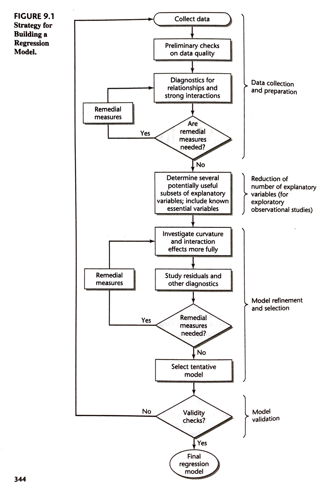

```{r xaringan-themer, include=FALSE, warning=FALSE}
library(xaringanthemer)
duo_accent(primary_color = "#006747", secondary_color = "#CFC493",   
	header_font_google = google_font("Josefin Sans"),
  text_font_google   = google_font("Montserrat", "300", "300i"),
  code_font_google   = google_font("Roboto Mono"))
```		


```{r setup, include=FALSE}
options(htmltools.dir.version = FALSE)
knitr::opts_chunk$set(fig.retina = 3, warning = FALSE, message = FALSE, fig.align="center", fig.height=5.5)
options(DT.options = list(scrollX = TRUE, pageLength=20, scrollY = 250))
options(digits = 4)
options(show.signif.stars=FALSE)

library(here)
library(sjPlot)
library(sjmisc)
library(sjlabelled)
library(tidyverse)
library(ggplot2)
library(knitr)
library(mosaic)
library(DT)
library(car)
library(psych)
library(MPV)  # For PRESS wrapper function

#params
spending_subset_all = read.csv(here("data", "spending_subset.csv"))

spending_subset=spending_subset_all[1:500,]

par(lwd=3,cex=1.5) 
cdi = as_tibble(read.delim(here("data", "CDI.txt"), sep=" ", header=FALSE)[,-c(1:2)] %>% mutate(V18 = recode_factor(V18, "NE", "NC", "S", "W")))
names(cdi) = c("county", "state", "land_area", "population", "pop_18_to_34", "pop_65", "number_physicians", "number_hospital_beds", "total_serious_crimes", "high_school_grads", "bachelor_degrees", "poverty_rate", "unemployment_rate", "per_capita_income", "total_personal_income", "region")

tab_model <- function(...,  show.ci=.95){sjPlot::tab_model(...,  show.ci=show.ci, show.se=TRUE, collapse.ci=TRUE, show.stat=TRUE)}
```


### Learning Objectives for Section 9.1

After Section 9.1, you should be able to 

- Understand the model-building process: data collection, variable selection, model selection, model validation

---

### 9.1: Overview of Model-Building Process

Data Collection:

* **Controlled Experiments**

* **Controlled Experiments with Covariates**

* **Confirmatory Observational Studies**

* **Exploratory Observational Studies**

--

[CONSORT statement on randomization:   www.consort-statement.org/checklists/view/32--consort-2010/87-randomisation-type](www.consort-statement.org/checklists/view/32--consort-2010/87-randomisation-type)

[CONSORT statement on adjusted analyses:   www.consort-statement.org/checklists/view/32--consort-2010/97-additional-analyses](www.consort-statement.org/checklists/view/32--consort-2010/97-additional-analyses)

<!-- Data Wrangling -->

---

```{r, fig.cap="", include=TRUE, message=FALSE, echo=FALSE,  out.width = "425px"}

```

<!-- herehere: 
	Figure 9.1 (highlight "for exploratory observational studies")
	talk about all of Figure 9.1 (Note that Model Validation will be in 9.6)
	Focus on "Reduction of Explanatory Variables"/ Model Selection, but don't put any words on slides...
		+ on slides: Reminder about comments on p 349:
			Comments
1. All too often, unwary investigators will screen a set of explanatory variables by fitting the regression model containing the entire set of potential X variables and then simply dropping those for which the t* statistic (7.25):
has a small absolute value. As we know from Chapter 7, this procedure can lead to the dropping of import~t interco~lated explanatory variables..Clearl~, a good search procedure mUf be. able to handle Important mtercorrelated explanatory vanabIes m such a way that not all of them will be dropped.
2. ControlledexperimentscanusuallyavoidmanyofPIeproblemsinexploratoryobservational studies. For example, the effects of latent predictor variables are minimized by using randomization. In addition, adequate ranges o f the explanatory variables can be selected and correlations among the explanatory variables can be eliminated by appropriate choices of their levels.

	Give examples from my work and have the class (socrative) classify them into the four types of studies.
		+ LAN: confirmatory
		+ gender-based inequalities: exploratory
		+ DSMB: controlled experiment
		+ Rob: confirmatory (from DAG) that mimics a controlled experiment.
	Note that we will focus on Model Selection for Exploratory Observational Studies in the next few Sections. 
-->

---

#### Residential outdoor light-at-night and breast cancer risk in Canada

Experimental and epidemiologic studies suggest that light-at-night (LAN) exposure disrupt circadian rhythms, which may increase breast cancer risk. We investigated whether residential outdoor LAN is associated with breast cancer risk in Canada. 

A population-based case-control study was conducted in Vancouver, British Columbia and Kingston, Ontario, Canada with incident breast cancer cases and controls frequency matched by age to cases living in the same region. This analysis was restricted to 782 cases and 833 controls who provided lifetime residential histories. Using time-weighted average duration at each home 10-20 years prior to study entry, two measures of cumulative average outdoor LAN were calculated using two satellite data sources. 

Logistic regression was used to estimate the relationship between outdoor LAN and breast cancer risk, considering interactions for menopausal status and night shift work.

---

#### Gender-based inequalities in adolescent mental health in Canada

We aim to generate new knowledge about the processes by which social factors, such as gender and social positions, act in combination to systematically marginalize or privilege boys and girls leading to gender-based inequalities in mental health in Canada. 

Our quantitative strand will use a WHO-affiliated adolescent health survey (the Health Study Approach. Behaviour in School-aged Children (HBSC) study). Analyses will involve descriptive and analytic methods that follow epidemiological traditions. 

---

#### Comparative effectiveness of newer oral diabetes medications in preventing advanced diabetic retinopathy

Diabetic retinopathy (DR), the most common complication of diabetes, is the leading cause of blindness and vision impairment in working-age adults. Pivotal studies have established that pharmacotherapy decreases the risk of developing severe DR and the associated vision loss. However, these studies were conducted before the availability of the many newer diabetes medication classes. Evidence suggests that these newer medications differ in their effects on DR. 

We will conduct a population-based retrospective cohort study to address the objectives. Administrative health care databases will be linked to perform the planned analyses. In our primary analysis we will use propensity score based methods to compare the risk of developing severe DR among patients treated with DPP4Is, SGLT2Is and SUs. 


---

#### A Phase II Randomized, Double-Blind, Placebo-Controlled Study of the Efficacy, Safety, and Tolerability of Arbaclofen Administered for the Treatment of Social Function in Children and Adolescents with Autism Spectrum Disorders.


---

layout: true
class: inverse
---

### Warm-up Exercises

```{r}
clothing_model = lm(clothing_expenditure~income+sex+food_expenditure+recreation_expenditure+ miscellaneous_expenditure+marital_status+type_of_dwelling, data=spending_subset)
msummary(clothing_model)
```

---

```{r}
anova(clothing_model)
```

---

* **Consider the four types of studies defined in Section 9.1. Which type of study have we been considering? Explain your reasoning. **


<!-- PUT SELECT WARM UP RESPONSES HEREHERE (preceded by a ">"): -->
<!-- warm up question 9a) 1 -->

*  In class, we have been considering confirmatory observational studies. We have not been dealing with experiments, so those two types can be ruled out. We can also exclude exploratory observational studies, as these deal with a search for explanatory variables that affect the response variable. If we were searching for appropriate explanatory variables, our tables would be much larger. This leaves confirmatory observational studies. Explanatory variables were chosen because researchers already have the idea that they are related to the response variable. For example, it is safe to say that income would have to impact clothing expenditure in some way.

* Exploratory Observational Study, we are using variables that we think might be able to tell us about the response variable.

* We have been considering an exploratory observational study. This is because the data was not collected in a controlled experiment, therefore it is not either type of experiment. Also, we are not using any previous findings as the basis for our variables and we are not trying to confirm findings from other studies, therefore this is not a confirmatory observational study. Therefore, this is an exploratory observational study.


---

* **Which of the available explanatory variables do you think should be included in our regression model?**


<!-- PUT SELECT WARM UP RESPONSES HEREHERE (preceded by a ">"): -->
<!-- warm up question 9a) 2 -->

*  The variables with the smallest p-values are income, food expenditure, and recreation expenditure. These variables should definitely be included in the model. The other variables could potentially still be important, so they should be tested using a general linear test.

* I think income, sex, food-expenditure, recreation-expenditure, marital-status, and type of dwelling would be the better explanatory variables to include in our regression model. Because miscellaneous expenditure in my opinion is quite unnecessary because it doesn't really contribute in giving us an answer towards clothing expenditure

---

* **Are there any potentially-important explanatory variables that are not available? Explain your reasoning. **

<!-- PUT SELECT WARM UP RESPONSES HEREHERE (preceded by a ">"): -->
<!-- warm up question 9a) 3 -->

* predictor variable region (urban or rural) is an important variable for clothing expenditure, because lifestyle can be an potentially-important factor impact people's expenditure on clothing.
	+ geographical region. 
	+ province
	
* The number of dependants that a person (single parent) and a couple (married couple) have can affect clothing expenditure 

* rent/mortgage expenditure


---
layout: false

### Recap: Section 9.1

After Section 9.1, you should be able to 

- Understand the model-building process: data collection, variable selection, model selection, model validation

---

### Learning Objectives for Sections 9.3-9.5

After Sections 9.3-9.5, you should be able to 

- Apply appropriate criteria to perform data-based variable selection
-	Understand automatic variable selection methods
-	Understand the difficulty (or, perhaps, futility) of attempting to automatically identify a "best" set of variables in exploratory model building.

---


### 9.3 Criteria for Model Selection

From any set of $p - 1$ predictors, $2^{p- 1}$ alternative sets of included variables can be constructed.


**Model selection procedures**, also known as subset selection or variables selection procedures, have been developed to identify a small group of regression models that are "good" according to a specified criterion. A detailed examination can then be made of a limited number of the more promising or "candidate" models, leading to the selection of the final regression model to be employed. This limited number might consist of three to six "good" subsets according to the criteria specified, so the investigator can then carefully study these regression models for choosing the final model.

---
.small[
<!-- While many criteria for comparing the regression models have been developed, we will focus on six:  -->

| Criterion | Calculation | Evidence of a good subset of $p-1$ predictors | 
|-----------|-------------|-----------------------------------------------|
| $R^2_p$    | $1 - \frac{SSE_p}{SSTO}$| Bigger is better (note: $max\{R_p^2\}$ always increses as $p$ increases) |
| $R^2_{a,p}$| $\begin{array} { } 1 - \left(\frac{n-1}{n-p}\right) \frac{SSE_p}{SSTO} \\ = 1 - \frac{MSE_p}{SSTO/(n-1)} \end{array}$| Bigger is better |
| Mallows' $C_p$ | $\frac{SSE_p}{MSE(X_1, \ldots, X_{P-1})} - (n-2p)$ | Small values; values near $p$ |
| $AIC_p$ | $n \ln SSE_p - n \ln n + 2 p$ | Small values (equivalent to $C_p$ for linear regression) |
| $SBC_p$ (or $BIC_p)$   | $n \ln SSE_p - n \ln n + (\ln n) p$ | Small values (note: $\ln n > 2$ for all $n \geq 8$)|
| $PRESS_p$ | $\sum_{i=1}^n (Y_i - \hat{Y}_{i(i)})^2$ | Small values (note: $PRESS_p$ is a leave-one-out estimate of $SSE$, which means it is less impacted by overfitting.)|

* $p-1$ is the number of predictors included in the model out of the available $P-1$ variables. We will assume that $n> > P$.
]

---
layout: inverse

```{r}
library(leaps)

spending = with(spending_subset, data.frame(clothing_transformed=I(clothing_expenditure^(1/4)), income=income, sex=sex, food=food_expenditure, rec=recreation_expenditure, misc=miscellaneous_expenditure, trans=transportation_expenditure, care=personal_care_expenditure, alcohol= tobacco_alcohol_expenditure, weeks=weeks_worked, married=as.numeric(I(marital_status=="married"))))

model_selection = summary(regsubsets(clothing_transformed~., data=spending, nvmax=10, nbest=1))
model_selection_10 = summary(regsubsets(clothing_transformed~., data=spending, nvmax=10, nbest=10))
```


---
layout: inverse


```{r, echo=FALSE}
library(leaps)

best <- function(model, ...) 
{
  subsets <- regsubsets(formula(model), model.frame(model), ...)
  subsets <- with(summary(subsets),
                  cbind(p = as.numeric(rownames(which)), which, rss, rsq, adjr2, cp, bic))

  return(subsets)
}  
fit <- lm(clothing_transformed~., data=spending)
x   <- best(fit, nbest = 20, nvmax=10)
mat = data.frame(best(fit, nbest = 10, nvmax=10)[,-2], row.names = NULL); 
mat[do.call(order, mat), ] %>% round(4) %>% datatable(options=list(scrollY=600, pageLength=100))
```

---

```{r, out.width="100%", echo=FALSE}
par(mfrow = c(2, 2), pch = 19)
plot(rsq ~ p, x, xlab = "(a)", ylab = "Rsq", col = "gray50")
lines(1:10, tapply(x[, "rsq"], x[, "p"], max), lwd = 2)

plot(adjr2 ~ p, x, xlab = "(b)", ylab = "Adj Rsq", col = "gray50")
lines(1:10, tapply(x[, "adjr2"], x[, "p"], max), lwd = 2)

plot(cp ~ p, x, xlab = "(c)", ylab = "Cp", col = "gray50"); lines(x=c(1, 10), y=c(1, 10), lty=2);
lines(1:10, tapply(x[, "cp"], x[, "p"], min), lwd = 2)

plot(bic ~ p, x, xlab = "(d)", ylab = "BIC", col = "gray50")
lines(1:10, tapply(x[, "bic"], x[, "p"], min), lwd = 2)
```

<!-- .pull-left[ -->
```{r, fig.height=4.5, include=FALSE}
plot(model_selection$rsq, type='l', xlab="p", ylab="R^2", ylim=range(model_selection_10$rsq)); points(rowSums(model_selection_10$which)-1, model_selection_10$rsq)
plot(model_selection$cp, type='l', xlab="p", ylab="Cp", ylim=range(model_selection_10$cp)); lines(x=c(1, 10), y=c(1, 10), lty=2); points(rowSums(model_selection_10$which)-1, model_selection_10$cp)
```
<!-- ] -->

<!-- .pull-right[ -->
```{r, fig.height=4.5, include=FALSE}
plot(model_selection$adjr2, type='l', xlab="p", ylab="Adjusted R^2", ylim=range(model_selection_10$adjr2)); points(rowSums(model_selection_10$which)-1, model_selection_10$adjr2)
plot(model_selection$bic, type='l', xlab="p", ylab="BIC", ylim=range(model_selection_10$bic)); points(rowSums(model_selection_10$which)-1, model_selection_10$bic)
```
<!-- ] -->

---


### 9.4 Automatic Search Procedures for Model Selection


As noted in the previous section, the number of possible models, $2^{P-1}$, grows rapidly with the number of predictors. Evaluating all of the possible alternatives can be a daunting endeavor. To simplify the task, a variety of automatic computer-search procedures have been developed.


---

### "Best" Subsets Algorithms

Time-saving algorithms have been developed in which the best subsets according to a specified criterion are identified without requiring the fitting of all of the possible subset regression models.


When the pool of potential $X$ variables contains 30 to 40 or even more variables, use of a "best" subsets algorithm may not be feasible. An automatic search procedure that develops the "best" subset of $X$ variables sequentially may then be helpful.

---

### Stepwise Regression Methods

#### Forward stepwise regression:

1. Choose the best single predictor (the $X$ variable with the largest $t$ -value).
2. Out of the remaining predictors, add the most useful predictor to the existing model (the $X$ variable with the largest $t$ -value, given everything else that is already in the model) if it meets some prespecified threshold
3. Drop the least useful predictor from the current model if it fails to meet some prespecified threshold
4. Repeat steps 2 and 3 until no more variables can enter or leave the model. 

--

#### Backward stepwise regression:

Start with the full model (include all variables), then proceed as in Forward stepwise regression, only backward...

--

Note:

* stepwise search procedures end with the identification of a single regression model as "best." 
* "best" subsets algorithm can identify several "good" regression models for final consideration. 


---

layout: inverse

```{r}
summary(regsubsets(clothing_transformed~., method="exhaustive", data=spending, nvmax=10, nbest=1))$outmat
```

--

> Since the algorithm returns a best model of each size, the results do not depend on a penalty model for model size: it doesn't make any difference whether you want to use AIC, BIC, CIC, DIC, ...


---

layout: inverse

```{r}
summary(regsubsets(clothing_transformed~., method="forward", data=spending, nvmax=10, nbest=1))$outmat
```
---

layout: inverse

```{r}
summary(regsubsets(clothing_transformed~., method="backward", data=spending, nvmax=10, nbest=1))$outmat
```

---

### 9.5: Some Final Comments on Automatic Model Selection Procedures

* no automatic search procedure will always find the "best" model
	+ indeed, there may exist several "good" regression models whose appropriateness for the purpose at hand needs to be investigated.

* Subject-specific expertise and judgment needs to play an important role in model building for exploratory studies. 

* When a qualitative predictor variable is represented in the pool of potential $X$ variables by a number of indicator variables (e.g., province is represented by several indicator variables), it is often appropriate to keep these indicator variables together as a group to represent the qualitative variable, even if a subset containing only some of the indicator variables is "better" according to the criterion employed. 

* Similarly, if second-order terms $X^2$ or interaction terms need to be present in a regression model, one would ordinarily wish to have the first-order terms in the model as representing the main effects.

---

### Penalized Regression

**Lasso** (least absolute shrinkage and selection operator) is a regression analysis method that performs both variable selection and regularization in order to enhance the prediction accuracy and interpretability of the statistical model it produces.

$$\beta_{lasso} = argmin[SSE(\beta) + \lambda \cdot ||\beta||_1 ],$$
where the $L_1$ -norm $||\beta||_1 = \sum_{j=1}^p | \beta_j|$ measures the *complexity* of the model.

So, instead of only seeking to minize SSE (as the least squares estimator does), the *lasso* penalizes models that are too complex. I.e., the lasso errs toward models with parameters set to zero (so models that exclude lots of not-overly-important predictor variables); this can help avoid overfitting (and can act as a variable selection tool). 

---
class:inverse
```{r, echo=FALSE}
library(glmnet)
normalize <- function(x) { return ((x - min(x)) / (max(x) - min(x))) }

designmatrix = model.matrix( ~ .-1, spending[,-1])[,-2]
designmatrix_std = cbind(designmatrix[,c(1,2),drop=FALSE], apply(designmatrix[,-c(1,2)], 2, normalize))

fit.lasso <- glmnet(designmatrix, spending[,1], family="gaussian", alpha=1)
fit.lasso_std <- glmnet(designmatrix_std, spending[,1], family="gaussian", alpha=1)

plot(fit.lasso_std, xvar="lambda", label=TRUE)
```

---
class:inverse

```{r, echo=TRUE}
coef(fit.lasso, s=exp(c(-.5, -1, -2, -3, -Inf))) %>% round(5)
msummary(lm(clothing_transformed~., data=spending))
```
---

### Recap Sections 9.3-9.5

After Sections 9.3-9.5, you should be able to 

- Apply appropriate criteria to perform data-based variable selection
-	Understand automatic variable selection methods
-	Understand the difficulty (or, perhaps, futility) of attempting to automatically identify a "best" set of variables in exploratory model building.

---


### Learning Objectives for Section 9.6

After Section 9.6, you should be able to 

- Understand the need for model validation. 
- Understand how to validate models using replicate studies and data splitting
- Assess model validity given appropriate output.

---

### 9.6: Model Validation

The final step in the model-building process is the validation of the selected regression models. 

Model validation usually involves checking a candidate model against independent data. 

Three basic ways of validating a regression model are:

1. Collection of new data to check the model and its predictive ability.
2. Comparison of results with theoretical expectations, earlier empirical results, and
simulation results.
3. Use of a holdout sample to check the model and its predictive ability.

--

With recent computational advances, **bootstrapping** has also become an appealing modification to using a holdout sample. 

---

### Collection of New Data to Check Model

One validation method is to re-estimate the model form chosen earlier using the new data. 

The estimated regression coefficients and various characteristics of the fitted model are then compared for consistency to those of the regression model based on the earlier data. 

If the results are consistent, they provide strong support that the chosen regression model is applicable under broader circumstances than those related to the original data.

--

>  I do not understand the difference between the validation step with new data for an exploratory observational study versus conducting a confirmatory observational study instead.

---

A second validation method is designed to calibrate the predictive capability of the selected regression model. 

When a regression model is developed from given data, it is inevitable that the selected model is chosen, at least in large part, because it fits well the data at hand (i.e., due to sampling noise). For a different set of random outcomes, one may likely have arrived at a different model. 

A result of this model development process is that the error mean square $MSE$ will tend to understate the inherent variability in making future predictions from the selected model.

---

A means of measuring the actual predictive capability of the selected regression model is to use this model to predict each case in the new data set and then to calculate the mean of the squared prediction errors, to be denoted by MSPR, which stands for **mean squared prediction error**:

$$MSPR = \frac{\sum_{{i^\ast}=1}^{n^\ast} (Y_{i^\ast} - \hat Y_{i^\ast})^2}{n^\ast}$$
where

* $Y_{i^\ast}$ is the value of the response valiable in the ${i^\ast}$th validation case
* $\hat Y_{i^\ast}$ is the predicted value for the ${i^\ast}$th validation case based on the model-building dataset
* $n^\ast$ is the number of cases in the validation data set

--

Recall that
$$MSE = \frac{\sum_{i=1}^{n} (Y_i - \hat Y_i)^2}{n-p}$$

* MSE is measured on the data set used to develop the prediction model
* MSPR measures how well the model works for predictions in a *different* data set


<!-- If MSPR is fairly close to MSE, then the MSE for the selected regression model is not seriously biased and gives an appropriate indication of the predictive ability of the model.  -->

<!-- If MSPR is much larger than MSE, one should rely on the MSPR as an indicator of how well the selected regression model will predict in the future. -->

---

### Comparison with Theory, Empirical Evidence, or Simulation Results

Comparisons of regression coefficients and predictions with theoretical expectations, previous empirical results, or simulation results should be made. 

Unfortunately, there is often little theory that can be used to validate regression models.

---

### Data Splitting


By far the preferred method to validate a regression model is through the collection of new data. Often, however, this is neither practical nor feasible. 

An alternative when the data set is large enough is to split the data into two sets. 

The first set, called the model-building set or the **training sample**, is used to develop the model. 

The second data set, called the **validation** or prediction set, is used to evaluate the reasonableness and predictive ability of the selected model. Data splitting in effect is an attempt to simulate replication of the study.

---

There are difficult decisions to be made when splitting the data: 

* How big should the training sample be? Alternately, how big should the validation sample be? 
* Should we split the data completely randomly, or should we try to somehow balance the distribution of predictors across the two samples?
* Should we even have a validation set or should be use all of our data in developing the best model possible? 

--

Using a single validation sample is usually insufficient; we still have sample noise in the validation sample.

In addition, splitting the data causes us to perform variable selection on a smaller data set, which increases the problems associated with overfitting (choosing variables based on sample noise, rather than any true underlying trends). 

---

Often, the validation process will be extended to *K-fold cross-validation*:

* the data are split into *K* parts
* the first *K-1* parts are treated as the training sample, with the *K*th part being the validation sample
* this process is repeated with each of the *K* parts being treated as the validation sample once

This gives us a sense of how *optmistic* MSE tends to be for that particular model (i.e., the average difference between MSE and MSPR). We don't want to base *model selection* on overly-optimistic MSEs.

--

This idea can be (and probably *should be*) taken further using *bootstrapping* (sampling with replacement from within our sample). 

--

In the end, we might want to fit an overall model (using all of the data), and report MSE along with some measure of how optimistic it may be.

---

Split the data into training and test samples
```{r}

library(tidyverse)
library(caret)

set.seed(123)
training.samples <- spending$clothing_transformed %>% createDataPartition(p = 0.8, list=FALSE)

train.data  <- spending[training.samples, ]
test.data <- spending[-training.samples, ]
```

Build the model using the training data
```{r}
model <- lm(clothing_transformed ~ income+sex+food+rec+care+married, data = train.data)
msummary(model)
```

---

Make predictions and compute the $R^2$ and MSPR on the TRAINING data
```{r}
predictions <- model %>% predict(train.data)
data.frame( 
	SSE   = anova(model)["Residuals", "Sum Sq"],
	PRESS = PRESS(model),
	MSE   = anova(model)["Residuals", "Mean Sq"],
	MSPR = RMSE(predictions, train.data$clothing_transformed)^2,
	R2 = R2(predictions, train.data$clothing_transformed))
```

Make predictions and compute the $R^2$ and MSPR on the TEST data
```{r}
predictions <- model %>% predict(test.data)
data.frame( 
	MSPR = RMSE(predictions, test.data$clothing_transformed)^2,
	R2 = R2(predictions, test.data$clothing_transformed))
```


---

Now consider the building of a very complex model (one that is more likely to be prone to overfitting)
```{r}
model <- lm(clothing_transformed ~ .^2, data = train.data)
msummary(model)
```

---

Make predictions and compute the $R^2$ and MSPR on the TRAINING data
```{r}
predictions <- model %>% predict(train.data)
data.frame( 
	SSE   = anova(model)["Residuals", "Sum Sq"],
	PRESS = PRESS(model),
	MSE   = anova(model)["Residuals", "Mean Sq"],
	MSPR = RMSE(predictions, train.data$clothing_transformed)^2,
	R2 = R2(predictions, train.data$clothing_transformed))
```

Make predictions and compute the $R^2$ and MSPR on the TEST data
```{r}
predictions <- model %>% predict(test.data)
data.frame( 
	MSPR = RMSE(predictions, test.data$clothing_transformed)^2,
	R2 = R2(predictions, test.data$clothing_transformed))
```

* **Which model is preferable? The complex model or the simpler model?**

<!-- Note that the difference between "RMSE" (root mean square prediction error) and "Residual standard error" (root mean square error) when they are both applied to the training data is just a change in denominator (sqrt(mean((pred - obs)^2 vs sqrt(1/(n-p) * sum((fitted - obs)^2) ) -->
<!-- e.g., sqrt(0.983^2*345/401) -->

---

layout: true
class: inverse
---

### Warm-up Exercises

```{r}
library(leaps)

spending = with(spending_subset, data.frame(clothing=clothing_expenditure, income=income, sex=sex, food=food_expenditure, rec=recreation_expenditure, misc=miscellaneous_expenditure, trans=transportation_expenditure, care=personal_care_expenditure, alcohol= tobacco_alcohol_expenditure, weeks=weeks_worked, married= as.numeric(I(marital_status=="married"))))

model_selection = summary(regsubsets(clothing~., data=spending, nvmax=10, nbest=1))
```

---

.pull-left[
```{r, fig.height=4.5}
plot(model_selection$rsq, type='l', xlab="p", ylab="R^2")
plot(model_selection$cp, type='l', xlab="p", ylab="Cp")
```
]

.pull-right[
```{r, fig.height=4.5}
plot(model_selection$adjr2, type='l', xlab="p", ylab="Adjusted R^2")
plot(model_selection$bic, type='l', xlab="p", ylab="BIC")
```
]
---


```{r}
model_selection$outmat
```

---

* **Based on the given output, what is the best set of variables to include in our exploratory regression model? Justify your reasoning. **


<!-- PUT SELECT WARM UP RESPONSES HEREHERE (preceded by a ">"): -->
<!-- warm up question 9b) 1 -->

*  It look like some where between 4 and 6 x variables should be used, so we will use 4. We should use rec, care, food, and income. Since they should all have an effect on how much of our income we can spend.


---

* **In your own words, what is the purpose of model validation in our setting? **


<!-- PUT SELECT WARM UP RESPONSES HEREHERE (preceded by a ">"): -->
<!-- warm up question 9b) 2 -->

* We need to check if the model we select is the best model universally, not just in this particular dataset.

* The purpose of validating our model is too see if it can be generalized and applied to new data, to help predict people's household spending habits in the coming years, for which we still do not have data for.

---

* **In your own words, explain how our model could be validated using new data. Then explain how our model could be validated using data splitting. **

<!-- PUT SELECT WARM UP RESPONSES HEREHERE (preceded by a ">"): -->
<!-- warm up question 9b) 3 -->

* We could gather new data showing how clothing expenditure is influenced by income, sex, food expenditure, and other factors. We could then compare the coefficients of each explanatory variable to the coefficients present in the current model. If the coefficients from the two sets of data are close to each other, we can be more confident that out model is valid. To validate the model through data splitting, we can break our current data into two separate sets in an attempt to replicate the study. The first set would be used to develop the model and the second set would evaluate the predictive ability of the model.


---
layout: false


### Recap Section 9.6

After Section 9.6, you should be able to 

- Understand the need for model validation. 
- Understand how to validate models using replicate studies and data splitting
- Assess model validity given appropriate output.


